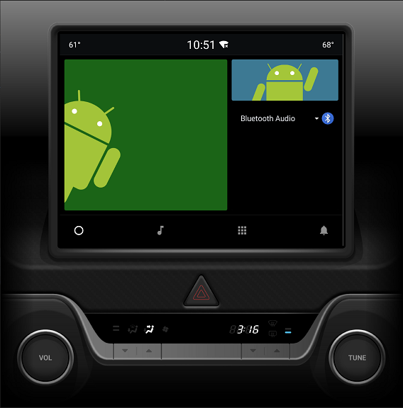

#### 前言

Google官方目前支持的平台，phone，pad，wear，car...等

这篇博客主要讲解如何通过avd运行汽车模拟器, 测试你开发的车载应用

<!--more-->

#### 官方教程地址：

https://developer.android.com/training/cars

#### 添加系统映像：

1.在 Android Studio 中，依次选择 Tools > SDK Manager。
2.点击 SDK Update Sites 标签。
3.点击 Add Add 图标。
4.输入以下 Name 和 URL，再点击 OK。

```
Name：Polestar 2 System Image
URL：https://developer.polestar.com/sdk/polestar2-sys-img.xml
```

5.点击 Apply，然后点击 OK。

#### 创建汽车 AVD 并运行模拟器

1.在 Android Studio 中，依次选择 Tools > AVD Manager。
2.点击 Create Virtual Device。
3.在 Select Hardware 对话框中，选择 Automotive，然后选择一个设备并点击 Next。
4.选择以 Automotive 为目标的系统映像，如 Android 9.0 (Automotive)，然后点击 Next。
5.为您的 AVD 命名，再设置其他要自定义的选项，然后点击 Finish。
6.在工具窗口栏中，选择您的 Android Automotive OS AVD 作为部署目标。
7.点击 Run



#### 问题

##### 1.没有automotive

升级android studio到3.5以上

##### 2.加载不出system image

创建avd的时候 ，select system image的时候可能加载不出系统镜像

Android Studio >> Preferences >> Appearance & Behavior >> System Settings >> Updates

更改检查更新的方式为：

'Stable Channel' -> 'Canary Channel'.
