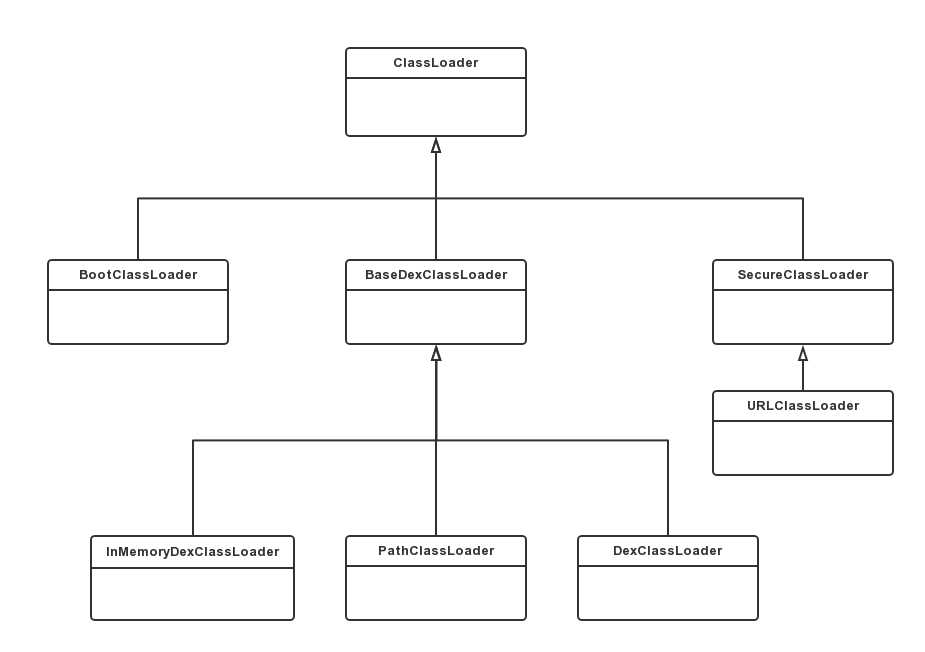

#### 前言

很多同学会把Java和Android的ClassLoader搞混，甚至会认为Android中的ClassLoader和Java中的ClassLoader是一样的，这显然是不对的。这一篇文章我们来看看它和Java中的ClassLoader有何不同。

<!--more-->

#### **1.ClassLoader的类型**

我们知道Java中的ClassLoader可以加载jar文件和Class文件（本质是加载Class文件），这一点在Android中并不适用，因为无论是DVM还是ART它们加载的不再是Class文件，而是dex文件，这就需要重新设计ClassLoader相关类，我们先来学习ClassLoader的类型。  
Android中的ClassLoader类型和Java中的ClassLoader类型类似，也分为两种类型，分别是系统ClassLoader和自定义ClassLoader。其中系统ClassLoader主要有3种分别是BootClassLoader、PathClassLoader和DexClassLoader。

##### 1.1 BootClassLoader

Android系统启动时会使用BootClassLoader来预加载常用类，与Java中的BootClassLoader不同，它并不是由C/C++代码实现，而是由Java实现的，BootClassLoade的代码如下所示。 
**libcore/ojluni/src/main/java/java/lang/ClassLoader.java**  

```java
class BootClassLoader extends ClassLoader {
	private static BootClassLoader instance;
	@FindBugsSuppressWarnings("DP_CREATE_CLASSLOADER_INSIDE_DO_PRIVILEGED")
	public static synchronized BootClassLoader getInstance() {
		if (instance == null) {
		instance = new BootClassLoader();
		}
		return instance;
	}
...
}
```

BootClassLoader是ClassLoader的内部类，并继承自ClassLoader。BootClassLoader是一个单例类，需要注意的是BootClassLoader的访问修饰符是默认的，只有在同一个包中才可以访问，因此我们在应用程序中是无法直接调用的。

##### 1.2 DexClassLoader

DexClassLoader可以加载dex文件以及包含dex的压缩文件（apk和jar文件），不管是加载哪种文件，最终都是要加载dex文件，为了方便理解和叙述，将dex文件以及包含dex的压缩文件统称为dex相关文件。
来查看DexClassLoader的代码，如下所示。
**libcore/dalvik/src/main/java/dalvik/system/DexClassLoader.java**

```java
public class DexClassLoader extends BaseDexClassLoader {
	public DexClassLoader(String dexPath, String optimizedDirectory,
	String librarySearchPath, ClassLoader parent) {
		super(dexPath, new File(optimizedDirectory), librarySearchPath, parent);
	}
}
```

DexClassLoader的构造方法有四个参数：

- dexPath：dex相关文件路径集合，多个路径用文件分隔符分隔，默认文件分隔符为‘：’
- optimizedDirectory：解压的dex文件存储路径，这个路径必须是一个内部存储路径，一般情况下使用当前应用程序的私有路径：`/data/data/<Package Name>/...`。
- librarySearchPath：包含 C/C++ 库的路径集合，多个路径用文件分隔符分隔分割，可以为null。
- parent：父加载器。

DexClassLoader 继承自BaseDexClassLoader ，方法实现都在BaseDexClassLoader中。

##### 1.3 PathClassLoader

Android系统使用PathClassLoader来加载系统类和应用程序的类，来查看它的代码:
**libcore/dalvik/src/main/java/dalvik/system/PathClassLoader.java**

```java
public class PathClassLoader extends BaseDexClassLoader {
	public PathClassLoader(String dexPath, ClassLoader parent) {
		super(dexPath, null, null, parent);
	}
	public PathClassLoader(String dexPath, String librarySearchPath, ClassLoader parent) {
		super(dexPath, null, librarySearchPath, parent);
	}
}
```

PathClassLoader继承自BaseDexClassLoader，实现也都在BaseDexClassLoader中。

PathClassLoader的构造方法中没有参数optimizedDirectory，这是因为PathClassLoader已经默认了参数optimizedDirectory的值为：/data/dalvik-cache，很显然PathClassLoader无法定义解压的dex文件存储路径，因此PathClassLoader通常用来加载已经安装的apk的dex文件(安装的apk的dex文件会存储在/data/dalvik-cache中)。

#### 2.ClassLoader的继承关系

运行一个Android程序需要用到几种类型的类加载器呢？如下所示。  

```java
public class MainActivity extends AppCompatActivity {
	@Override
	protected void onCreate(Bundle savedInstanceState) {
		super.onCreate(savedInstanceState);
		setContentView(R.layout.activity_main);
		ClassLoader loader = MainActivity.class.getClassLoader();
		while (loader != null) {
			Log.d("xxx",loader.toString());//1
			loader = loader.getParent();
		}
	}
}
```

首先我们得到MainActivity的类加载器，并在注释1处通过Log打印出来，接着打印出当前类的类加载器的父加载器，直到没有父加载器终止循环。打印结果如下所示。

```prolog
10-07 07:23:02.835 8272-8272/? D/xxx: dalvik.system.PathClassLoader[DexPathList[[zip file “/data/app/com.example.xxx.moonclassloader-2/base.apk”, zip file “/data/app/com.example.xxx.moonclassloader-2/split_lib_dependencies_apk.apk”, zip file “/data/app/com.example.xxx.moonclassloader-2/split_lib_slice_0_apk.apk”, zip file “/data/app/com.example.xxx.moonclassloader-2/split_lib_slice_1_apk.apk”, zip file “/data/app/com.example.xxx.moonclassloader-2/split_lib_slice_2_apk.apk”, zip file “/data/app/com.example.xxx.moonclassloader-2/split_lib_slice_3_apk.apk”, zip file “/data/app/com.example.xxx.moonclassloader-2/split_lib_slice_4_apk.apk”, zip file “/data/app/com.example.xxx.moonclassloader-2/split_lib_slice_5_apk.apk”, zip file “/data/app/com.example.xxx.moonclassloader-2/split_lib_slice_6_apk.apk”, zip file “/data/app/com.example.xxx.moonclassloader-2/split_lib_slice_7_apk.apk”, zip file “/data/app/com.example.xxx.moonclassloader-2/split_lib_slice_8_apk.apk”, zip file “/data/app/com.example.xxx.moonclassloader-2/split_lib_slice_9_apk.apk”],nativeLibraryDirectories=[/data/app/com.example.xxx.moonclassloader-2/lib/x86, /vendor/lib, /system/lib]]]
 10-07 07:23:02.835 8272-8272/? D/xxx: java.lang.BootClassLoader@e175998
```

可以看到有两种类加载器，一种是PathClassLoader，另一种则是BootClassLoader。DexPathList中包含了很多apk的路径，其中/data/app/com.example.xxx.moonclassloader-2/base.apk就是示例应用安装在手机上的位置。关于DexPathList后续文章会进行介绍。

和Java中的ClassLoader一样，虽然系统所提供的类加载器主要有3种类型，但是系统提供的ClassLoader相关类却不只3个。ClassLoader的继承关系如下图所示。 



可以看到上面一共有8个ClassLoader相关类，其中有一些和Java中的ClassLoader相关类十分类似，下面简单对它们进行介绍：

- ClassLoader是一个抽象类，其中定义了ClassLoader的主要功能。BootClassLoader是它的内部类。

- SecureClassLoader类和JDK8中的SecureClassLoader类的代码是一样的，它继承了抽象类ClassLoader。SecureClassLoader并不是ClassLoader的实现类，而是拓展了ClassLoader类加入了权限方面的功能，加强了ClassLoader的安全性。

- URLClassLoader类和JDK8中的URLClassLoader类的代码是一样的，它继承自SecureClassLoader，用来通过URl路径从jar文件和文件夹中加载类和资源。

- InMemoryDexClassLoader是Android8.0新增的类加载器，继承自BaseDexClassLoader，用于加载内存中的dex文件。

- BaseDexClassLoader继承自ClassLoader，是抽象类ClassLoader的具体实现类，PathClassLoader和DexClassLoader都继承它。

#### 3.BootClassLoader的创建

  BootClassLoader是在何时被创建的呢？这得先从Zygote进程开始说起，
  ZygoteInit的main方法如下所示。  **frameworks/base/core/java/com/android/internal/os/ZygoteInit.java**

```java
  public static void main(String argv[]) {
   ...
   try {
   ...
   preload(bootTimingsTraceLog);
   ... 
      }
   }
```

main方法是ZygoteInit入口方法，其中调用了ZygoteInit的preload方法，preload方法中又调用了ZygoteInit的preloadClasses方法，如下所示。
**frameworks/base/core/java/com/android/internal/os/ZygoteInit.java**  

```java
private static void preloadClasses() {
	final VMRuntime runtime = VMRuntime.getRuntime();
	InputStream is;
	try {
		is = new FileInputStream(PRELOADED_CLASSES);//1
	} catch (FileNotFoundException e) {
		Log.e(TAG, "Couldn't find " + PRELOADED_CLASSES + ".");
	return;
	}
...
	try {
	    BufferedReader br = new BufferedReader(new InputStreamReader(is), 256);//2
	int count = 0;
	String line;
	while ((line = br.readLine()) != null) {//3
		line = line.trim();
		if (line.startsWith("#") || line.equals("")) {
		continue;
	}
		Trace.traceBegin(Trace.TRACE_TAG_DALVIK, line);
	try {
		if (false) {
		    Log.v(TAG, "Preloading " + line + "...");
	    }
	    Class.forName(line, true, null);//4
	    count++;
	} catch (ClassNotFoundException e) {
		Log.w(TAG, "Class not found for preloading: " + line);
	}
	...
	} catch (IOException e) {
		Log.e(TAG, "Error reading " + PRELOADED_CLASSES + ".", e);
	} finally {
	...
	}
}
```

preloadClasses方法用于Zygote进程初始化时预加载常用类。注释1处将/system/etc/preloaded-classes文件封装成FileInputStream，preloaded-classes文件中存有预加载类的目录，这个文件在系统源码中的路径为frameworks/base/preloaded-classes，这里列举一些preloaded-classes文件中的预加载类名称，如下所示。

```java
android.app.ApplicationLoaders
android.app.ApplicationPackageManager
android.app.ApplicationPackageManager$OnPermissionsChangeListenerDelegate
android.app.ApplicationPackageManager$ResourceName
android.app.ContentProviderHolder
android.app.ContentProviderHolder$1
android.app.ContextImpl
android.app.ContextImpl$ApplicationContentResolver
android.app.DexLoadReporter
android.app.Dialog
android.app.Dialog$ListenersHandler
android.app.DownloadManager
android.app.Fragment
```

可以看到preloaded-classes文件中的预加载类的名称有很多都是我们非常熟知的。预加载属于拿空间换时间的策略，Zygote环境配置的越健全越通用，应用程序进程需要单独做的事情也就越少，预加载除了预加载类，还有预加载资源和预加载共享库，因为不是本文重点，这里就不在延伸讲下去了。 
回到preloadClasses方法的注释2处，将FileInputStream封装为BufferedReader，并注释3处遍历BufferedReader，读出所有预加载类的名称，每读出一个预加载类的名称就调用注释4处的代码加载该类，Class的forName方法如下所示。 
**libcore/ojluni/src/main/java/java/lang/Class.java**  

```java
@CallerSensitive
public static Class<?> forName(String name, boolean initialize,
	ClassLoader loader) throws ClassNotFoundException {
	if (loader == null) {
		loader = BootClassLoader.getInstance();//1
	}
	Class<?> result;
	try {
		result = classForName(name, initialize, loader);//2
	} catch (ClassNotFoundException e) {
		Throwable cause = e.getCause();
	    if (cause instanceof LinkageError) {
		    throw (LinkageError) cause;
	    }
	    throw e;
	}
	return result;
}
```

注释1处创建了BootClassLoader，并将BootClassLoader实例传入到了注释2处的classForName方法中，classForName方法是Native方法，它的实现由c/c++代码来完成，如下所示。

```java
@FastNative
static native Class<?> classForName(String className, boolean shouldInitialize,
        ClassLoader classLoader) throws ClassNotFoundException;
```

#### 4.PathClassLoader的创建

PathClassLoader的创建也得从Zygote进程开始说起，Zygote进程启动SyetemServer进程时会调用ZygoteInit的startSystemServer方法，如下所示。 
**frameworks/base/core/java/com/android/internal/os/ZygoteInit.java**

```java
private static boolean startSystemServer(String abiList, String socketName)
 throws MethodAndArgsCaller, RuntimeException {
	 ...
	 int pid;
	 try {
		 parsedArgs = new ZygoteConnection.Arguments(args);//2
		 ZygoteConnection.applyDebuggerSystemProperty(parsedArgs);
		 ZygoteConnection.applyInvokeWithSystemProperty(parsedArgs);
		 /*1*/
		 pid = Zygote.forkSystemServer(
		 parsedArgs.uid, parsedArgs.gid,
		 parsedArgs.gids,
		 parsedArgs.debugFlags,
		 null,
		 parsedArgs.permittedCapabilities,
		 parsedArgs.effectiveCapabilities);
	 } catch (IllegalArgumentException ex) {
		 throw new RuntimeException(ex);
	 }
	 if (pid == 0) {//2
		 if (hasSecondZygote(abiList)) {
		 	waitForSecondaryZygote(socketName);
		 }
	 	handleSystemServerProcess(parsedArgs);//3
	 }
	 return true;
 }
```

注释1处，Zygote进程通过forkSystemServer方法fork自身创建子进程（SystemServer进程）。注释2处如果forkSystemServer方法返回的pid等于0，说明当前代码是在新创建的SystemServer进程中执行的，接着就会执行注释3处的handleSystemServerProcess方法： 
**frameworks/base/core/java/com/android/internal/os/ZygoteInit.java**  

```java
private static void handleSystemServerProcess(
	ZygoteConnection.Arguments parsedArgs) throws Zygote.MethodAndArgsCaller {
	...
	if (parsedArgs.invokeWith != null) {
	...
	} else {
		ClassLoader cl = null;
		if (systemServerClasspath != null) {
			cl = createPathClassLoader(systemServerClasspath, parsedArgs.targetSdkVersion);//1
			Thread.currentThread().setContextClassLoader(cl);
		}
		ZygoteInit.zygoteInit(parsedArgs.targetSdkVersion, parsedArgs.remainingArgs, cl);
	}
}
```

注释1处调用了createPathClassLoader方法，如下所示。  
**frameworks/base/core/java/com/android/internal/os/ZygoteInit.java**  

```java
static PathClassLoader createPathClassLoader(String classPath, int targetSdkVersion) {
	String libraryPath = System.getProperty("java.library.path");
	return PathClassLoaderFactory.createClassLoader(classPath,
	        libraryPath,
	        libraryPath,
	        ClassLoader.getSystemClassLoader(),
	        targetSdkVersion,
	        true /* isNamespaceShared */);
}
```

createPathClassLoader方法中又会调用PathClassLoaderFactory的createClassLoader方法，看来PathClassLoader是用工厂来进行创建的。
**frameworks/base/core/java/com/android/internal/os/PathClassLoaderFactory.java**  

```java
public static PathClassLoader createClassLoader(String dexPath,
	String librarySearchPath,
	String libraryPermittedPath,
	ClassLoader parent,
	int targetSdkVersion,
	boolean isNamespaceShared) {
	PathClassLoader pathClassloader = new PathClassLoader(dexPath, librarySearchPath, parent);
	...
	return pathClassloader;
}
```

在PathClassLoaderFactory的createClassLoader方法中会创建PathClassLoader。
