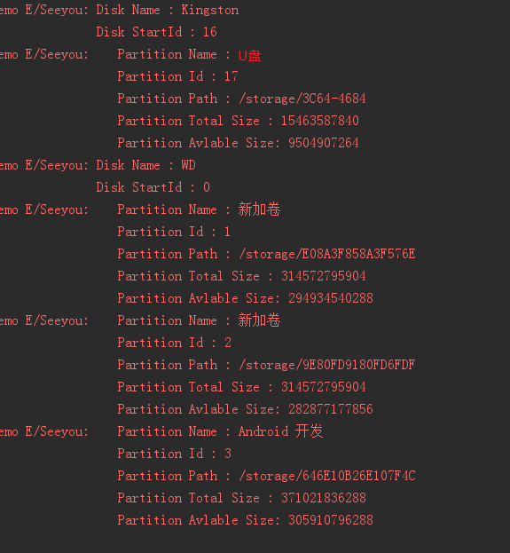

### 前言

Android设备可以通过usb口扩展多个外置存储设备，本blog主要讲述如何获取这些外置存储设备的信息

<!--more-->

### 存储挂载/卸载监听

#### 静态注册

```markup
<receiver android:name=".USBReceiver">
                <intent-filter>
                    <action android:name="android.intent.action.MEDIA_BAD_REMOVAL"/>
                    <action android:name="android.intent.action.MEDIA_BUTTON"/>
                    <action android:name="android.intent.action.MEDIA_CHECKING"/>
                    <action android:name="android.intent.action.MEDIA_EJECT"/>
                    <action android:name="android.intent.action.MEDIA_MOUNTED"/>
                    <action android:name="android.intent.action.MEDIA_NOFS"/>
                    <action android:name="android.intent.action.MEDIA_REMOVED"/>
                    <action android:name="android.intent.action.MEDIA_UNMOUNTED"/>
                    <action android:name="android.intent.action.MEDIA_SHARED"/>
                    <action android:name="android.intent.action.MEDIA_SCANNER_FINISHED"/>
                    <action android:name="android.intent.action.MEDIA_SCANNER_SCAN_FILE"/>
                    <action android:name="android.intent.action.MEDIA_SCANNER_STARTED"/>
                    <data android:scheme="file"></data>
                </intent-filter>
</receiver>
```

#### 动态注册

```java
private void registReceiver() {
    IntentFilter iFilter = new IntentFilter();
    iFilter.addAction(Intent.ACTION_MEDIA_EJECT);
    iFilter.addAction(Intent.ACTION_MEDIA_MOUNTED);
    iFilter.addAction(Intent.ACTION_MEDIA_REMOVED);
    iFilter.addAction(Intent.ACTION_MEDIA_UNMOUNTED);
    iFilter.addDataScheme("file");    //注意这句一定添加
    mBroadcastReceiver = new BroadcastRecevicer();
    registerReceiver(mBroadcastReceiver, iFilter);
}
```

#### 存储设备信息获取



#### 方法

```java
public class StateBarActivity extends AppCompatActivity {
    @Override
    protected void onCreate(Bundle savedInstanceState) {
        super.onCreate(savedInstanceState);
        //获取usb连接的外置设备
        showUsbDev();
        //获取usb外置存储详情
        getDiskInfo();
        for(DiskInfo info : mDiskList){
            Log.e("Seeyou", "Disk Name : " + info.name + "\n"
                    + "Disk diskId : " + info.diskId + "\n");
            for(DiskPartition partition : info.diskPartitions) {
                Log.e("Seeyou", "\tPartition Name : " + partition.name + "\n"
                        + "\tPartition diskId : " + partition.diskId + "\n"
                        + "\tPartition partitionId : " + partition.partitionId + "\n"
                        + "\tPartition Path : " + partition.path + "\n"
                        + "\tPartition Total Size : " + partition.totalSize + "\n"
                        + "\tPartition Avlable Size: " + partition.avlableSize + "\n"
                );
            }
        }

    }

    private void showUsbDev() {
        HashMap<String, UsbDevice> deviceHashMap = ((UsbManager) getSystemService(USB_SERVICE)).getDeviceList();
        for (Map.Entry entry : deviceHashMap.entrySet()) {
            Log.e("Seeyou", "detectUsbDeviceWithUsbManager: \n" + entry.getKey() + "\n, " + entry.getValue());
        }
    }

    private List mDiskList = new ArrayList();
    public void getDiskInfo() {
        StorageManager mstorageManager = (StorageManager)this.getApplicationContext().getSystemService(Context.STORAGE_SERVICE);

        try {
            Method methodGetDisks = StorageManager.class.getMethod("getDisks");
            Method methodGetStorageVolumes = StorageManager.class.getMethod("getVolumeList");
            Method getVolumeById = StorageManager.class.getMethod("findVolumeById", String.class);

            StorageVolume[] storageVolumes = (StorageVolume[]) methodGetStorageVolumes.invoke(mstorageManager);
            List disks = (List) methodGetDisks.invoke(mstorageManager);

            //DiskInfo
            Class<?> diskIndoClass = Class.forName("android.os.storage.DiskInfo");
            Method mGetDiskId = diskIndoClass.getMethod("getId");
            Field diskName = diskIndoClass.getField("label");

            //StorageVolume
            Class<?> storageVolumeClass = Class.forName("android.os.storage.StorageVolume");
            Method mGetStorageVolId = storageVolumeClass.getMethod("getId");
            Method mGetStorageVolDescription = storageVolumeClass.getMethod("getDescription", Context.class);
            Method mGetStorageVolPath = storageVolumeClass.getMethod("getPath");
            Method isRemovable = storageVolumeClass.getMethod("isRemovable");
            Method getVolumeState = StorageManager.class.getMethod("getVolumeState", String.class);

            //VolumeInfo
            Class<?> volumeClass = Class.forName("android.os.storage.VolumeInfo");
            Method volumeDiskId = volumeClass.getMethod("getDiskId");

            for(int i = 0; i < disks.size(); i++) {
                DiskInfo diskInfo = new DiskInfo();
                Parcelable parcelable = (Parcelable) disks.get(i);
                diskInfo.diskId = (String) mGetDiskId.invoke(parcelable);
                Log.e("Seeyou", "diskid : " + diskInfo.diskId);
                String des = (String) diskName.get(parcelable);
                Log.e("Seeyou", "diskName : " + des);
                diskInfo.name = des;
                mDiskList.add(diskInfo);
            }

            for(int j = 0; j < storageVolumes.length; j++) {
                DiskPartition partition = new DiskPartition();
                StorageVolume storageVolume = storageVolumes[j];
                partition.partitionId = (String) mGetStorageVolId.invoke(storageVolume);
                if("emulated".equals(partition.partitionId)) { continue; }
                partition.name = (String) mGetStorageVolDescription.invoke(storageVolume, this);
                partition.path = (String) mGetStorageVolPath.invoke(storageVolume);
                Boolean removeAble = ((Boolean) isRemovable.invoke(storageVolume)).booleanValue();
                String state = (String) getVolumeState.invoke(mstorageManager, partition.path);
                if("mounted".equals(state) && removeAble) {
                    partition.diskId = (String) volumeDiskId.invoke(getVolumeById.invoke(mstorageManager, partition.partitionId));
                    for(DiskInfo diskInfo : mDiskList) {
                        if(diskInfo.diskId.equals(partition.diskId)) {
                            getStorageBlockInfo(partition);
                            diskInfo.diskPartitions.add(partition);
                        }
                    }
                }
            }
        } catch (NoSuchMethodException e) {
            e.printStackTrace();
        } catch (InvocationTargetException e) {
            e.printStackTrace();
        } catch (IllegalAccessException e) {
            e.printStackTrace();
        } catch (ClassNotFoundException e) {
            e.printStackTrace();
        } catch (NoSuchFieldException e) {
            e.printStackTrace();
        }
    }

    public class DiskInfo {
        public String diskId;
        public String name;
        public ArrayList diskPartitions = new ArrayList<>();
    }

    public class DiskPartition{
        public String name;
        public String partitionId;
        public String diskId;
        public long totalSize;
        public long avlableSize;
        public String path;
    }

    public static void getStorageBlockInfo(DiskPartition info) {
        if(TextUtils.isEmpty(info.path))
            return;
        android.os.StatFs statfs = new android.os.StatFs(info.path);
        long nBlocSize = statfs.getBlockSizeLong();
        long blockCountLong = statfs.getBlockCountLong();
        long nAvailaBlock = statfs.getAvailableBlocksLong();
        info.totalSize = blockCountLong * nBlocSize;
        info.avlableSize = nBlocSize * nAvailaBlock;
    }
}
```
