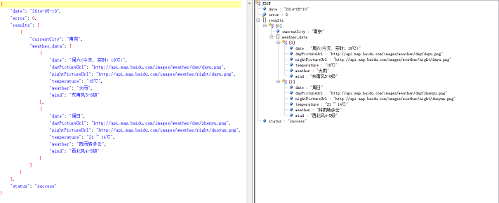

#### 前言

Gson是google推出的用来解析json数据的开源框架,  简单的数据格式通过原生的框架JsonObject或者JsonArray还好, 复杂的数据格式的情况下会很繁琐, 了解了一下Gson的简单用法记录下来, 也方便看到这篇blog的同学能够快速上手这个框架

<!--more-->

#### **简单使用:**

**Json语法:**

- 数据在名称/值对中
- 数据由逗号分隔
- 花括号保存对象
- 方括号保存数组

**Gson解析Bean:**

**Json数据内容:**

```json
    {
        "App": "http://apk.yoolauncher.com/apk/14588716557753.apk",
        "Apps": "3.42M",
        "Auth": "邻家胖子",
        "DC": 11628,
        "Id": "6510",
        "Name": "淡雅女子7",
        "Rem": "<p>when can i see you again，淡雅女子第七季。</p>
        <p>本主题不包含YOO桌面，必需下载安装YOO桌面才能正常使用.YOO桌面自适配所有机型，占用内存少，可以实现多屏壁纸，新增了天气时钟和一键开关、一键清理、搜索条的插件;YOO桌面拥有海量主题随心换，专业的主题制作团队，海量精美主题免费下载！YOO桌面主题技术支持:143659751.</p>"    
    }
```

** 创建Theme Bean**

```java
public class Bean {
    private String App;
    private String Apps;
    private String Auth;
    private String DC;
    private String Id;
    private String Name;
    private String Rem;
    public String getApp() { return App; }
    public void setApp(String app) { App = app; }
    public String getApps() { return Apps; }
    public void setApps(String apps) { Apps = apps; }
    public String getAuth() { return Auth; }
    public void setAuth(String auth) { Auth = auth; }
    public String getDC() { return DC; }
    public void setDC(String DC) { this.DC = DC; }
    public String getId() { return Id; }
    public void setId(String id) { Id = id; }
    public String getName() { return Name; }
    public void setName(String name) { Name = name; }
    public String getRem() { return Rem; }
    public void setRem(String rem) { Rem = rem; }
}
```

**解析Bean代码**

```java
Gson gson = new GsonBuilder().setPrettyPrinting().create();
Bean bean = gson.fromJson(jsonString, Bean.class);
```

**Gson解析数组:**

**Json数据内容**

```json
[
    {
        "hotword": "向艳梅斩获金牌",
        "url": "http://m.yz2.sm.cn/s?q=%E5%90%91%E8%89%B3%E6%A2%85%E6%96%A9%E8%8E%B7%E9%87%91%E7%89%8C&by=hot&from=wm635479"
    },
    {
        "hotword": "傅园慧网络直播",
        "url": "http://m.yz2.sm.cn/s?q=%E5%82%85%E5%9B%AD%E6%85%A7%E7%BD%91%E7%BB%9C%E7%9B%B4%E6%92%AD&by=hot&from=wm635479"
    },
    {
        "hotword": "亲哥偷走23万",
        "url": "http://m.yz2.sm.cn/s?q=%E4%BA%B2%E5%93%A5%E5%81%B7%E8%B5%B023%E4%B8%87&by=hot&from=wm635479"
    }
]
```

**创建热词Bean**

```java
public class HotWords {
    private String hotword;
    private String url;
    public String getHotword() { return hotword; }
    public void setHotword(String hotword) { this.hotword = hotword; }
    public String getUrl() { return url; }
    public void setUrl(String url) { this.url = url; }
}
```

**解析代码**

```java
Gson gson = new GsonBuilder().setPrettyPrinting().create();
Bean bean = gson.fromJson(jsonString, new TypeToken<List<Bean>>(){}.getType());
```

**复杂解析方式:**

内部进行对象 集合嵌套

复杂数据格式: (天气数据)



整体视为 status,  内部包含 results 数组, results 单个项目内包含 weather_data 数组

**首先定义status Bean**

```java
public class Status   
{  
        private String error;  
        private String status;  
        private String date;  
        private List<Results> results;  
        public String getError(){   return error;   }  
        public void setError(String error){ this.error = error;   }  
        public String getStatus(){  return status; }  
        public void setStatus(String status){  this.status = status; }  
        public String getDate(){  return date;  }  
        public void setDate(String date){ this.date = date;}  
        public List<Results> getResults(){ return results;}  
        public void setResults(List<Results> results){ this.results = results; }  
}
```

**定义Results Bean**

```java
public class Results   
{     
    private String currentCity;  
    private List<Weather> weather_data;  
    public String getCurrentCity() { return currentCity;  }  
    public void setCurrentCity(String currentCity) { this.currentCity = currentCity; }  
    public List<Weather> getWeather_data() { return weather_data; }  
    public void setWeather_data(List<Weather> weather_data) { this.weather_data = weather_data; }   
}
```

**定义Weather Bean**

```java
public class Weather {  
    private String date;  
                private String dayPictureUrl;  
                private String nightPictureUrl;  
                private String weather;  
                private String wind;  
                private String temperature;  
                public String getDate() { return date; }  
                public void setDate(String date) { this.date = date; }  
                public String getDayPictureUrl() { return dayPictureUrl; }  
                public void setDayPictureUrl(String dayPictureUrl) { this.dayPictureUrl = dayPictureUrl; }  
                public String getNightPictureUrl() { return nightPictureUrl; }  
                public void setNightPictureUrl(String nightPictureUrl) { this.nightPictureUrl = nightPictureUrl; }  
                public String getWeather() { return weather; }  
                public void setWeather(String weather) { this.weather = weather; }  
                public String getWind() { return wind; }  
                public void setWind(String wind) { this.wind = wind; }  
                public String getTemperature() { return temperature; }  
                public void setTemperature(String temperature) { this.temperature = temperature; }   
}
```

**解析代码**

```java
Gson gson = new GsonBuilder().setPrettyPrinting().create();
Status s = gson.fromJson(Constant.themeBean, Status.class);
```
