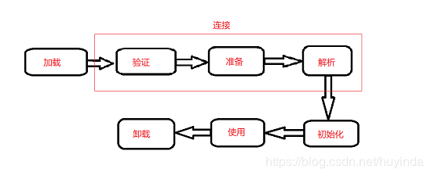
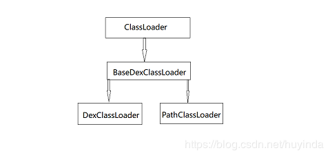

#### 前言

组件化开发，最终会编译成一个整体，插件化开发，会在运行时动态的加载dex等文件。

通俗点说就是:两个apk， 一个宿主apk，一个或多个插件apk，运行的时候宿主apk可以加载插件apk运行，继承了组件化开发优点的同时，减小了主程的大小以及解决了方法数上线的问题。

<!--more-->

#### 原理

##### Android类加载机制

**类生命周期**



可以看到一个类的生命周期需要经历几个过程：加载、连接、初始化。

其中连接分为三个步骤：验证、准备、解析

**加载**

在加载过程，虚拟机主要完成三件事

1、通过一个类的全限定名来获取定义此类的二进制字节流
2、将这个字节流所代表的静态存储结构转化为方法区的运行时数据结构
3、在java内存堆中生成一个代表这个类的java.lang.Class对象，作为这个类的各种数据的访问入口。

**第一步**主要是获取一个类的二进制字节流，意思就是把类以流的形式加载进内存，类的来源没有说，可以是jar包，也可以是class文件或者是apk文件。这个特性是能够实现插件化技术的理论基础。

**第二步**就是在获取到这个字节流以后，虚拟机就会把类中的静态存储结果保存到方法区中，保存的过程会转化对应方法区中的数据结构，所以说静态的结构都保存在内存中的方法区中。

**第三步**是当类加载进内存以后，每个类都会生成一个对应的Class对象，当我们使用这个类的时候，都是通过此Class对象为入口来使用的，比如我们写程序的时候通过 new 关键字创建一个类的对象的时候，也是通过这个类的Class对象来创建的。

**连接**

连接阶段主要分验证、准备和解析。

**验证：** 主要是对类中的语法结构是否合法进行验证，确认类型符合Java语言的语义。
**准备：** 这个阶段是给类中的类变量分配内存，设置默认初始值，比如一个静态的int变量初始值是0，布尔变量初始值是false。
**解析：** 在类型的常量池中寻找类，接口，字段和方法的符号引用，把这些符号引用替换成直接引用的过程。

解析的过程可能不好理解，关于符号引用和直接引用是什么意思可以暂时忽略，这个过程可以理解为一开始虚拟机对加载到内存中的各种类、字段等并没有一一编号，只是通过一个符号去表示，在解析阶段，虚拟机把内存中的类、方法等进行统一管理起来。

**初始化**

初始化阶段才真正到了类中定义的java代码的阶段，在这个阶段会对类中的变量和一些代码块进行初始化，比如对类变量进行初始化，在准备阶段对类变量进行的默认初始化，到这个阶段就对变量进行显式的赋值，其中静态代码块就是在这个阶段来执行的。

初始化不会马上执行，当一个类被主动使用的时候才会去初始化，主要有下面这几种情况：

1、当创建某个类的新实例时（如通过new或者反射等）
2、当调用某个类的静态方法时
3、当使用某个类或接口的静态字段时
4、当初始化某个子类时

**类加载机制**

Java中的ClassLoader是加载class文件，而Android中的虚拟机无论是dvm还是art都只能识别dex文件。因此Java中的ClassLoader在Android中不适用。Android中的java.lang.ClassLoader这个类也不同于Java中的java.lang.ClassLoader。

Dalvik虚拟机识别的是dex文件，而不是class文件，因此，我们加载的是dex文件，或者包含dex文件的apk文件或jar文件。

先来看下Android类加载器的结构图



可以看出，PathClassLoader和DexClassLoader都是继承BaseDexClassLoader，那这两种加载器有什么区别呢？答案是：没有任何区别，严格的说，是在API26(含)以后，这两种类加载器就没有任何区别了，而在API26以前，还是有一定的区别的，主要区别就是跟网上说的，PathClassLoader主要是加载系统已经安装的apk,而DexClassLoader主要是加载未安装的apk/jar/zip/dex。我们来看下源码就知道了

**PathClassLoader**

```java

package dalvik.system;

public class PathClassLoader extends BaseDexClassLoader {

    public PathClassLoader(String dexPath, ClassLoader parent) {
        super(dexPath, null, null, parent);
    }

    public PathClassLoader(String dexPath, String libraryPath,
            ClassLoader parent) {
        super(dexPath, null, libraryPath, parent);
    }
```

**DexClassLoader**

```java
package dalvik.system;
import java.io.File;
public class DexClassLoader extends BaseDexClassLoader {
    public DexClassLoader(String dexPath, String optimizedDirectory,
            String libraryPath, ClassLoader parent) {
        super(dexPath, new File(optimizedDirectory), libraryPath, parent);
    }
}
```

两个类的构造函数只有String optimizedDirectory不同，这个参数的意思是生成的odex(优化的dex)文件存放的路路径，决定了两种类加载器的不同，而在API26以后，这个参数已经废弃，没有使用了，那唯一区别的参数都没有用了，那两者不就是一模一样了吗。所以，自从API26(含26)以后，PathClassLoader和DexClassLoader两种类加载器是同一个，那为什么会有两个相同的类加载器呢？其实这是谷歌工程师一开始就预留扩展的，一般PathClassLoader是给谷歌工程师用的，而DexClassLoader是给开发者用的，这样也比较好维护，但是兜兜转转，两者还是回到了一样。

**父子关系**

**DexClassLoader**的父加载器(parent)是**PathClassLoader**

**PathClassLoader**的父加载器(parent)是**BootClassLoader**

parent和继承是两回事

**区别**

BootClassLoader主要用来**加载SDK中定义的类**

PathClassLoader主要用来**加载应用中类(包含自己写的类)如加载插件中的类**

**BaseDexClassloader**

```java
public BaseDexClassLoader(String dexPath, File optimizedDirectory, 
        String librarySearchPath, ClassLoader parent) {
            super(parect);
            this.pathList = new DexPathList(this, dexPath, librarySearchPath, null);

            if(reporter ！= null) {
                reporter.report(this.pathList.getDexPaths())
            }


        }
```

三个参数

**dexPath:** dex文件的路劲或者是包含dex文件的apk路径，zip路径(必须是绝对路径)，可以是一个路径，也可以是多个路径，多个路径之间用特定的分割符分隔,特定的分割符可以使用System.getProperty(“path.separtor”)获得。

**libraryPath：** 指目标类中所使用的C/C++库存放的路径，也可以有多个路径，之间需要添加分隔符。

**parent：** 是指当前类加载器的父加载器。

我们可以看到BaseDexClassLoader构造方法中，直接创建了一个DexPathList对象，并将参数传进去，那这个类的主要作用又是什么呢，来看一下它的源码:

```java
// dalvik.system.DexPathList

private final Element[] dexElements;

public DexPathList(ClassLoader definingContext, String dexPath,
        String libraryPath, File optimizedDirectory) {
    if (definingContext == null) {
        throw new NullPointerException("definingContext == null");
    }

    if (dexPath == null) {
        throw new NullPointerException("dexPath == null");
    }

    if (optimizedDirectory != null) {
        if (!optimizedDirectory.exists())  {
            throw new IllegalArgumentException(
                    "optimizedDirectory doesn't exist: "
                    + optimizedDirectory);
        }
        // 如果文件不是可读可写的也会抛出异常
        if (!(optimizedDirectory.canRead()
                        && optimizedDirectory.canWrite())) {
            throw new IllegalArgumentException(
                    "optimizedDirectory not readable/writable: "
                    + optimizedDirectory);
        }
    }

    this.definingContext = definingContext;
    ArrayList<IOException> suppressedExceptions = new ArrayList<IOException>();
    // 通过makeDexElements方法来获取Element数组
    // splitDexPath(dexPath)方法是用来把我们之前按照“：”分隔的路径转为File集合。
    this.dexElements = makeDexElements(splitDexPath(dexPath), optimizedDirectory, suppressedExceptions);
    if (suppressedExceptions.size() > 0) {
        this.dexElementsSuppressedExceptions =
            suppressedExceptions.toArray(new IOException[suppressedExceptions.size()]);
    } else {
        dexElementsSuppressedExceptions = null;
    }
    this.nativeLibraryDirectories = splitLibraryPath(libraryPath);
}
```

其中我们重点来关注下它的成员变量dexElements,它是一个Element[]数组,里面主要用来存放dex的文件集合，Element是DexPathList的一个静态内部类。DexPathList的构造方法有4个参数。从其构造方法中也可以看到传递过来的classLoade对象和dexPath不能为null，否则就抛出空指针异常。


里面有一个方法**makeDexElements**的作用是获取一个包含dex文件的元素集合。

```java
// dalvik.system.DexPathList
private static Element[] makeDexElements(ArrayList<File> files, File optimizedDirectory, ArrayList<IOException> suppressedExceptions) {
    ArrayList<Element> elements = new ArrayList<Element>();
 
    // 遍历打开所有的文件并且加载直接或者间接包含dex的文件。
    for (File file : files) {
        File zip = null;
        DexFile dex = null;
        String name = file.getName();
 
        if (file.isDirectory()) {
            // We support directories for looking up resources.
            // This is only useful for running libcore tests.
            // 可以发现它是支持传递目录的，但是说只测试libCore的时候有用
            elements.add(new Element(file, true, null, null));
        } else if (file.isFile()){
            // 如果文件名后缀是.dex，说明是原始dex文件
            if (name.endsWith(DEX_SUFFIX)) {
                // Raw dex file (not inside a zip/jar).
                try {
                    //调用loadDexFile()方法，加载dex文件，获得DexFile对象
                    dex = loadDexFile(file, optimizedDirectory);
                } catch (IOException ex) {
                    System.logE("Unable to load dex file: " + file, ex);
                }
            } else {
                // dex文件包含在其它文件中
                zip = file;
 
                try {
                    // 同样调用loadDexFile()方法
                    dex = loadDexFile(file, optimizedDirectory);
                } catch (IOException suppressed) {
                    // 和加载纯dex文件不同的是，会把异常添加到异常集合中
                    /*
                     * IOException might get thrown "legitimately" by the DexFile constructor if
                     * the zip file turns out to be resource-only (that is, no classes.dex file
                     * in it).
                     * Let dex == null and hang on to the exception to add to the tea-leaves for
                     * when findClass returns null.
                     */
                    suppressedExceptions.add(suppressed);
                }
            }
        } else {
            System.logW("ClassLoader referenced unknown path: " + file);
        }
 
        // 如果zip或者dex二者一直不为null，就把元素添加进来
        // 注意，现在添加进来的zip存在不为null也不包含dex文件的可能。
        if ((zip != null) || (dex != null)) {
            elements.add(new Element(file, false, zip, dex));
        }
    }
 
    return elements.toArray(new Element[elements.size()]);
}
```


从源码中可以看出，dexPath既可以直接传dex文件的路径，也可以传包含dex文件的.apk或者.zip类型的文件。通过上面的代码也可以看到，加载一个dex文件调用的是loadDexFile()方法。


```java

# dalvik.system.DexPathList
private static DexFile loadDexFile(File file, File optimizedDirectory)
        throws IOException {
    // 如果缓存存放目录为null就直接创建一个DexFile对象返回
    if (optimizedDirectory == null) {
        return new DexFile(file);
    } else {
        // 根据缓存存放目录和文件名得到一个优化后的缓存文件路径
        String optimizedPath = optimizedPathFor(file, optimizedDirectory);
        // 调用DexFile的loadDex()方法来获取DexFile对象。
        return DexFile.loadDex(file.getPath(), optimizedPath, 0);
    }
```

再来看下DexFile中的loadDex()方法的源码

```java

# dalvik.system.DexFile 
static public DexFile loadDex(String sourcePathName, String outputPathName, int flags) throws IOException {

    /*
     * TODO: we may want to cache previously-opened DexFile objects.
     * The cache would be synchronized with close().  This would help
     * us avoid mapping the same DEX more than once when an app
     * decided to open it multiple times.  In practice this may not
     * be a real issue.
     */
    //loadDex方法内部就是调用了DexFile的一个构造方法
    return new DexFile(sourcePathName, outputPathName, flags);
}
 
private DexFile(String sourceName, String outputName, int flags) throws IOException {
    if (outputName != null) {
        try {
            String parent = new File(outputName).getParent();
            if (Libcore.os.getuid() != Libcore.os.stat(parent).st_uid) {
                throw new IllegalArgumentException("Optimized data directory " + parent
                        + " is not owned by the current user. Shared storage cannot protect"
                        + " your application from code injection attacks.");
            }
        } catch (ErrnoException ignored) {
            // assume we'll fail with a more contextual error later
        }
    }
 
    mCookie = openDexFile(sourceName, outputName, flags);
    mFileName = sourceName;
    guard.open("close");
    //System.out.println("DEX FILE cookie is " + mCookie + " sourceName=" + sourceName + " outputName=" + outputName);
}
 
private static long openDexFile(String sourceName, String outputName, int flags) throws IOException {
    // Use absolute paths to enable the use of relative paths when testing on host.
    return openDexFileNative(new File(sourceName).getAbsolutePath(),
                             (outputName == null) ? null : new File(outputName).getAbsolutePath(),
                             flags);
}
 
private static native long openDexFileNative(String sourceName, String outputName, int flags);
```

可以看出在loadDex()方法中，它的作用就是加载DexFile文件，而且会把优化后的dex文件缓存到对应目录。

所以，现在来回答下DexPathList这个类它的主要作用就是存放指明包含dex文件、native库和优化目录，封装了dex路径。

**总结下**

在BaseDexClassLoader对象构造方法内，创建了DexPathList对象。而在DexPathList构造方法内部，通过调用一系列方法，把直接包含或者间接包含dex的文件解压缩并缓存优化后的dex文件，通过DexPathList的成员变量 Element[] dexElements来指向这个文件。到此，dex文件就保存在了dexElements数组中。

##### 加载过程

类加载是按需加载，也就是说当明确需要使用class文件的时候才会加载。

Android中类的加载采用了双亲委托机制的加载方式，我们先来了解下什么叫做双亲委托机制

当一个ClassLoader去加载一个类的时候，它会去判断当前类，记载其是否已经加载过这个类，如果已经加载过，则直接获取并返回，如果还没有加载过，它不会马上使用自己的类加载器去加载，而是委托给父加载器进行查找，这样递归一直找到最上层的parent父加载类(BootClassLoader)，如果从缓存中找到了，就直接返回这个类所对应的Class对象，如果都没有加载过，就从顶层的parent加载类去开始依次向下加载，直到加载到目标类。

简单说，就是第一次加载的时候，是从下到上依次从缓存中查找之前有没有加载过，如果有就返回，如果都没有，就从上到下从自己制定的位置去加载这个类，最后在交给发起者去加载该类。

可能这样用文字描述，听起来还是一塌糊涂，怎么查找的。没关系，下面就从源码上去分析具体是怎么实现的双亲委派机制。因为加载一个类的时候，是调用loadClass()方法，所以来看看这个方法的源码，下面这个是PathClassLoader和DexClassLoader的loadClass()源码，两者的该方法是一样的。

```java

protected Class<?> loadClass(String name, boolean resolve)
        throws ClassNotFoundException
    {
            // First, check if the class has already been loaded
            Class<?> c = findLoadedClass(name);
            if (c == null) {
                try {
                    if (parent != null) {
                        c = parent.loadClass(name, false);
                    } else {
                        c = findBootstrapClassOrNull(name);
                    }
                } catch (ClassNotFoundException e) {
                    // ClassNotFoundException thrown if class not found
                    // from the non-null parent class loader
                }
 
                if (c == null) {
                    // If still not found, then invoke findClass in order
                    // to find the class.
                    c = findClass(name);
                }
            }
            return c;
     }
```

下面是BootClassLoader的loadClass()方法源码

```java

@Override
    protected Class<?> loadClass(String className, boolean resolve)
           throws ClassNotFoundException {
        Class<?> clazz = findLoadedClass(className);
 
        if (clazz == null) {
            clazz = findClass(className);
        }
 
        return clazz;
    }
```

来解读下源码

上面说过父加载器的关系是 DexClassLoader---->PathClassLoader--->BootClassLoader，所以会依次去调用这三个类中的loadClass()方法。

一开始的时候，会先调用DexClassLoader类中loadClass()方法里面的findLoadedClass()方法来查询该类是否已经被DexClassLoader加载器加载过，如果已经加载过，就直接返回该类对应的Class对象，如果还没有被加载过，再判断其parent父加载器(PathClassLoader)如果不为null,则直接调用parent.loadClass(className, false)方法，向上从父加载器中查询，进入了PathClassLoader类的loadClass()方法，父加载器同样会先调用findLoadedClass()方法判断是否已经加载过，如果加载过，则直接返回该类的Class对象，如果同样还没有被加载过，又调用parent.loadClass(className, false)方法，此时进入的是BootClassLoader类中的loadClass()方法，同样还是先判断BootClassLoader类加载器是否已经加载过该类，如果已经加载过，直接获取并返回，如果还没有加载过该类，则直接调用BootClassLoader的findClass()方法去第一次加载该类(因为BootClassLoader已经没有父加载器了，所以不会再调用parent.loadClass()方法)，不管有没有加载到，都会返回，然后由PathClassLoader类loadClass()方法里面接收的父加载器是否加载到类，父加载器返回的Class对象不为空时，说明父加载器已经加载成功，否则说明加载失败，那只能由PathClassLoader类加载器自己去加载该类，同样将结果返回给DexClassLoader，向下交给子加载器调用findClass(className)方法(因为子加载器中的parent.loadClass(className, false)方法是返回null,所以会进入子加载器的findClass(className)方法)，这样依次向下加载。


接着来看下BaseDexClassLoader中的findClass()方法的源码

```java

# dalvik.system.BaseDexClassLoader
@Override
protected Class<?> findClass(String name) throws ClassNotFoundException {
    List<Throwable> suppressedExceptions = new ArrayList<Throwable>();
    // 调用DexPathList对象的findClass()方法
    Class c = pathList.findClass(name, suppressedExceptions);
    if (c == null) {
        ClassNotFoundException cnfe = new ClassNotFoundException("Didn't find class \"" + name + "\" on path: " + pathList);
        for (Throwable t : suppressedExceptions) {
            cnfe.addSuppressed(t);
        }
        throw cnfe;
    }
    return c;
}
```

很明显可以看到BaseDexClassLoader的findClass()方法中是直接调用DexPathList类中的findClass()方法。

再来看DexPathList中的findClass()方法的源码

```java
# dalvik.system.DexPathList
public Class findClass(String name, List<Throwable> suppressed) {
    // 遍历Element
    for (Element element : dexElements) {
        // 获取DexFile，然后调用DexFile对象的loadClassBinaryName()方法来加载Class文件。
        DexFile dex = element.dexFile;
       
        if (dex != null) {
            Class clazz = dex.loadClassBinaryName(name, definingContext, suppressed);
            if (clazz != null) {
                return clazz;
            }
        }
    }
    if (dexElementsSuppressedExceptions != null) {
        suppressed.addAll(Arrays.asList(dexElementsSuppressedExceptions));
    }
    return null;
}
```

```java
# dalvik.system.DexFile
public Class loadClassBinaryName(String name, ClassLoader loader, List<Throwable> suppressed) {
    return defineClass(name, loader, mCookie, suppressed);
}
 
private static Class defineClass(String name, ClassLoader loader, long cookie,List<Throwable> suppressed) {
    Class result = null;
    try {
        result = defineClassNative(name, loader, cookie);
    } catch (NoClassDefFoundError e) {
        if (suppressed != null) {
            suppressed.add(e);
        }
    } catch (ClassNotFoundException e) {
        if (suppressed != null) {
            suppressed.add(e);
        }
    }
    return result;
}
```

从上面的代码中我们也可以看到，实际上DexPathList最终还是遍历其自身的Element[]数组，获取DexFile对象来加载Class文件。我们之前讲DexPathList构造方法内是调用其makeDexElements()方法来创建Element[]数组的，而且也提到了如果zip文件或者dex文件二者之一不为null，就把元素添加进来，而添加进来的zip存在不为null也不包含dex文件的可能。从上面的代码中也可以看到，获取Class的时候跟这个zip文件没什么关系，调用的是dex文件对应的DexFile的方法来获取Class。

从上面源码中也可以看出，当从某一个dex文件中加载到类时，就会结束循环，也就是说后面的dex文件就不会执行到。这样的话，如果同时有一个类名叫A.class分别在两个不同的dex文件中时，系统到底是加载哪一个dex文件中的A.class类呢，很明显，取决于哪一个dex文件是在dexElements数组中比较靠前的，就加载那一个dex文件中的类。

从上面也可以总结出一点

Android加载一个Class是调用DexFile的defineClass()方法。而不是调用ClassLoader的defineClass()方法。这一点与Java不同，毕竟Android虚拟机加载的dex文件，而不是class文件。


##### 总结

我们知道插件apk里面也是包含dex文件的，根据Android类加载器，我们可以知道DexClassLoader可以直接加载dex文件或者包含dex文件的apk文件/zip文件/jar文件，所以我们就可以在宿主apk中去动态加载插件apk，加载完插件apk之后，同样会在dexElement数组中保存插件apk中的所有dex文件，那我们只要将宿主apk的dexElement数组中的dex文件和插件apk的dexElement数组中的dex文件进行合并成一个新的dexElement数组，然后重新赋值给原来宿主apk的dexElement即可。所以最关键的就是要分别获取宿主apk中的dexElement数组对象和插件apk中的dexElement数组对象，而通过源码我们可以看到dexElement对象在DexPathList中是private私有的，如果用正常手段，我们是没办法在其他地方访问这个对象的，所以我们只能采用非常规的手段(反射的技术)去获取并操作这个对象。

总结下插件化实现的整体流程

1、创建插件的DexClassLader类加载器，传入插件apk的绝对路径(插件apk由服务器下发，然后客户端保存在指定的路径)，然后通过反射获取插件的dexElement值。

2、获取宿主apk的PathClassLoader类加载器(当前类的加载器)，然后通过反射获取宿主的dexElement值。

3、通过反射创建一个新的数组，用来存放插件的dexElement与宿主dexElement的值。

4、通过反射将新创建的dexElement数组赋值给宿主apk的dexElements。


#### 如何加载插件类


因为我们通过反射最终的目的是要获取dexElements成员变量的值，根据反射中获取成员变量并使用的方法

```java
Class<?> dexPathClass = Class.forName("dalvik.system.DexPathList");
Field dexElementsField = dexPathClass.getField("dexElements")
Element[] dexElements = (Element[]) dexElementsField.get("DexPathLis对象");
```

我们可以看出，要获取dexElements数组的值，前提是要先获取dexElementsField对象，然后还要获取DexPathList对象，因为dexElements是DexPathList类中非static的成员变量，所以外界要访问该成员变量，需要依赖DexPathList对象。接着就来获取DexPathList类的对象，我们通过源码可以发现DexPathList在BaseDexClassLoader构造函数中被创建了，也就是说DexPathList对象已经在BaseDexClassLoader的成员变量中pathList

```java
private final DexPathList pathList;
```


那我们现在就要获取BaseDexClassLoader中的成员变量pathList的值，通过获取方法，此处获取DexPathList对象不能直接通过调用

```java
Object pathList = getDeclaredConstructor(null).newInstance(null);
```

 因为，此处相当于是重新new了一个新的DexPathList对象，而DexPathList已经在BaseDexClassLoader构造函数中创建了，所以只能   从BaseDexClassLoader类中去获取这个对象值，也就是调用以下的方法获取

```java
Class<?> baseDexClass = Class.forName("dalvik.system.BaseDexClassLoader");
Field pathListField = baseDexClass.getField("pathList");
Object dexPathList = pathListField.get("BaseDexClassLoader对象");
```

可以看出，要获取DexPathList对象，前提是要获取pathListField对象，然后还要获取BaseDexClassLoader对象，因为pathList是BaseDexClassLoader类中的非static的成员变量，所以要访问该变量，就需要依赖BaseDexClassLoader对象，所以现在问题就在于如何获取BaseDexClassLoader对象即可。等同于获取DexClassLoader对象。

宿主apk中获取DexClassLoader方法

因为宿主apk中的类已经被加载了，所以可以直接获取加载当前这个类的加载器

```java
ClassLoader hostDexClassLoader = mContext.getClassLoader();
```

其中hostDexClassLoader就是宿主apk中BaseDexClassLoader对象。

**插件apk中获取DexClassLoader方法**

因为插件apk中的类还没有在宿主apk中被加载过，所以只能通过创建一个类加载

```ajva
DexClassLoader pluginDexClassLoader = new DexClassLoader("dexPath", mContext.getCacheDir().getAbsolutePath(), null, hostDexClassLoader);
```

这样我们就分别获取到了宿主apk和插件apk中的BaseDexClassLoader对象，进而就可通过上面的流程获取两者的dexElements数组的值。

以下是完整的获取代码。

```java
/**
     * 动态加载apk，并合并插件apk的dexElement和宿主apk的dexElement
     */
    private void loadApk(Context mContext) {
        try {
            //获取dexElementsField对象，公共的
            Class<?> dexPathClass = Class.forName("dalvik.system.DexPathList");
            Field dexElementsField = dexPathClass.getField("dexElements");
            //获取pathListField对象，公共的
            Class<?> baseDexClass = Class.forName("dalvik.system.BaseDexClassLoader");
            Field pathListField = baseDexClass.getField("pathList");
            /**
             * 宿主apk
             */
            //获取宿主apk加载当前类的加载器
            ClassLoader hostDexClassLoader = mContext.getClassLoader();
            //获取宿主apk中DexPathList对象
            Object hostDexPathList = pathListField.get(hostDexClassLoader);
            //获取宿主apk中的dexElements数组的值
            Element[] hostDexElements = (Element[]) 
            dexElementsField.get(hostDexPathList);
            /**
             * 插件apk
             */
            //创建插件apk的类加载器
            DexClassLoader pluginDexClassLoader = new DexClassLoader(dexPath, 
            mContext.getCacheDir().getAbsolutePath(), null, hostDexClassLoader);
            //获取插件apk中DexPathList对象
            Object pluginDexPathList = pathListField.get(pluginDexClassLoader);
            //获取插件apk中的dexElements数组的值
            Element[] pluginDexElements = (Element[]) 
            dexElementsField.get(pluginDexPathList);
 
            //合并两个dexElements数组，反射中使用数组
            //创建一个新的数组
            Object[] newDexElements = (Object[]) 
            Array.newInstance(hostDexElements.getClass().getComponentType(), 
            hostDexElements.length + pluginDexElements.length);
            //将两个dexElements数组的内容拷贝到新创建的数组中
            //先拷贝宿主apk中的dexElements数组
            System.arraycopy(hostDexElements,0,newDexElements,0,hostDexElements.length);
            //再拷贝插件apk中的dexElements数组
            System.arraycopy(pluginDexElements,0,newDexElements,
            hostDexElements.length,pluginDexElements.length);
            //合并完成之后，将这个新的dexElements数组赋值给宿主apk中的dexElements
            dexElementsField.set(hostDexPathList,newDexElements);
            //到此结束
        } catch (Exception e) {
            e.printStackTrace();
        }
    }
```

通过以上的代码，我们已经完成了在宿主apk中动态加载插件apk的功能，那接下来就要考虑以下几个问题：

1、如何在宿主apk中加载插件apk中的类

2、如何在宿主apk中启动插件apk中的四大组件

3、如何在宿主apk中加载插件apk中的资源

本文我们主要来讲解第一点如何加载插件中的类

其实这个相对比较简单，我们知道要获取某一个类的话，就要通过创建构造函数获取该类的对象，但是因为宿主apk和插件apk是完全独立的，没有任何依赖，那很显然在宿主apk中是没有办法直接获取插件apk中的某一个类对象的，那怎么办呢，这时候反射技术又派上用场了，我们可以通过反射的技术去获取插件中某一个类的Class对象，进行对这个类进行操作。代码走起

```java

/**
* 调用插件apk中PluginClass类中的function方法
*/
private void callMethod() {
  try {
    Class<?> pluginClass = Class.forName("com.example.pluginapp.PluginClass");
    Method functionMethod = pluginClass.getDeclaredMethod("function", int.class,int.class);
    Object pluginObject = pluginClass.getDeclaredConstructor(null).newInstance(null);
    functionMethod.setAccessible(true);
    int result = (int) functionMethod.invoke(pluginObject, 50, 100);
    tv_show.setText("" + result);
  } catch (Exception e) {
     e.printStackTrace();
   }
}
```

这样我们就可以正常的在宿主apk中去调用插件apk中某一个类了。


