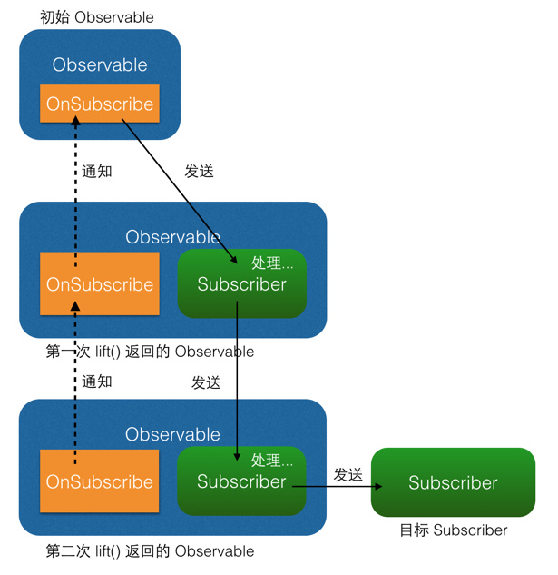

#### 前言

Rxjava已经问世有几年的时间，如今的版本迭代也已经到了3.0，这样的任务调度框架其实还有很多， 但是Rxjava的上手可能让然刚开始看的时候， 有点雾水，但是使用使用之后， 你会发现爽的一批，今天来讲解一下RxAndroid的简单实用。

<!--more-->

#### Github地址：

[https://github.com/ReactiveX/RxAndroid](https://github.com/ReactiveX/RxAndroid)

#### 定义

RxJava 在 GitHub 主页上的自我介绍是

> RxJava is a Java VM implementation of [Reactive Extensions](http://reactivex.io/): a library for composing asynchronous and event-based programs by using observable sequences.

一个在 Java VM 上使用可观测的序列来组成异步的、基于事件的程序的库

说的直白一些就是一个异步任务框架，自动处理任务调度。

#### 好处

方便！

不在需要自己手动切换线程来执行任务， 框架一个方法就可指定执行线程。

简洁！

链式调用的方式，减少了代码的层级嵌套， 让你对于任务的执行流程一目了然。

#### 简单解析

RxJava 的异步实现，是通过一种扩展的观察者模式来实现的。对于事件序列，做出相应的处理，类似我们给view指定点击事件。

#### 使用

框架的使用思想就是创建事件源，创建观察者， 把观察者绑定到事件源上， 就可以处理事件源进行的事件回调。

##### 观察者类  Observer  Subscriber

```java
Observer<String> observer = new Observer<String>() {
    @Override
    public void onNext(String s) {
        Log.d(tag, "Item: " + s);
    }

    @Override
    public void onCompleted() {
        Log.d(tag, "Completed!");
    }

    @Override
    public void onError(Throwable e) {
        Log.d(tag, "Error!");
    }
};
```

```javba
Subscriber<String> subscriber = new Subscriber<String>() {
    @Override
    public void onNext(String s) {
        Log.d(tag, "Item: " + s);
    }

    @Override
    public void onCompleted() {
        Log.d(tag, "Completed!");
    }

    @Override
    public void onError(Throwable e) {
        Log.d(tag, "Error!");
    }
};
```

选择 `Observer` 和 `Subscriber` 是完全一样的。它们的区别对于使用者来说主要有两点：

1. `onStart()`: 这是 `Subscriber` 增加的方法。它会在 subscribe 刚开始，而事件还未发送之前被调用，可以用于做一些准备工作，例如数据的清零或重置。这是一个可选方法，默认情况下它的实现为空。需要注意的是，如果对准备工作的线程有要求（例如弹出一个显示进度的对话框，这必须在主线程执行）， `onStart()` 就不适用了，因为它总是在 subscribe 所发生的线程被调用，而不能指定线程。要在指定的线程来做准备工作，可以使用 `doOnSubscribe()` 方法，具体可以在后面的文中看到。
2. `unsubscribe()`: 这是 `Subscriber` 所实现的另一个接口 `Subscription` 的方法，用于取消订阅。在这个方法被调用后，`Subscriber` 将不再接收事件。一般在这个方法调用前，可以使用 `isUnsubscribed()` 先判断一下状态。 `unsubscribe()` 这个方法很重要，因为在 `subscribe()` 之后， `Observable` 会持有 `Subscriber` 的引用，这个引用如果不能及时被释放，将有内存泄露的风险。所以最好保持一个原则：要在不再使用的时候尽快在合适的地方（例如 `onPause()` `onStop()` 等方法中）调用 `unsubscribe()` 来解除引用关系，以避免内存泄露的发生。

##### 事件源类 Observable

```java
/*
 * Observable.create
 */
Observable observable = Observable.create(new Observable.OnSubscribe<String>() {
    @Override
    public void call(Subscriber<? super String> subscriber) {
        subscriber.onNext("Hello");
        subscriber.onNext("Hi");
        subscriber.onNext("Aloha");
        subscriber.onCompleted();
    }
});
/*
 * Observable.just
 */
Observable observable = Observable.just("Hello", "Hi", "Aloha");

// 将会依次调用：
// onNext("Hello");
// onNext("Hi");
// onNext("Aloha");
// onCompleted();

/*
 * Observable.from
 */
String[] words = {"Hello", "Hi", "Aloha"};
Observable observable = Observable.from(words);
// 将会依次调用：
// onNext("Hello");
// onNext("Hi");
// onNext("Aloha");
// onCompleted();
```

##### 订阅

就是将Observable 和 Observer/Subscriber联系起来

```java
observable.subscribe(observer);
// 或者：
observable.subscribe(subscriber);
```

Observable 回调 Observer/Subscriber 的顺序


不完整回调

```java
Action1<String> onNextAction = new Action1<String>() {
    // onNext()
    @Override
    public void call(String s) {
        Log.d(tag, s);
    }
};
Action1<Throwable> onErrorAction = new Action1<Throwable>() {
    // onError()
    @Override
    public void call(Throwable throwable) {
        // Error handling
    }
};
Action0 onCompletedAction = new Action0() {
    // onCompleted()
    @Override
    public void call() {
        Log.d(tag, "completed");
    }
};

// 自动创建 Subscriber ，并使用 onNextAction 来定义 onNext()
observable.subscribe(onNextAction);
// 自动创建 Subscriber ，并使用 onNextAction 和 onErrorAction 来定义 onNext() 和 onError()
observable.subscribe(onNextAction, onErrorAction);
// 自动创建 Subscriber ，并使用 onNextAction、 onErrorAction 和 onCompletedAction 来定义 onNext()、 onError() 和 onCompleted()
observable.subscribe(onNextAction, onErrorAction, onCompletedAction);
```

##### 例子

字符串打印

```java
String[] names = ...;
Observable.from(names)
    .subscribe(new Action1<String>() {
        @Override
        public void call(String name) {
            Log.d(tag, name);
        }
    });
```

图片加载展示

```java
int drawableRes = ...;
ImageView imageView = ...;
Observable.create(new OnSubscribe<Drawable>() {
    @Override
    public void call(Subscriber<? super Drawable> subscriber) {
        Drawable drawable = getTheme().getDrawable(drawableRes));
        subscriber.onNext(drawable);
        subscriber.onCompleted();
    }
}).subscribe(new Observer<Drawable>() {
    @Override
    public void onNext(Drawable drawable) {
        imageView.setImageDrawable(drawable);
    }

    @Override
    public void onCompleted() {
    }

    @Override
    public void onError(Throwable e) {
        Toast.makeText(activity, "Error!", Toast.LENGTH_SHORT).show();
    }
});
```

##### 线程控制

就是指定事件流和订阅者分别在什么线程执行

```java
Observable.just(1, 2, 3, 4)
    .subscribeOn(Schedulers.io()) // 指定 subscribe() 发生在 IO 线程
    .observeOn(AndroidSchedulers.mainThread()) // 指定 Subscriber 的回调发生在主线程
    .subscribe(new Action1<Integer>() {
        @Override
        public void call(Integer number) {
            Log.d(tag, "number:" + number);
        }
    });
```

到这里RxAndroid的简单使用基本已经完成， 简单总结一下， 就是创建事件源，创建观察者， 指定两者的执行线程，事件源里发送事件，观察者处理事件。

#### 进阶

**map方法**

```java
Observable.just("images/logo.png") // 输入类型 String
    .map(new Func1<String, Bitmap>() {
        @Override
        public Bitmap call(String filePath) { // 参数类型 String
            return getBitmapFromPath(filePath); // 返回类型 Bitmap
        }
    })
    .subscribe(new Action1<Bitmap>() {
        @Override
        public void call(Bitmap bitmap) { // 参数类型 Bitmap
            showBitmap(bitmap);
        }
    });
```


说白了就是事件先经过一次处理之后在回调给订阅者

**flatmap方法**

```java
Student[] students = ...;
Subscriber<Course> subscriber = new Subscriber<Course>() {
    @Override
    public void onNext(Course course) {
        Log.d(tag, course.getName());
    }
    ...
};
Observable.from(students)
    .flatMap(new Func1<Student, Observable<Course>>() {
        @Override
        public Observable<Course> call(Student student) {
            return Observable.from(student.getCourses());
        }
    })
    .subscribe(subscriber);
```


这个需求是打印学生的课程名称， 每个学生会上不同课程，通过一次flatmap可以将学生的课程信息回调，避免自己手动写for循环

**left方法**

```java
observable.lift(new Observable.Operator<String, Integer>() {
    @Override
    public Subscriber<? super Integer> call(final Subscriber<? super String> subscriber) {
        // 将事件序列中的 Integer 对象转换为 String 对象
        return new Subscriber<Integer>() {
            @Override
            public void onNext(Integer integer) {
                subscriber.onNext("" + integer);
            }

            @Override
            public void onCompleted() {
                subscriber.onCompleted();
            }

            @Override
            public void onError(Throwable e) {
                subscriber.onError(e);
            }
        };
    }
});
```



提供了只用责任链方式的事件处理

**compose方法**

```java
public class LiftAllTransformer implements Observable.Transformer<Integer, String> {
    @Override
    public Observable<String> call(Observable<Integer> observable) {
        return observable
            .lift1()
            .lift2()
            .lift3()
            .lift4();
    }
}
...
Transformer liftAll = new LiftAllTransformer();
observable1.compose(liftAll).subscribe(subscriber1);
observable2.compose(liftAll).subscribe(subscriber2);
observable3.compose(liftAll).subscribe(subscriber3);
observable4.compose(liftAll).subscribe(subscriber4);
```

这个方法添加多个left， 并且可以left复用

**线程切换**

```java
Observable.just(1, 2, 3, 4) // IO 线程，由 subscribeOn() 指定
    .subscribeOn(Schedulers.io())
    .observeOn(Schedulers.newThread())
    .map(mapOperator) // 新线程，由 observeOn() 指定
    .observeOn(Schedulers.io())
    .map(mapOperator2) // IO 线程，由 observeOn() 指定
    .observeOn(AndroidSchedulers.mainThread) 
    .subscribe(subscriber);  // Android 主线程，由 observeOn() 指定
```
