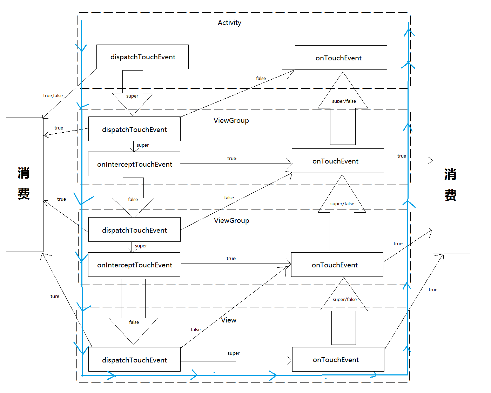

#### 前言

对于Android屏幕的事件分发，中高级的Android开发人员应该会时常的提起，因为了解了事件分发之后，我们可以处理一些事件冲突，自定义一些触摸反馈。 其实事件分发机制并不难理解，开发中ontouchevent中的逻辑处理才是核心。

<!--more-->

事件的传递流程一张图就可以说明， 

手指在触摸屏幕的时候会产生事件流  action_down -> (... action_move ...) ->activon_up

总之系统将事件向子view传递， 直至找到处理事件的view，每个view通过dispatchtouchevent来告知父view我是否处理这个事件，如果down事件都不进行消费，后续的事件将不会传递过来, 可以理解， 在做事件判断的时候，首先就要捕获down事件记录起始位置，或者记录被点击的时刻。 如果你是父view，还需要在onintercepttouchevent中进行拦截的判断， 通常down事件不应该拦截， 询问子view是否需要事件处理，可以在onintercepttouchevent方法中添加拦截事件的条件， 判断成功，交由自己的ontouchevent来处理。 比如说做一个滑动的列表， 点击事件需要交由子view来处理， 手指在y轴滑动一定距离，拦截事件进行滚动。

**问题？**

listview中的子view如果有长按事件是否会出现事件的冲突？又滑动又触发                                                                                                          了子view的长按

查看源码得知， listview进入滑动状态时会调用item的 view.setPressed(false);

这样子view就会取消长按事件的判断了

**总结**

理解事件分发流程不难， 看看源码， 看看事件是如何传递的便可， 中心思想也就是找到处理事件的view，理解了之后， 对于事件的触摸反馈逻辑处理才是难点核心点。
