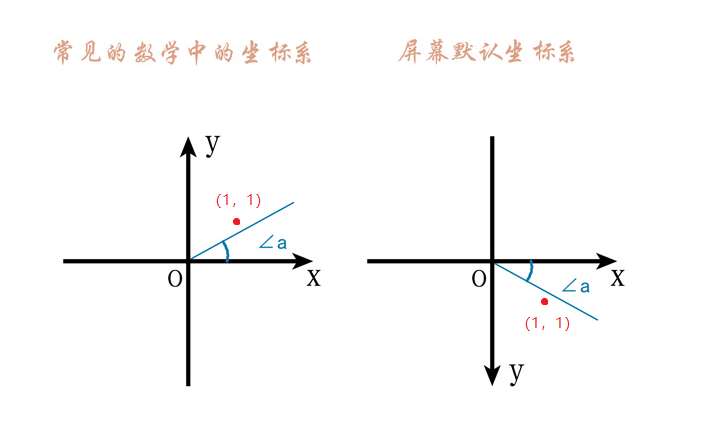
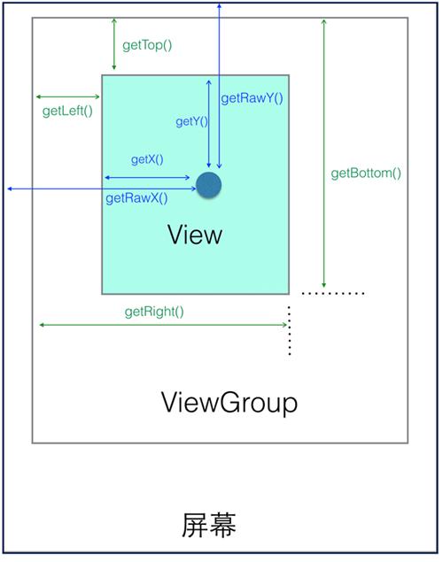

#### 前言

坐标系的应用主要在二维平面确定一个点的位置，android中的坐标系与传统数学中的坐标系有所不同，Y轴方向相反，如果所示，坐标（1，1）的区别.

<!--more-->



#### 定位

**绝对定位：** 相对于屏幕的位置

**相对定位：** 相对于控件的位置

**涉及方法：**

```java
//MotionEvent

 event.getRawX();    //触摸点相对于屏幕默认坐标系的坐标
 event.getRawY();

 event.getX();       //触摸点相对于其所在组件坐标系的坐标
 event.getY();
```


