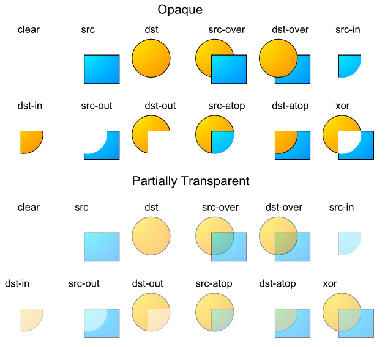

#### 前言

简要介绍安卓中的颜色相关内容，包括颜色的定义，创建颜色的几种方式，以及颜色的混合模式等

<!--more-->

#### 颜色模式

| 颜色模式     | 说明              |
|:-------- | --------------- |
| ARGB8888 | 四通道高精度(32位)     |
| ARGB4444 | 四通道低精度(16位)     |
| RGB565   | **屏幕默认模式**(16位) |
| Alpha8   | 仅有透明通道(8位)      |

#### 颜色定义

| 类型       | 解释  | 0(0x00) | 255(0xff) |
|:-------- |:--- |:------- |:--------- |
| A(Alpha) | 透明度 | 透明      | 不透明       |
| R(Red)   | 红色  | 无色      | 红色        |
| G(Green) | 绿色  | 无色      | 绿色        |
| B(Blue)  | 蓝色  | 无色      | 蓝色        |

#### 取值范围

A从0x00到0xff表示从透明到不透明。

RGB 从0x00到0xff表示颜色从浅到深。

**当RGB全取最小值(0或0x000000)时颜色为黑色，全取最大值(255或0xffffff)时颜色为白色**

#### 创建及使用

**1.java中定义颜色**

```java
  int color = Color.GRAY;     //灰色
```

由于Color类提供的颜色仅为有限的几个，通常还是用ARGB值进行表示。

```java
  int color = Color.argb(127, 255, 0, 0);   //半透明红色
  int color = 0xaaff0000;                   //带有透明度的红色
```

**2.在xml文件中定义颜色**

在/res/values/color.xml 文件中如下定义：

```xml
<?xml version="1.0" encoding="utf-8"?>  
<resources>    
    <color name="red">#ff0000</color>    
    <color name="green">#00ff00</color>
</resources>
```

**详解：** 在以上xml文件中定义了两个颜色，红色和蓝色，是没有alpha（透明）通道的。

定义颜色以‘#’开头，后面跟十六进制的值，有如下几种定义方式：

```java
  #f00            //低精度 - 不带透明通道红色
  #af00           //低精度 - 带透明通道红色
  #ff0000         //高精度 - 不带透明通道红色
  #aaff0000       //高精度 - 带透明通道红色
```

**3.在java文件中引用xml中定义的颜色：**

```java
  int color = getResources().getColor(R.color.mycolor);    
  int color = getColor(R.color.myColor);    //API 23 及以上支持该方法
```

**4.在xml文件(layout或style)中引用或者创建颜色**

```xml
<!--在style文件中引用-->
<style name="AppTheme" parent="Theme.AppCompat.Light.DarkActionBar">
    <item name="colorPrimary">@color/red</item>    
</style>
```

```java
android:background="@color/red"   //引用在/res/values/color.xml 中定义的颜色
android:background="#ff0000"      //创建并使用颜色
```

#### 颜色混合模式

因为我们的显示屏是没法透明的，因此最终显示在屏幕上的颜色里可以认为没有Alpha通道。Alpha通道主要在两个图像混合的时候生效。

默认情况下，当一个颜色绘制到Canvas上时的混合模式是这样计算的：

> **(RGB通道) 最终颜色 = 绘制的颜色 + (1 - 绘制颜色的透明度) × Canvas上的原有颜色。**

**注意：**

1.这里我们一般把每个通道的取值从0(0x00)到255(0xff)映射到0到1的浮点数表示。

2.这里等式右边的“绘制的颜色"、“Canvas上的原有颜色”都是经过预乘了自己的Alpha通道的值。如绘制颜色：0x88ffffff，那么参与运算时的每个颜色通道的值不是1.0，而是(1.0 * 0.5333 = 0.5333)。 (其中0.5333 = 0x88/0xff)

使用这种方式的混合，就会造成后绘制的内容以半透明的方式叠在上面的视觉效果。

还有不同的混合模式供我们选择，用Paint.setXfermode，指定不同的PorterDuff.Mode。

下表是各个PorterDuff模式的混合计算公式:

(D指原本在Canvas上的内容dst, S指绘制输入的内容src, a指alpha通道, c指RGB各个通道)

| 混合模式     | 计算公式                                                       |
| -------- | ---------------------------------------------------------- |
| ADD      | Saturate(S + D)                                            |
| CLEAR    | [0, 0]                                                     |
| DARKEN   | [Sa + Da - Sa*Da, Sc*(1 - Da) + Dc*(1 - Sa) + min(Sc, Dc)] |
| DST      | [Da, Dc]                                                   |
| DST_ATOP | [Sa, Sa * Dc + Sc * (1 - Da)]                              |
| DST_IN   | [Sa * Da, Sa * Dc]                                         |
| DST_OUT  | [Da * (1 - Sa), Dc * (1 - Sa)]                             |
| DST_OVER | [Sa + (1 - Sa)*Da, Rc = Dc + (1 - Da)*Sc]                  |
| LIGHTEN  | [Sa + Da - Sa*Da, Sc*(1 - Da) + Dc*(1 - Sa) + max(Sc, Dc)] |
| MULTIPLY | [Sa * Da, Sc * Dc]                                         |
| SCREEN   | [Sa + Da - Sa * Da, Sc + Dc - Sc * Dc]                     |
| SRC      | [Sa, Sc]                                                   |
| SRC_ATOP | [Da, Sc * Da + (1 - Sa) * Dc]                              |
| SRC_IN   | [Sa * Da, Sc * Da]                                         |
| SRC_OUT  | [Sa * (1 - Da), Sc * (1 - Da)]                             |
| SRC_OVER | [Sa + (1 - Sa)*Da, Rc = Sc + (1 - Sa)*Dc]                  |
| XOR      | [Sa + Da - 2 * Sa * Da, Sc * (1 - Da) + (1 - Sa) * Dc]     |

用示例图来查看使用不同模式时的混合效果如下

(src表示输入的图，dst表示原Canvas上的内容):


