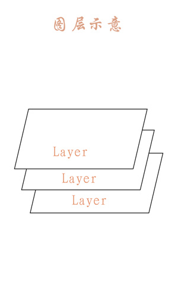

#### 前言

绘制最主要的两个点就是Canvas和Paint了,  画布和画笔. 画是画在画布上的，所以画什么内容的方法封装在了canvas中，颜色空心实心等属性是属于笔的，所以封装在了Paint中.

<!--more-->

#### Canvas的常用操作速查表

| 操作类型       | 相关API                                                                                              | 备注                                                              |
| ---------- | -------------------------------------------------------------------------------------------------- | --------------------------------------------------------------- |
| 绘制颜色       | drawColor, drawRGB, drawARGB                                                                       | 使用单一颜色填充整个画布                                                    |
| 绘制基本形状     | drawPoint, drawPoints, drawLine, drawLines, drawRect, drawRoundRect, drawOval, drawCircle, drawArc | 依次为 点、线、矩形、圆角矩形、椭圆、圆、圆弧                                         |
| 绘制图片       | drawBitmap, drawPicture                                                                            | 绘制位图和图片                                                         |
| 绘制文本       | drawText, drawPosText, drawTextOnPath                                                              | 依次为 绘制文字、绘制文字时指定每个文字位置、根据路径绘制文字                                 |
| 绘制路径       | drawPath                                                                                           | 绘制路径，绘制贝塞尔曲线时也需要用到该函数                                           |
| 顶点操作       | drawVertices, drawBitmapMesh                                                                       | 通过对顶点操作可以使图像形变，drawVertices直接对画布作用、 drawBitmapMesh只对绘制的Bitmap作用 |
| 画布剪裁       | clipPath, clipRect                                                                                 | 设置画布的显示区域                                                       |
| 画布快照       | save, restore, saveLayerXxx, restoreToCount, getSaveCount                                          | 依次为 保存当前状态、 回滚到上一次保存的状态、 保存图层状态、 回滚到指定状态、 获取保存次数                |
| 画布变换       | translate, scale, rotate, skew                                                                     | 依次为 位移、缩放、 旋转、错切                                                |
| Matrix(矩阵) | getMatrix, setMatrix, concat                                                                       | 实际画布的位移，缩放等操作的都是图像矩阵Matrix，只不过Matrix比较难以理解和使用，故封装了一些常用的方法。      |

#### 绘制基本形

```java
canvas.drawxxx //即可在画布上画上你想要的内容
```

#### 画布变换

##### translate

```java
 canvas.translate(200,200); //向x轴 y轴方向 移动200
```

多次调用效果叠加

##### scale

两个方法：

```java
 public void scale (float sx, float sy)

 public final void scale (float sx, float sy, float px, float py)
```

这两个方法中前两个参数是相同的分别为x轴和y轴的缩放比例。而第二种方法比前一种多了两个参数，用来控制缩放中心位置的。

缩放比例(sx,sy)取值范围详解：

| 取值范围(n)  | 说明                         |
| -------- | -------------------------- |
| (-∞, -1) | 先根据缩放中心放大n倍，再根据中心轴进行翻转     |
| -1       | 根据缩放中心轴进行翻转                |
| (-1, 0)  | 先根据缩放中心缩小到n，再根据中心轴进行翻转     |
| 0        | 不会显示，若sx为0，则宽度为0，不会显示，sy同理 |
| (0, 1)   | 根据缩放中心缩小到n                 |
| 1        | 没有变化                       |
| (1, +∞)  | 根据缩放中心放大n倍                 |

**缩放的中心默认为坐标原点,而缩放中心轴就是坐标轴**

示例

```java
 canvas.scale(0.5f,0.5f);   // 以坐标原点进行画布缩放
 canvas.scale(0.5f,0.5f,200,0); // 画布缩放  <-- 缩放中心向右偏移了200个单位
```

多次调用效果叠加

##### rotate

两个方法：

```java
 public void rotate (float degrees)

 public final void rotate (float degrees, float px, float py)
```

和缩放一样，第二种方法多出来的两个参数依旧是控制旋转中心点的

```java
canvas.rotate(180);              // 旋转180度 <-- 默认旋转中心为原点

canvas.rotate(180,200,0);        // 旋转180度 <-- 旋转中心向右偏移200个单位
```

多次调用效果叠加

##### skew

skew这里翻译为错切，错切是特殊类型的线性变换

```java
  public void skew (float sx, float sy)
```

**参数含义：**
float sx:将画布在x方向上倾斜相应的角度，sx倾斜角度的tan值
float sy:将画布在y轴方向上倾斜相应的角度，sy为倾斜角度的tan值

```java
    canvas.skew(1,0);                       // 水平错切 45
    canvas.skew(0,1);                       // 垂直错切 45
```

**错切也是可叠加的，不过请注意，调用次序不同绘制结果也会不同**

##### 快照(save)和回滚(restore)

画布的操作是不可逆的，而且很多画布操作会影响后续的步骤，例如第一个例子，两个圆形都是在坐标原点绘制的，而因为坐标系的移动绘制出来的实际位置不同。所以会对画布的一些状态进行保存和回滚

| 相关API          | 简介                             |
| -------------- | ------------------------------ |
| save           | 把当前的画布的状态进行保存，然后放入特定的栈中        |
| saveLayerXxx   | 新建一个图层，并放入特定的栈中                |
| restore        | 把栈中最顶层的画布状态取出来，并按照这个状态恢复当前的画布  |
| restoreToCount | 弹出指定位置及其以上所有的状态，并按照指定位置的状态进行恢复 |
| getSaveCount   | 获取栈中内容的数量(即保存次数)               |

状态压栈：

save就是把画布状态保存起来，放入栈中


这个栈可以存储画布状态和图层状态，如果会ps的同学相信对于图层这个概念很熟悉



我们之前讲解的绘制操作和画布操作都是在默认图层上进行的，在通常情况下，使用默认图层就可满足需求，但是如果需要绘制比较复杂的内容，如地图(地图可以有多个地图层叠加而成，比如：政区层，道路层，兴趣点层)等，则分图层绘制比较好一些。
你可以把这些图层看做是一层一层的玻璃板，你在每层的玻璃板上绘制内容，然后把这些玻璃板叠在一起看就是最终效果。

###### save

save 有两种方法：

```java
  // 保存全部状态
  public int save ()    // 根据saveFlags参数保存一部分状态
  public int save (int saveFlags)
```

可以看到第二种方法比第一种多了一个saveFlags参数，使用这个参数可以只保存一部分状态，更加灵活，这个saveFlags参数具体可参考上面表格中的内容。

每调用一次save方法，都会在栈顶添加一条状态信息，以上面状态栈图片为例，再调用一次save则会在第5次上面载添加一条状态。

###### saveLayerXxx

saveLayerXxx有比较多的方法：

```java
// 无图层alpha(不透明度)通道
public int saveLayer (RectF bounds, Paint paint)
public int saveLayer (RectF bounds, Paint paint, int saveFlags)
public int saveLayer (float left, float top, float right, float bottom, Paint paint)
public int saveLayer (float left, float top, float right, float bottom, Paint paint, int saveFlags)

// 有图层alpha(不透明度)通道
public int saveLayerAlpha (RectF bounds, int alpha)
public int saveLayerAlpha (RectF bounds, int alpha, int saveFlags)
public int saveLayerAlpha (float left, float top, float right, float bottom, int alpha)
public int saveLayerAlpha (float left, float top, float right, float bottom, int alpha, int saveFlags)
```

**注意：** saveLayerXxx方法会让你花费更多的时间去渲染图像(图层多了相互之间叠加会导致计算量成倍增长)，使用前请谨慎，如果可能，尽量避免使用。

使用saveLayerXxx方法，也会将图层状态也放入状态栈中，同样使用restore方法进行恢复。

###### restore

状态回滚，就是从栈顶取出一个状态然后根据内容进行恢复。

同样以上面状态栈图片为例，调用一次restore方法则将状态栈中第5次取出，根据里面保存的状态进行状态恢复。

###### restoreToCount

弹出指定位置以及以上所有状态，并根据指定位置状态进行恢复。

以上面状态栈图片为例，如果调用restoreToCount(2) 则会弹出 2 3 4 5 的状态，并根据第2次保存的状态进行恢复。

###### getSaveCount

获取保存的次数，即状态栈中保存状态的数量，以上面状态栈图片为例，使用该函数的返回值为5。

不过请注意，该函数的最小返回值为1，即使弹出了所有的状态，返回值依旧为1，代表默认状态。

###### 常用格式

虽然关于状态的保存和回滚啰嗦了不少，不过大多数情况下只需要记住下面的步骤就可以了：

```java
   save();      //保存状态
   ...          //具体操作
   restore();   //回滚到之前的状态
```

这种方式也是最简单和最容易理解的使用方法。


