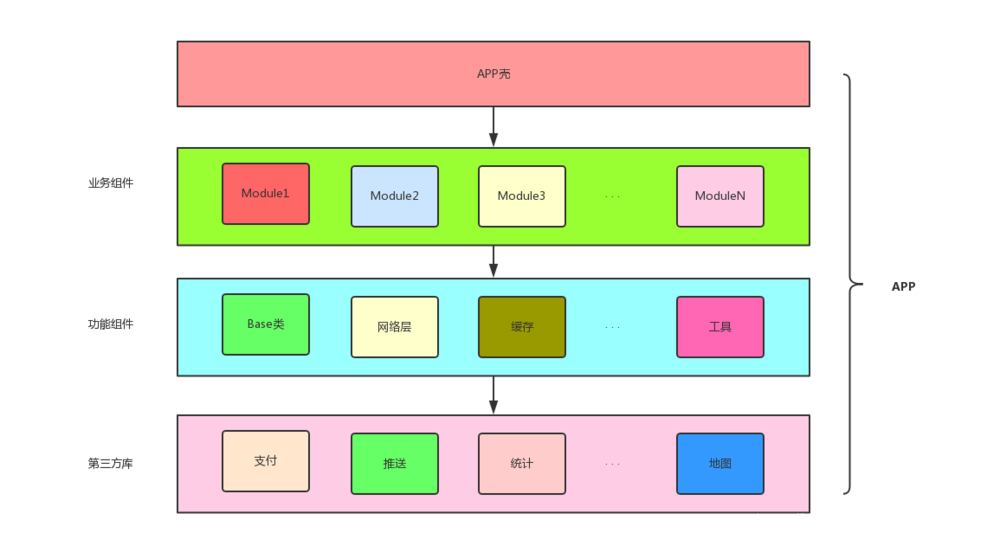

#### 前言

目前项目结构的优化方案组件化和插件化非常常见，本篇博客主要介绍一下组件化实现思路.

<!-- more-->

#### 模块化

比较早的时候，大部分的项目结构都是通过模块话实现的，要聊组件化，惯例是要谈谈模块化的，毕竟它与组件化确实有一些相同点，在组件化的项目中它也会与组件化发生关联。

##### 什么是模块化

模块化开发，是每个开发者都熟悉的。就是将常用的UI、网络请求、数据库操作、第三方库的使用等公共部分抽离封装成基础模块，或者将大的业务上拆分为多个小的业务模块，这些业务模块又依赖于公共基础模块的开发方式。 更宏观上，又会将这些不同的模块组合为一个整体，打包成一个完成的项目。

##### 模块化的好处

**复用**
首先，基础模块，可为业务模块所复用；
其次，子业务模块，可为父业务模块，甚至不同的项目所复用。

**解耦**
降低模块间的耦合，避免出现一处代码修改，牵一发而动全身的尴尬局面。

**协同开发**
项目越来越大，团队人数越来越多，模块化开发可在尽量解耦的情况下，使不同的开发人员专注于自己负责的业务，同步开发，显著提供开发效率。
……

##### 模块化的弊端

任凭模块化做得多么好，还是跳不出组合在单一项目下的范围，项目规模越来越大，业务模块越来越多，团队人数越来越多，模块化开发渐渐出现了以下的问题：

1.项目代码量越来越大，每次的编译速度越来越慢，哪怕几句代码的修改，都需要等待若干分钟等待编译运行查看执行结果，极大的降低了开发效率；

2.业务模块越来越多，不可避免地产生越来越多且复杂的耦合，哪怕一次小的功能更新，也需要对修改代码耦合的模块进行充分测试；

3.团队人数越来越多，却要求开发人员了解与之业务相关的每一个业务模块，防止出现此开发人员修改代码导致其他模块出现bug的情况，这个要求对于开发人员显然是不友好的；
……

#### 组件化

组件化可以说是Android中级开发工程师必备技能了，能有效解决许多单一项目下开发出现的问题。并且我要强调的是，组件化真的不难，还没搞过的小伙伴不要怂。

##### 什么是组件化

 组件，顾名思义，组装的零件，术语上叫做软件单元，可用于组装在应用程序中。 从这个角度上看，组件化，要更关注可复用性、更注重关注点分离、功能单一、高内聚、粒度更小、是业务上能划分的最小单元，毕竟是“组装的零件”嘛！

##### 组件化的好处

模块化的优点， 组件化也都具备，并且组件化也避免了模块化的弊端，具体如下：

1.组件，既可以作为library，又可以单独作为application，便于单独编译单独测试，大大的提高了编译和开发效率；

2.（业务）组件，可有自己独立的版本，业务线互不干扰，可单独编译、测试、打包、部署
各业务线共有的公共模块开发为组件，作为依赖库供各业务线调用，减少重复代码编写，减少冗余，便于维护

3.通过gradle配置文件，可对第三方库的引入进行统一管理，避免版本冲突，减少冗余库

4.通过gradle配置文件，可对各组件实现library与application间便捷切换，实现项目的按需加载

直白点说，每个组件都是高内聚低耦合，单一职责，可单独运行也可统一管理。提高了代码的复用 维护和开发效率。 后续详细讲解架构方式，以及配置方式，资源冲突的的问题。

#### 组件化实践

先来一张架构图



其中的“业务组件”，既可以单独打包为apk，又可以作为library按需组合为综合一些的应用程序。

##### 统一配置

项目结构

> app                                    //app壳
> ModuleA                             //业务模块A
> ModuleB                            //业务模块B
> 
> ModuleFunction               //功能模块
> ModuleCommon              //公用模块 第三方库

**版本统一**

Project下创建config.gradle

```groovy
ext {

    /**
     * module开关统一声明在此处
     * true：module作为application，可单独打包为apk
     * false：module作为library，可作为宿主application的组件
     */
    isModuleA = false
    isModuleB = false


   /**
     * 版本统一
     */
    versions = [
            applicationId           : "com.xxx.xxx",        //应用ID
            versionCode             : 1,                    //版本号
            versionName             : "1.0",                //版本名称

            compileSdkVersion       : 28,
            minSdkVersion           : 21,
            targetSdkVersion        : 28,

            androidSupportSdkVersion: "28.0.0",
            constraintlayoutVersion : "1.1.3",

    ]

    /*
    * 依赖统一
    */

    dependencies = [
    "appcompat" : "androidx.appcompat:appcompat:${versions["appcompatVersion"]}",
    "constraintlayout" : "androidx.constraintlayout:constraintlayout:${versions["constraintlayoutVersion"]}"
    ]

}
```

Project的build.gradle中引入config.gradle文件

```groovy
apply from: "config.gradle"
```

这样在主工程环境中就统一好我们的版本以及三方依赖了，还需在Model中引用主工程配置

**ModuleCommon**

Module 的build.gradle

```groovy
dependencies {
    // 在项目中的libs中的所有的.jar结尾的文件，都是依赖
    implementation fileTree(dir: 'libs', include: ['*.jar'])

    //把implementation 用api代替,它是对外部公开的, 所有其他的module就不需要添加该依赖
    api rootProject.ext.dependencies["appcompat"]
    api rootProject.ext.dependencies["constraintlayout"]
   }
```

**ModuleA/ModuleB**

```groovy
if (Boolean.valueOf(rootProject.ext.isModule_North)) {
    apply plugin: 'com.android.application'
} else {
    apply plugin: 'com.android.library'
}
apply plugin: 'com.jakewharton.butterknife'

……

dependencies {
    implementation fileTree(dir: 'libs', include: ['*.jar'])

    //公用依赖库
    implementation project(':ModuleCommon')
    //公用功能
    implementation project(':ModuleFunction')

}
```

这样就搭建好了一个组件化开发的项目结构

#### 问题

**Application**

CommonFunction中创建一个BaseApplication, 上层业务组件在组件化模式下，均需继承于BaseAppliaction

```java
public class BaseApplication extends Application {

    //全局唯一的context
    private static BaseApplication application;

    @Override
    protected void attachBaseContext(Context base) {
        super.attachBaseContext(base);
        application = this;
    }

    public static BaseApplication getApplication() {
        return application;
    }
```

**applicationId**

可为不同组件设置不同的applicationId，也可缺省，在Android Studio中，默认的applicationId与包名一致。组件的applicationId在其build.gradle文件的defaultConfig中进行配置：

```groovy
if (Boolean.valueOf(rootProject.ext.isModule_North)) {
    //组件模式下设置applicationId
    applicationId "com.xxx.modulea"

}
```

**Manifest**

组件在集成模式和组件化模式下，需要配置不同的manifest文件，因为在组件化模式下，程序入口Activity和自定义的Application是不可或缺的。

在组件的build.gradle文件的android中进行manifest的管理：

```groovy
   /*
    * java插件引入了一个概念叫做SourceSets，通过修改SourceSets中的属性，
    * 可以指定哪些源文件（或文件夹下的源文件）要被编译，
    * 哪些源文件要被排除。
    * */
    sourceSets {
        main {
            if (Boolean.valueOf(rootProject.ext.isModuleA)) {//apk
                manifest.srcFile 'src/main/manifest/AndroidManifest.xml'
            } else {
                manifest.srcFile 'src/main/AndroidManifest.xml'
                java {
                    //library模式下，排除java/debug文件夹下的所有文件
                    exclude '*module'
                }
            }
        }
    }
```

**资源冲突**

资源名冲突问题，相信大家多多少少都遇到过，以前最常见的就是第三方SDK导致的资源名冲突了。这个问题没有特别好的解决办法，只能通过设置资源名前缀 resourcePrefix 以及约束自己开发习惯进行解决。

资源名前缀 resourcePrefix ，是在project的build.gradle中进行设置的：

```groovy
/**
 * 限定所有子类xml中的资源文件的前缀
 * 注意：图片资源，限定失效，需要手动添加前缀
 * */
subprojects {
    afterEvaluate {
        android {
            resourcePrefix "${project.name}_"
        }
    }
}
```

这样设置完之后，string、style、color、dimens等中资源名，必须以设置的字符串为前缀，而layout、drawable文件夹下的shape他们的xml文件的命名，必须以设置的字符串为前缀，否则会报错提示。

另外，资源前缀的设置对图片的命名无法限定，建议大家约束自己的开发习惯，自觉加上前缀。

建议：
将color、shape、style这些放在基础库组件中去，这些资源不会太多，且复用性极高，所有业务组件又都会依赖基础库组件。

**组件通讯**

业务组件间不存在依赖关系，不可以通过Intent进行显式跳转，是要借助于路由的，详细了解ARouter。
