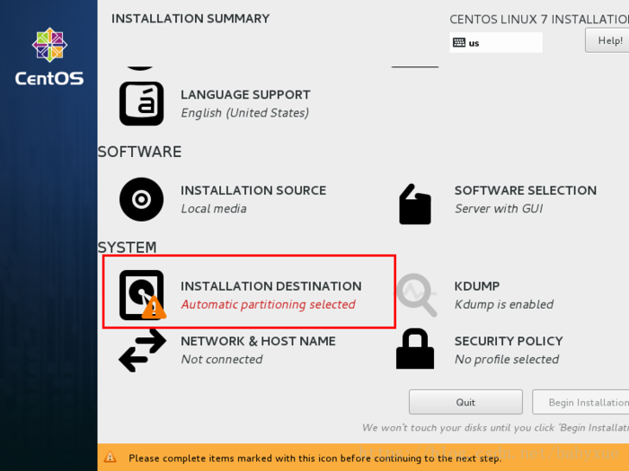

### Centos7下载

官网下载地址：[https://www.centos.org/](https://www.centos.org/)

<!--more-->

### Centos7安装

虚拟机以及Centos6的安装流程在上一篇博客有介绍，本篇直接讲述7的安装流程

#### 选择语言

#### 选择时区

#### 选择预装软件

图像化界面

#### 分区

分三个区即可 “/”  “/boot” “/swap”

#### 网络设置

#### 设置root用户

#### 添加普通用户

完成！
