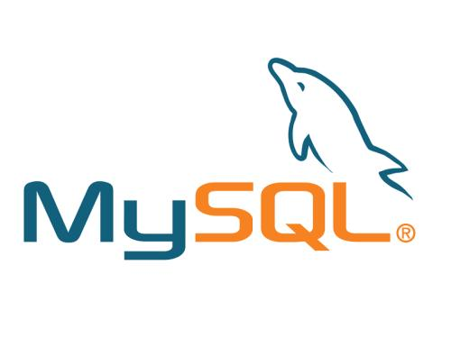

<!--more-->

### 官方教程：

[https://dev.mysql.com/doc/mysql-yum-repo-quick-guide/en/](https://dev.mysql.com/doc/mysql-yum-repo-quick-guide/en/)

### Mysql官方程序包地址：

[https://repo.mysql.com/yum/](https://repo.mysql.com/yum/)

### 下载rpm程序包

(不同的版本可以去上面的程序包的库里找)

```bash
wget http://dev.mysql.com/get/mysql-community-release-el7-5.noarch.rpm
```

### 安装程序包

```bash
 rpm -ivh mysql-community-release-el7-5.noarch.rpm
```

### 安装mysql

```bash
yum -y install mysql mysql-server mysql-devel
```

### 启动服务

```
service mysqld start
```

### 连接数据库

查看临时root密码

```bash
cat /var/log/mysqld.log | grep 'temporary password'
```

```bash
mysql -u root -p  #回车 密码  
```

### 初始化数据库root密码

```bash
#选择数据库
use mysql 

#修改root用户密码：

#5.7版本之前
update user set password=password('root') where user='root';

#5.7及以后版本
update user set authentication_string=password('root') where user='root';

#刷新权限
flush privileges;

#退出
quit;
```

至此安装完成！

### 卸载

停止服务

```bash
systemctl stop mysqld.service
```

查看已安装软件

```bash
yum list installed | grep mysql
```

卸载安装软件 根据上一步列出的安装软件进行卸载

```
yum remove mysql-community-client mysql-community-common mysql-community-server mysql-community-libs mysql-community-libs-compat
```

查看残留文件

```
whereis mysql
#或
find / -name mysql

rm -rf xxx
```


