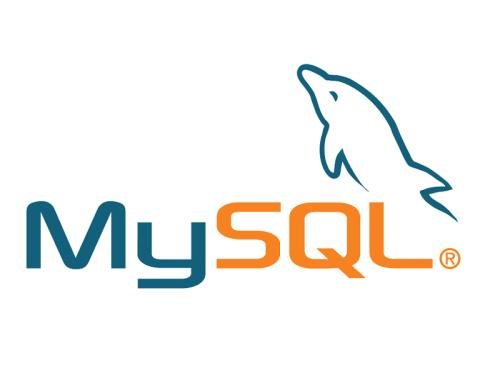

### 

<!--more-->

### 第一步：修改配置文件免密码登录mysql

1、进入文件：vi /etc/my.cnf

2、按i键表示可以编辑；添加skip-grant-tables；按esc键，输入:wq保存退出

3、重启mysql:

```bash
sudo service mysqld restart
```

### 第二步免密码登录mysql

1、登录：

```bash
mysql -u root -p
```

2、提示输入密码按回车进入

3、进入数据库，输入：

```sql
use mysql；
```

4、查看root用户信息：

```sql
select host, user, authentication_string, plugin from user;
```

5、更新root用户信息，把密码设置为空字符串：

```sql
update user set authentication_string='' where user='root';
```

### 第三步、退出mysql；

注释掉/etc/my.cnf文件最后的 skip-grant-tables ；

重启：

```bash
sudo service mysqld restart
```

### 第四步：设置新密码

1、重新开启一个客户端；

2、登录mysql(这时候还是不用输入密码，因为上面已经把密码设置为空字符串了);

3、修改root用户密码:

```sql
ALTER user 'root'@'%' IDENTIFIED BY '123456';
```

4、退出mysql后就可以用密码登录了
