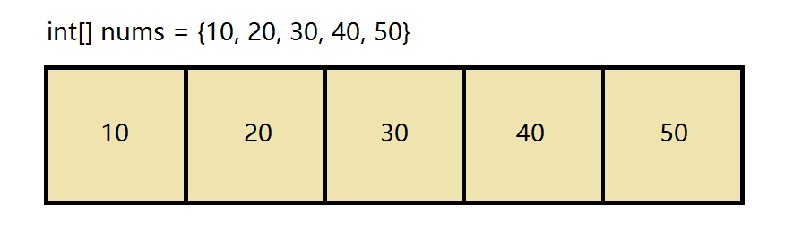
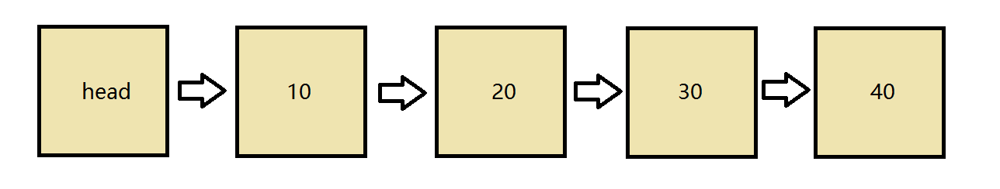
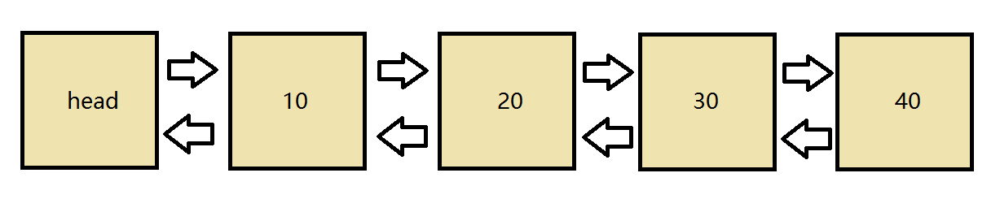
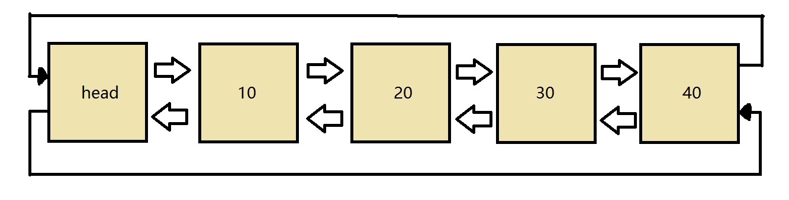
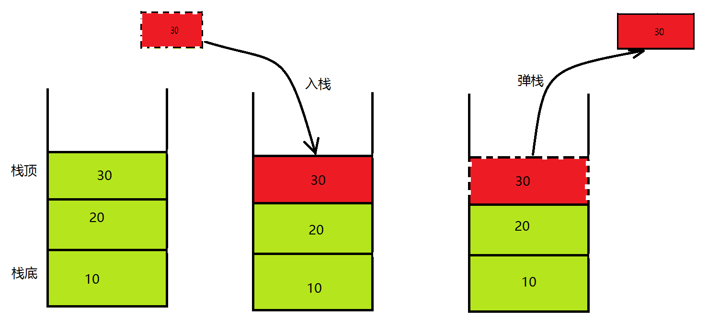
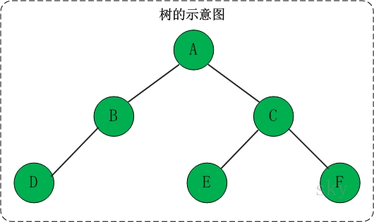
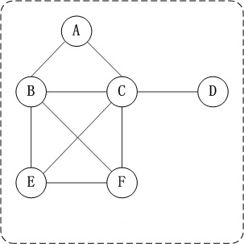
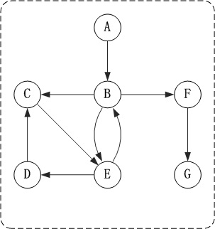

#### 前言

数据在存储设备中的组织形式。
在开发过程中针对不同的业务逻辑以及数据特典选择更高效的数据结构
本文只是进行概念性简述, 未避免篇幅过长没有进行更深层的表述.

<!--more-->

#### 数组

内存空间中连续的内存地址, 查找快, 增删慢(需要内存移动).

#### 单向链表

以头Node开始, 每个Node指向下一个Node. 查询慢, 增删快(只需要修改指针)

#### 双向链表

与单向链表不同, 两个元素键互相持有对方内存地址的指针. 查询慢, 增删快(只需要修改指针)

#### 循环列表

与双向列表不同, 头尾之间也会相互持有指针. 查询慢, 增删快(只需要修改指针)

#### 栈 stack

(01) 栈中数据是按照”后进先出（LIFO, Last In First Out）”方式进出栈的。
(02) 向栈中添加/删除数据时，只能从栈顶进行操作。

#### 队列

(1) 队列中数据是按照”先进先出（FIFO, First-In-First-Out）”方式进出队列的。
(2) 队列只允许在”队首”进行删除操作，而在”队尾”进行插入操作。 队列通常包括的两种操作：入队列 和 出队列。

#### 树

是由n（n>=1）个有限节点组成一个具有层次关系的集合。

把它叫做“树”是因为它看起来像一棵倒挂的树，也就是说它是根朝上，而叶朝下的。它具有以下的特点：
(01) 每个节点有零个或多个子节点；
(02) 没有父节点的节点称为根节点；
(03) 每一个非根节点有且只有一个父节点；
(04) 除了根节点外，每个子节点可以分为多个不相交的子树。

##### 术语:

结点的度：结点拥有的子树的数目。
叶子：度为零的结点。
分支结点：度不为零的结点。
树的度：树中结点的最大的度。
层次：根结点的层次为1，其余结点的层次等于该结点的双亲结点的层次加1。
树的高度：树中结点的最大层次。
无序树：如果树中结点的各子树之间的次序是不重要的，可以交换位置。
有序树：如果树中结点的各子树之间的次序是重要的, 不可以交换位置。
森林：0个或多个不相交的树组成。对森林加上一个根，森林即成为树；删去根，树即成为森林。
种类: 满二叉树, 完全二叉树, 平衡树, 红黑树, b树, avl树, 哈夫曼树

#### 图

图(graph)是由一些点(vertex)和这些点之间的连线(edge)所组成的；其中，点通常被成为”顶点(vertex)”，而点与点之间的连线则被成为”边或弧”(edege)。通常记为，G=(V,E)。
无向图

##### 有向图

路径：如果顶点(Vm)到顶点(Vn)之间存在一个顶点序列。则表示Vm到Vn是一条路径。
路径长度：路径中”边的数量”。
简单路径：若一条路径上顶点不重复出现，则是简单路径。
回路：若路径的第一个顶点和最后一个顶点相同，则是回路。
简单回路：第一个顶点和最后一个顶点相同，其它各顶点都不重复的回路则是简单回路。

#### 散列数组(hash表)

哈希表就是一种以 键-值(key-indexed) 存储数据的结构，我们只要输入待查找的值即key，即可查找到其对应的值。
哈希的思路很简单，如果所有的键都是整数，那么就可以使用一个简单的无序数组来实现：将键作为索引，值即为其对应的值，这样就可以快速访问任意键的值。这是对于简单的键的情况，我们将其扩展到可以处理更加复杂的类型的键。

##### 使用哈希查找有两个步骤:

使用哈希函数将被查找的键转换为数组的索引。在理想的情况下，不同的键会被转换为不同的索引值，但是在有些情况下我们需要处理多个键被哈希到同一个索引值的情况。所以哈希查找的第二个步骤就是处理冲突
处理哈希碰撞冲突。有很多处理哈希碰撞冲突的方法，本文后面会介绍拉链法和线性探测法。
哈希表是一个在时间和空间上做出权衡的经典例子。如果没有内存限制，那么可以直接将键作为数组的索引。那么所有的查找时间复杂度为O(1)；如果没有时间限制，那么我们可以使用无序数组并进行顺序查找，这样只需要很少的内存。哈希表使用了适度的时间和空间来在这两个极端之间找到了平衡。只需要调整哈希函数算法即可在时间和空间上做出取舍。
