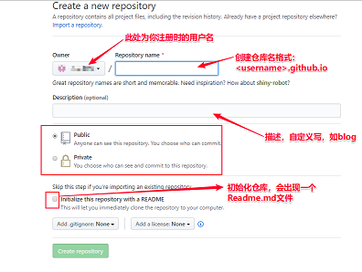
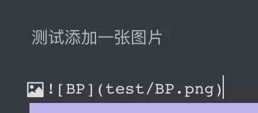

## 前言:

之前都是用Wordpress搭建Blog, 需要自己购买域名服务器, 服务器和域名每年花钱不说, 而且如果想要迁移的话, 资源的管理也比较烦. 发现Hexo之后, 感觉这种静态页面的方式真的爽的一匹, 有点一处编写处处上传的感觉, 本地Markdown软件写blog, 通过Hexo编译静态页面, 然后上传到服务器就可以了. 使用GithubPage或者码云Page, 不用花钱, 而且用Git管理, 舒服!!! 本篇博客记录一下我搭建的流程, 也方便别人了解

<!--more-->

## 基本搭建(win10):

### 1.安装Node.js

官网: [https://nodejs.org/en/download/](https://nodejs.org/en/download/)

### 2.安装Git

官网:[https://git-scm.com/](https://git-scm.com/)

### 3.GitHub上创建库

名称位<用户名>.github.io的库



大概几分钟之后就可以通过<username>.github.io访问了

### 4.安装Hexo

 创建一个文件夹用来存放博客文件, 通过GitBashHere执行

```shell
 #安装Hexo框架 npm是node.js包管理工具
 npm install -g hexo-cli 
 #初始化Hexo
 hexo init <文件夹路径>
 cd <文件夹路径>
 #安装博客所需依赖, 依赖配置文件可以查看package.json
 npm install 

 hexo g #编译静态文件

 hexo s #开启服务器 地址 localhost:4000
```

### 5.搭建完成

如果你可以在本地进行访问了, 恭喜你环境搭建完成, 接下来只需要通过Git, push /public文件夹内容到第3步创建的库中, 便可通过Githubpages来查看你的blog了. 

## 主题

官方theme地址:[https://hexo.io/themes/](https://hexo.io/themes/)

### 主题使用流程

1.下载主题到themes文件夹

2.修改博客_config.yml 中的 theme:

推荐Next主题[https://github.com/theme-next/hexo-theme-next](https://github.com/theme-next/hexo-theme-next)

可以在主题内的_config.yml中进行一些自定义的配置

### Next主题推荐

#### 1.搜索功能

1.安装依赖

```undefined
npm install hexo-generator-searchdb --save
```

2.在根目录下的/theme/next/_config.yml文件中添加配置：

```bash
search:  
path: search.xml  
field: post  
format: html  
limit: 10000
```

3.在根目录下的/theme/next/_config.yml文件中搜索local_search，将enable改为true：

```bash
local_search:  
    enable: true
```

#### 2.About/Categories/About

主题文件下的_config.yml

```ruby
menu:
  home: / || home  
  about: /about/ || user  
  archives: /archives/ || archive  
  tags: /tags/ || tags  
  categories: /categories/ || th  
  schedule: /schedule/ || calendar  
  sitemap: /sitemap.xml || sitemap 
  # commonweal: /404/ || heartbeat
```

需要什么开启什么, 然后文章中需要指定tag 和 category

```css
title: 利用GitHub和HEXO免费搭建个人博客
date: 2019-01-29 22:58:56
tags: [hexo建站,hexo部署,github部署,个人博客]      #添加的标签
categories: hexo博客                              #添加的分类
```

#### 3.上传图片

1、cd到博客根目录下 查看_config.yml文件 

查找 post_asset_folder 字段

确定post_asset_folder 设置为true

```css
 post_asset_folder:true
```

2、当您设置 post_asset_folder 参数后，在建立文件时，Hexo 会自动建立一个与文章同名的文件夹，您可以把与该文章相关的所有资源都放到此文件夹内，这样就可以更方便的使用资源。

3、到博客的根目录下执行 

```bash
npm install https://github.com/CodeFalling/hexo-asset-image --save
```

命令来进行插件的安装。

4、然后创建一文章 hexo new "test" 然后查看博客的 ../source/_posts 目录下的文件，会看到存在一个test 文件夹 和 test.md 文件

使用:



## 多端提交

中心思想，博客文件放置远程仓库hexo分支，静态页面放在远程仓库master分支

本地安装号node.js以及git， 就可以下载配置好的博客程序

### 本地博客文件推到远程仓库

添加 /.deploy_git, /public 到.gitignore文件末尾,一个一行

初始化本地仓库 

```bash
  git init
```

将本地仓库与远程仓库对接 

```bash
  git remote add origin 远程仓库
```

添加所有本地文件到git 

```bash
  git add .
```

注意:如果自己的主题是克隆下来的,先把主题下的.git文件夹和.gitignore文件删除,不然上传不上去

git提交 

```bash
  git commit -m "提交hexo配置文件"
```

新建分之并切换 

```bash
    git branch hexo
    git checkout hexo
```

push到Github项目的hexo分支上 

```bash
  git push origin hexo
```

## **Git覆盖远程提交**

我的hexo项目管理方式是, 程序推送到远程仓库的hexo分支, blog静态页面推到远程仓库的master分支,  有时多地上传或者更换theme导致冲突, 那就覆盖提交

```bash
    git push origin xxx --force
```

## 参考:

超级详细搭建教程

[https://cloud.tencent.com/developer/article/1577027](https://cloud.tencent.com/developer/article/1577027)

多端更新

[https://www.jianshu.com/p/1ae341483683](https://www.jianshu.com/p/1ae341483683)

分类/标签/关于

[https://blog.csdn.net/mqdxiaoxiao/article/details/93644533](https://blog.csdn.net/mqdxiaoxiao/article/details/93644533)

[https://www.jianshu.com/p/f138032e7539](https://www.jianshu.com/p/f138032e7539)

本地搜索

[https://www.jianshu.com/p/202c9e789c8f](https://www.jianshu.com/p/202c9e789c8f)

hexo博客 图片显示

[https://www.jianshu.com/p/8d28027fec76](https://www.jianshu.com/p/8d28027fec76)

git覆盖远程提交

[https://www.cnblogs.com/davidgu/p/9072493.html](https://www.cnblogs.com/davidgu/p/9072493.html)
