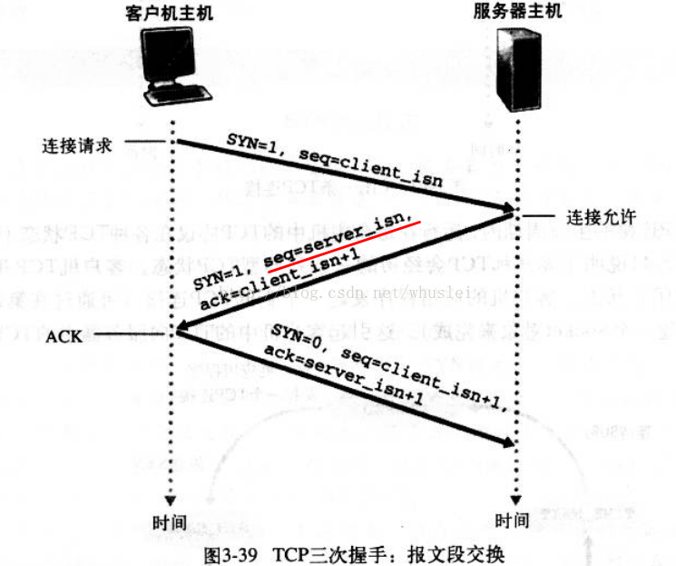
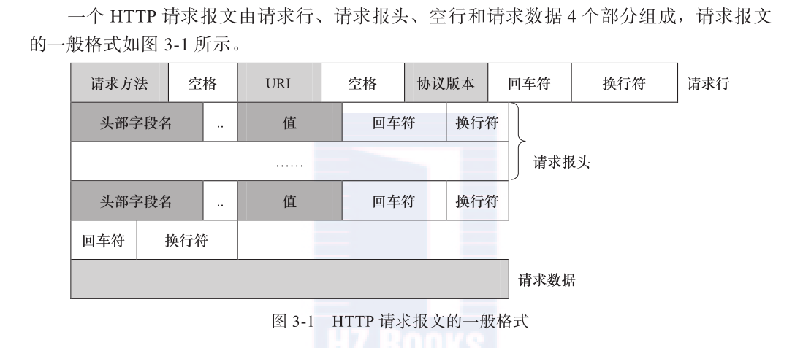
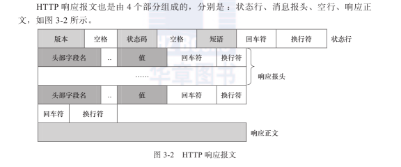
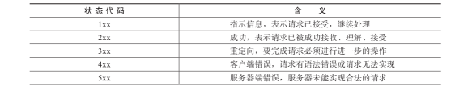
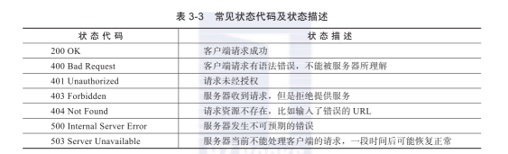

### http协议

#### 三次握手:

第一次握手：主机A发送位码为syn＝1,随机产生seq number=1234567的数据包到服务器，主机B由SYN=1知道，A要求建立联机； 
第二次握手：主机B收到请求后要确认联机信息，向A发送ack number=(主机A的seq+1),syn=1,ack=1,随机产生seq=7654321的包 
第三次握手：主机A收到后检查ack number是否正确，即第一次发送的seq number+1,以及位码ack是否为1，若正确，主机A会再发送ack number=(主机B的seq+1),ack=1，主机B收到后确认seq值与ack=1则连接建立成功。

<!--more-->

#### 请求报文

#### Http请求方法

HTTP/1.1协议中共定义了八种方法（有时也叫“动作”），来表明Request-URL指定的资源不同的操作方式

1. OPTIONS 
   返回服务器针对特定资源所支持的HTTP请求方法，也可以利用向web服务器发送‘*’的请求来测试服务器的功能性

2. HEAD 
   向服务器索与GET请求相一致的响应，只不过响应体将不会被返回。这一方法可以再不必传输整个响应内容的情况下，就可以获取包含在响应小消息头中的元信息。

3. GET 
   向特定的资源发出请求。注意：GET方法不应当被用于产生“副作用”的操作中，例如在Web Application中，其中一个原因是GET可能会被网络蜘蛛等随意访问。Loadrunner中对应get请求函数：web_link和web_url

4. POST 
   向指定资源提交数据进行处理请求（例如提交表单或者上传文件）。数据被包含在请求体中。POST请求可能会导致新的资源的建立和/或已有资源的修改。 Loadrunner中对应POST请求函数：web_submit_data,web_submit_form

5. PUT 
   向指定资源位置上传其最新内容

6. DELETE 
   请求服务器删除Request-URL所标识的资源

7. TRACE 
   回显服务器收到的请求，主要用于测试或诊断

8. CONNECT 
   HTTP/1.1协议中预留给能够将连接改为管道方式的代理服务器。

#### 响应报文

#### 常见状态码

### https协议

常基于TCP的连接方式 是HTTP的安全版, HTTPS是与SSL一起使用的, SSL逐渐演变到TLS

#### 与http差异

1、https协议需要到ca申请证书，一般免费证书很少，需要交费。 
2、http是超文本传输协议，信息是明文传输，https 则是具有安全性的ssl加密传输协议。 
3、http和https使用的是完全不同的连接方式，用的端口也不一样，前者是80，后者是443。 
4、http的连接很简单，是无状态的；HTTPS协议是由SSL+HTTP协议构建的可进行加密传输、身份认证的网络协议，比http协议安全。

#### 五次握手:

1 客户端发起一个https的请求，把自身支持的一系列Cipher Suite（密钥算法套件，简称Cipher）发送给服务端 
2 服务端，接收到客户端所有的Cipher后与自身支持的对比，如果不支持则连接断开，反之则会从中选出一种加密算法和HASH算法 
以证书的形式返回给客户端 证书中还包含了 公钥 颁证机构 网址 失效日期等等。 
3 客户端收到服务端响应后会做以下几件事 
3.1 验证证书的合法性 
颁发证书的机构是否合法与是否过期，证书中包含的网站地址是否与正在访问的地址一致等 
证书验证通过后，在浏览器的地址栏会加上一把小锁(每家浏览器验证通过后的提示不一样 不做讨论) 
3.2 生成随机密码 
如果证书验证通过，或者用户接受了不授信的证书，此时浏览器会生成一串随机数，然后用证书中的公钥加密。 
3.3 HASH握手信息 
用最开始约定好的HASH方式，把握手消息取HASH值， 然后用 随机数加密 “握手消息+握手消息HASH值(签名)” 并一起发送给服务端 
在这里之所以要取握手消息的HASH值，主要是把握手消息做一个签名，用于验证握手消息在传输过程中没有被篡改过。

4 服务端拿到客户端传来的密文，用自己的私钥来解密握手消息取出随机数密码，再用随机数密码 解密 握手消息与HASH值，并与传过来的HASH值做对比确认是否一致。 
然后用随机密码加密一段握手消息(握手消息+握手消息的HASH值 )给客户端

5 客户端用随机数解密并计算握手消息的HASH，如果与服务端发来的HASH一致，此时握手过程结束，之后所有的通信数据将由之前浏览器生成的随机密码并利用对称加密算法进行加密 
因为这串密钥只有客户端和服务端知道，所以即使中间请求被拦截也是没法解密数据的，以此保证了通信的安全
