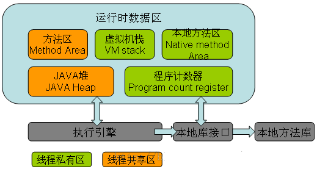

#### 前言

很多人将Java的内存分为堆内存（heap）和栈内存（Stack），这种分发不够准确，Java的内存区域划分实际上远比这复杂

<!--more-->

**方法区（公有）：** 用户存储已被虚拟机加载的类信息，常量，静态常量，即时编译器编译后的代码等数据。异常状态 OutOfMemoryError

其中包含常量池：用户存放编译器生成的各种字面量和符号引用。

**堆（公有）：** 是JVM所管理的内存中最大的一块。唯一目的就是存放实例对象，几乎所有的对象实例都在这里分配。Java堆是垃圾收集器管理的主要区域，因此很多时候也被称为“GC堆”。异常状态 OutOfMemoryError

**虚拟机栈（线程私有）：** 描述的是java方法执行的内存模型：每个方法在执行时都会创建一个栈帧，用户存储局部变量表，操作数栈，动态连接，方法出口等信息。每一个方法从调用直至完成的过程，就对应着一个栈帧在虚拟机栈中入栈到出栈的过程。 对这个区域定义了两种异常状态 OutOfMemoryError StackOverflowError

**本地方法栈（线程私有）:** 与虚拟机栈所发挥的作用相似。它们之间的区别不过是虚拟机栈为虚拟机执行java方法，而本地方法栈为虚拟机使用到的Native方法服务。

**程序计数器（线程私有）：** 一块较小的内存，当前线程所执行的字节码的行号指示器。字节码解释器工作时，就是通过改变这个计数器的值来选取下一条需要执行的字节码指令。

