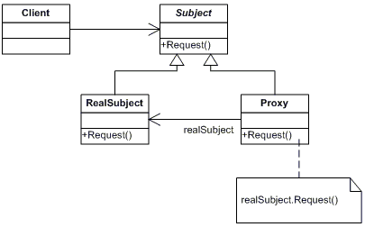

### 概述

**Java反射机制定义**

Java反射机制是在运行状态中，对于任意一个类，都能够知道这个类中的所有属性和方法；对于任意一个对象，都能够调用它的任意一个方法和属性；这种动态获取的信息以及动态调用对象的方法的功能称为java语言的反射机制

<!--more-->

**Java 反射机制的功能**

1.在运行时判断任意一个对象所属的类。

2.在运行时构造任意一个类的对象。

3.在运行时判断任意一个类所具有的成员变量和方法。

4.在运行时调用任意一个对象的方法。

5.生成动态代理。

**Java 反射机制的应用场景**

1.逆向代码 ，例如反编译

2.与注解相结合的框架 例如Retrofit

3.单纯的反射机制应用框架 例如EventBus

4.动态生成类框架 例如Gson

### 通过Java反射查看类信息

**获得Class对象** 
每个类被加载之后，系统就会为该类生成一个对应的Class对象。通过该Class对象就可以访问到JVM中的这个类。

在Java程序中获得Class对象通常有如下三种方式：

1.使用Class类的forName(String clazzName)静态方法。该方法需要传入字符串参数，该字符串参数的值是某个类的全限定名（必须添加完整包名）。

2.调用某个类的class属性来获取该类对应的Class对象。

3.调用某个对象的getClass()方法。该方法是java.lang.Object类中的一个方法。

```java
//第一种方式 通过Class类的静态方法——forName()来实现
class1 = Class.forName("com.xxx.Person");
//第二种方式 通过类的class属性
class1 = Person.class;
//第三种方式 通过对象getClass方法
Person person = new Person();
Class<?> class1 = person.getClass();
```

**获取class对象的属性、方法、构造函数等**

1.获取class对象的成员变量

```java
Field[] allFields = class1.getDeclaredFields();//获取class对象的所有属性
Field[] publicFields = class1.getFields();//获取class对象的public属性
Field ageField = class1.getDeclaredField("age");//获取class指定属性
Field desField = class1.getField("des");//获取class指定的public属性
```

2.获取class对象的方法

```java
Method[] methods = class1.getDeclaredMethods();//获取class对象的所有声明方法
Method[] allMethods = class1.getMethods();//获取class对象的所有public方法 包括父类的方法
Method method = class1.getMethod("info", String.class);//返回次Class对象对应类的、带指定形参列表的public方法
Method declaredMethod = class1.getDeclaredMethod("info", String.class);//返回次Class对象对应类的、带指定形参列表的方法
```

3.获取class对象的构造函数

```java
Constructor<?>[] allConstructors = class1.getDeclaredConstructors();//获取class对象的所有声明构造函数
Constructor<?>[] publicConstructors = class1.getConstructors();//获取class对象public构造函数
Constructor<?> constructor = class1.getDeclaredConstructor(String.class);//获取指定声明构造函数
Constructor publicConstructor = class1.getConstructor(String.class);//获取指定声明的public构造函数
```

4.其他方法

```java
Annotation[] annotations = (Annotation[]) class1.getAnnotations();//获取class对象的所有注解
Annotation annotation = (Annotation) class1.getAnnotation(Deprecated.class);//获取class对象指定注解
Type genericSuperclass = class1.getGenericSuperclass();//获取class对象的直接超类的 Type
Type[] interfaceTypes = class1.getGenericInterfaces();//获取class对象的所有接口的type集合
```

**获取class对象的信息**

比较多。

```java
boolean isPrimitive = class1.isPrimitive();//判断是否是基础类型
boolean isArray = class1.isArray();//判断是否是集合类
boolean isAnnotation = class1.isAnnotation();//判断是否是注解类
boolean isInterface = class1.isInterface();//判断是否是接口类
boolean isEnum = class1.isEnum();//判断是否是枚举类
boolean isAnonymousClass = class1.isAnonymousClass();//判断是否是匿名内部类
boolean isAnnotationPresent = class1.isAnnotationPresent(Deprecated.class);//判断是否被某个注解类修饰
String className = class1.getName();//获取class名字 包含包名路径
Package aPackage = class1.getPackage();//获取class的包信息
String simpleName = class1.getSimpleName();//获取class类名
int modifiers = class1.getModifiers();//获取class访问权限
Class<?>[] declaredClasses = class1.getDeclaredClasses();//内部类
Class<?> declaringClass = class1.getDeclaringClass();//外部类
```

### 通过Java反射生成并操作对象

**生成类的实例对象**

1.使用Class对象的newInstance()方法来创建该Class对象对应类的实例。这种方式要求该Class对象的对应类有默认构造器，而执行newInstance()方法时实际上是利用默认构造器来创建该类的实例。

2.先使用Class对象获取指定的Constructor对象，再调用Constructor对象的newInstance()方法来创建该Class对象对应类的实例。通过这种方式可以选择使用指定的构造器来创建实例。

```java
//第一种方式 Class对象调用newInstance()方法生成
Object obj = class1.newInstance();
//第二种方式 对象获得对应的Constructor对象，再通过该Constructor对象的newInstance()方法生成
Constructor<?> constructor = class1.getDeclaredConstructor(String.class);//获取指定声明构造函数
obj = constructor.newInstance("hello");
```

**调用类的方法**

1.通过Class对象的getMethods()方法或者getMethod()方法获得指定方法，返回Method数组或对象。

2.调用Method对象中的`Object invoke(Object obj, Object... args)`方法。第一个参数对应调用该方法的实例对象，第二个参数对应该方法的参数。

```java
 // 生成新的对象：用newInstance()方法
 Object obj = class1.newInstance();
//首先需要获得与该方法对应的Method对象
Method method = class1.getDeclaredMethod("setAge", int.class);
//调用指定的函数并传递参数
method.invoke(obj, 28);
```

**当通过Method的invoke()方法来调用对应的方法时，Java会要求程序必须有调用该方法的权限。如果程序确实需要调用某个对象的private方法，则可以先调用Method对象的如下方法。**
**setAccessible(boolean flag)：将Method对象的acessible设置为指定的布尔值。值为true，指示该Method在使用时应该取消Java语言的访问权限检查；值为false，则知识该Method在使用时要实施Java语言的访问权限检查。**

**访问成员变量值**

1.通过Class对象的getFields()方法或者getField()方法获得指定方法，返回Field数组或对象。

2.Field提供了两组方法来读取或设置成员变量的值： 
getXXX(Object obj):获取obj对象的该成员变量的值。此处的XXX对应8种基本类型。如果该成员变量的类型是引用类型，则取消get后面的XXX。 
setXXX(Object obj,XXX val)：将obj对象的该成员变量设置成val值。

```java
//生成新的对象：用newInstance()方法 
Object obj = class1.newInstance();
//获取age成员变量
Field field = class1.getField("age");
//将obj对象的age的值设置为10
field.setInt(obj, 10);
//获取obj对象的age的值
field.getInt(obj);
```

### 代理模式

**定义：**给某个对象提供一个代理对象，并由代理对象控制对于原对象的访问，即客户不直接操控原对象，而是通过代理对象间接地操控原对象。

#### 1、代理模式的理解

代理模式使用代理对象完成用户请求，屏蔽用户对真实对象的访问。现实世界的代理人被授权执行当事人的一些事宜，无需当事人出面，从第三方的角度看，似乎当事人并不存在，因为他只和代理人通信。而事实上代理人是要有当事人的授权，并且在核心问题上还需要请示当事人。  
在软件设计中，使用代理模式的意图也很多，比如因为安全原因需要屏蔽客户端直接访问真实对象，或者在远程调用中需要使用代理类处理远程方法调用的技术细节，也可能为了提升系统性能，对真实对象进行封装，从而达到延迟加载的目的。

#### 2、代理模式的参与者

代理模式的角色分四种：



**主题接口：** Subject 是委托对象和代理对象都共同实现的接口，即代理类的所实现的行为接口。Request() 是委托对象和代理对象共同拥有的方法。
**目标对象：** ReaSubject 是原对象，也就是被代理的对象。
**代理对象：** Proxy 是代理对象，用来封装真是主题类的代理类。
**客户端 ：** 代理类和主题接口完成一些工作。

#### 3、代理模式的分类

代理的实现分为：

**静态代理：** 代理类是在编译时就实现好的。也就是说 Java 编译完成后代理类是一个实际的 class 文件。
**动态代理：** 代理类是在运行时生成的。也就是说 Java 编译完之后并没有实际的 class 文件，而是在运行时动态生成的类字节码，并加载到JVM中。

#### 4、代理模式的实现思路

1.代理对象和目标对象均实现同一个行为接口。

2.代理类和目标类分别具体实现接口逻辑。

3.在代理类的构造函数中实例化一个目标对象。

4.在代理类中调用目标对象的行为接口。

5.客户端想要调用目标对象的行为接口，只能通过代理类来操作。

#### 5、静态代理模式的简单实现

```java
public class ProxyDemo {
    public static void main(String args[]){
        RealSubject subject = new RealSubject();
        Proxy p = new Proxy(subject);
        p.request();
    }
}

interface Subject{
    void request();
}

class RealSubject implements Subject{
    public void request(){
        System.out.println("request");
    }
}

class Proxy implements Subject{
    private Subject subject;
    public Proxy(Subject subject){
        this.subject = subject;
    }
    public void request(){
        System.out.println("PreProcess");
        subject.request();
        System.out.println("PostProcess");
    }
}
```

目标对象(RealSubject )以及代理对象（Proxy）都实现了主题接口（Subject）。在代理对象（Proxy）中，通过构造函数传入目标对象(RealSubject )，然后重写主题接口（Subject）的request()方法，在该方法中调用目标对象(RealSubject )的request()方法，并可以添加一些额外的处理工作在目标对象(RealSubject )的request()方法的前后。

**代理模式的好处：**

假如有这样的需求，要在某些模块方法调用前后加上一些统一的前后处理操作，比如在添加购物车、修改订单等操作前后统一加上登陆验证与日志记录处理，该怎样实现？首先想到最简单的就是直接修改源码，在对应模块的对应方法前后添加操作。如果模块很多，你会发现，修改源码不仅非常麻烦、难以维护，而且会使代码显得十分臃肿。

这时候就轮到代理模式上场了，它可以在被调用方法前后加上自己的操作，而不需要更改被调用类的源码，大大地降低了模块之间的耦合性，体现了极大的优势。

静态代理比较简单，上面的简单实例就是静态代理的应用方式，下面介绍本篇文章的主题：动态代理。

### Java反射机制与动态代理

动态代理的思路和上述思路一致，下面主要讲解如何实现。

#### 1、动态代理介绍

动态代理是指在运行时动态生成代理类。即，代理类的字节码将在运行时生成并载入当前代理的 ClassLoader。与静态处理类相比，动态类有诸多好处。

①不需要为(RealSubject )写一个形式上完全一样的封装类，假如主题接口（Subject）中的方法很多，为每一个接口写一个代理方法也很麻烦。如果接口有变动，则目标对象和代理类都要修改，不利于系统维护；

②使用一些动态代理的生成方法甚至可以在运行时制定代理类的执行逻辑，从而大大提升系统的灵活性。

#### 2、动态代理涉及的主要类

主要涉及两个类，这两个类都是java.lang.reflect包下的类，内部主要通过反射来实现的。

**java.lang.reflect.Proxy:** 这是生成代理类的主类，通过 Proxy 类生成的代理类都继承了 Proxy 类。
Proxy提供了用户创建动态代理类和代理对象的静态方法，它是所有动态代理类的父类。

**java.lang.reflect.InvocationHandler:** 这里称他为"调用处理器"，它是一个接口。当调用动态代理类中的方法时，将会直接转接到执行自定义的InvocationHandler中的invoke()方法。即我们动态生成的代理类需要完成的具体内容需要自己定义一个类，而这个类必须实现 InvocationHandler 接口，通过重写invoke()方法来执行具体内容。

Proxy提供了如下两个方法来创建动态代理类和动态代理实例。

> static Class<?> getProxyClass(ClassLoader loader, Class<?>... interfaces) 返回代理类的java.lang.Class对象。第一个参数是类加载器对象（即哪个类加载器来加载这个代理类到 JVM 的方法区），第二个参数是接口（表明你这个代理类需要实现哪些接口），第三个参数是调用处理器类实例（指定代理类中具体要干什么），该代理类将实现interfaces所指定的所有接口，执行代理对象的每个方法时都会被替换执行InvocationHandler对象的invoke方法。

> static Object newProxyInstance(ClassLoader loader, Class<?>[] interfaces, InvocationHandler h) 返回代理类实例。参数与上述方法一致。

对应上述两种方法创建动态代理对象的方式：

```java
        //创建一个InvocationHandler对象
        InvocationHandler handler = new MyInvocationHandler(.args..);
        //使用Proxy生成一个动态代理类
        Class proxyClass = Proxy.getProxyClass(RealSubject.class.getClassLoader(),RealSubject.class.getInterfaces(), handler);
        //获取proxyClass类中一个带InvocationHandler参数的构造器
        Constructor constructor = proxyClass.getConstructor(InvocationHandler.class);
        //调用constructor的newInstance方法来创建动态实例
        RealSubject real = (RealSubject)constructor.newInstance(handler);
```

```java
  //创建一个InvocationHandler对象
        InvocationHandler handler = new MyInvocationHandler(.args..);
        //使用Proxy直接生成一个动态代理对象
        RealSubject real =Proxy.newProxyInstance(RealSubject.class.getClassLoader(),RealSubject.class.getInterfaces(), handler);
```

**newProxyInstance这个方法实际上做了两件事：第一，创建了一个新的类【代理类】，这个类实现了Class[] interfaces中的所有接口，并通过你指定的ClassLoader将生成的类的字节码加载到JVM中，创建Class对象；第二，以你传入的InvocationHandler作为参数创建一个代理类的实例并返回。**

Proxy 类还有一些静态方法，比如：

`InvocationHandler getInvocationHandler(Object proxy):`

获得代理对象对应的调用处理器对象。

`Class getProxyClass(ClassLoader loader, Class[] interfaces):`

根据类加载器和实现的接口获得代理类。

InvocationHandler 接口中有方法：

`invoke(Object proxy, Method method, Object[] args)` 
这个函数是在代理对象调用任何一个方法时都会调用的，方法不同会导致第二个参数method不同，第一个参数是代理对象（表示哪个代理对象调用了method方法），第二个参数是 Method 对象（表示哪个方法被调用了），第三个参数是指定调用方法的参数。

#### 3、动态代理模式的简单实现

```java
public class DynamicProxyDemo {
    public static void main(String[] args) {
        //1.创建目标对象
        RealSubject realSubject = new RealSubject();    
        //2.创建调用处理器对象
        ProxyHandler handler = new ProxyHandler(realSubject);    
       //3.动态生成代理对象
        Subject proxySubject = (Subject)Proxy.newProxyInstance(RealSubject.class.getClassLoader(),
                                                        RealSubject.class.getInterfaces(), handler);   
        //4.通过代理对象调用方法   
        proxySubject.request();    
    }
}

/**
 * 主题接口
 */
interface Subject{
    void request();
}

/**
 * 目标对象类
 */
class RealSubject implements Subject{
    public void request(){
        System.out.println("====RealSubject Request====");
    }
}
/**
 * 代理类的调用处理器
 */
class ProxyHandler implements InvocationHandler{
    private Subject subject;
    public ProxyHandler(Subject subject){
        this.subject = subject;
    }
    @Override
    public Object invoke(Object proxy, Method method, Object[] args)
            throws Throwable {
        //定义预处理的工作，当然你也可以根据 method 的不同进行不同的预处理工作
        System.out.println("====before====");
       //调用RealSubject中的方法
        Object result = method.invoke(subject, args);
        System.out.println("====after====");
        return result;
    }
}
```

可以看到，我们通过newProxyInstance就产生了一个Subject 的实例，即代理类的实例，然后就可以通过Subject .request()，就会调用InvocationHandler中的invoke()方法，传入方法Method对象，以及调用方法的参数，通过Method.invoke调用RealSubject中的方法的request()方法。同时可以在InvocationHandler中的invoke()方法加入其他执行逻辑。

### 泛型和Class类

从JDK 1.5 后，Java中引入泛型机制，Class类也增加了泛型功能，从而允许使用泛型来限制Class类，例如：String.class的类型实际上是Class<String>。如果Class对应的类暂时未知，则使用Class<?>(?是通配符)。通过反射中使用泛型，可以避免使用反射生成的对象需要强制类型转换。

泛型的好处众多，最主要的一点就是避免类型转换，防止出现ClassCastException，即类型转换异常。以下面程序为例：

```java
public class ObjectFactory {
    public static Object getInstance(String name){
        try {
            //创建指定类对应的Class对象
            Class cls = Class.forName(name);
            //返回使用该Class对象创建的实例
            return cls.newInstance();
        } catch (ClassNotFoundException | InstantiationException | IllegalAccessException e) {
            e.printStackTrace();
            return null;
        }
    }

}
```

上面程序是个工厂类，通过指定的字符串创建Class对象并创建一个类的实例对象返回。但是这个对象的类型是Object对象，取出实例后需要强制类型转换。  
如下例：

```java
Date date = (Date) ObjectFactory.getInstance("java.util.Date");
```

或者如下：

```java
String string = (String) ObjectFactory.getInstance("java.util.Date");
```

上面代码在编译时不会有任何问题，但是运行时将抛出ClassCastException异常，因为程序试图将一个Date对象转换成String对象。

但是泛型的出现后，就可以避免这种情况。

```java
public class ObjectFactory {
    public static <T> T getInstance(Class<T> cls) {
        try {
            // 返回使用该Class对象创建的实例
            return cls.newInstance();
        } catch (InstantiationException | IllegalAccessException e) {
            e.printStackTrace();
            return null;
        }
    }

}
```

在上面程序的getInstance()方法中传入一个Class<T>参数，这是一个泛型化的Class对象，调用该Class对象的newInstance()方法将返回一个T对象。

```java
String instance = ObjectFactory.getInstance(String.class);
```

通过传入`String.class`便知道T代表String，所以返回的对象是String类型的，避免强制类型转换。

当然Class类引入泛型的好处不止这一点，在以后的实际应用中会更加能体会到。

### 使用反射来获取泛型信息

通过指定类对应的 Class 对象，可以获得该类里包含的所有 Field，不管该 Field 是使用 private 修饰，还是使用 public 修饰。获得了 Field 对象后，就可以很容易地获得该 Field 的数据类型，即使用如下代码即可获得指定 Field 的类型。

```java
// 获取 Field 对象 f 的类型
Class<?> a = f.getType();
```

但这种方式只对普通类型的 Field 有效。如果该 Field 的类型是有泛型限制的类型，如 Map<String, Integer> 类型，则不能准确地得到该 Field 的泛型参数。

为了获得指定 Field 的泛型类型，应先使用如下方法来获取指定 Field 的类型。

```java
// 获得 Field 实例的泛型类型
Type type = f.getGenericType();
```

然后将 Type 对象强制类型转换为 ParameterizedType 对象，ParameterizedType 代表被参数化的类型，也就是增加了泛型限制的类型。ParameterizedType 类提供了如下两个方法。

**getRawType()：** 返回没有泛型信息的原始类型。

**getActualTypeArguments()：** 返回泛型参数的类型。

下面是一个获取泛型类型的完整程序。

```java
public class GenericTest
{
    private Map<String , Integer> score;
    public static void main(String[] args)
        throws Exception
    {
        Class<GenericTest> clazz = GenericTest.class;
        Field f = clazz.getDeclaredField("score");
        // 直接使用getType()取出Field类型只对普通类型的Field有效
        Class<?> a = f.getType();
        // 下面将看到仅输出java.util.Map
        System.out.println("score的类型是:" + a);
        // 获得Field实例f的泛型类型
        Type gType = f.getGenericType();
        // 如果gType类型是ParameterizedType对象
        if(gType instanceof ParameterizedType)
        {
            // 强制类型转换
            ParameterizedType pType = (ParameterizedType)gType;
            // 获取原始类型
            Type rType = pType.getRawType();
            System.out.println("原始类型是：" + rType);
            // 取得泛型类型的泛型参数
            Type[] tArgs = pType.getActualTypeArguments();
            System.out.println("泛型类型是:");
            for (int i = 0; i < tArgs.length; i++) 
            {
                System.out.println("第" + i + "个泛型类型是：" + tArgs[i]);
            }
        }
        else
        {
            System.out.println("获取泛型类型出错！");
        }
    }
}
```

输出结果：

> score 的类型是: interface java.util.Map 
> 原始类型是: interface java.util.Map 
> 泛型类型是: 
> 第 0 个泛型类型是: class java.lang.String 
> 第 1 个泛型类型是：class java.lang.Integer

从上面的运行结果可以看出，直接使用 Field 的 getType() 方法只能获取普通类型的 Field 的数据类型：对于增加了泛型参数的类型的 Field，应该使用 getGenericType() 方法来取得其类型。

Type 也是 java.lang.reflect 包下的一个接口，该接口代表所有类型的公共高级接口，Class 是 Type 接口的实现类。Type 包括原始类型、参数化类型、数组类型、类型变量和基本类型等。
