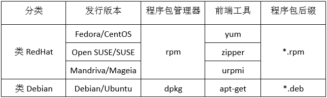
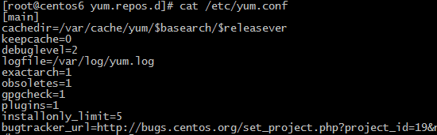
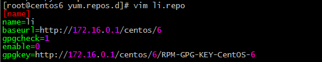

<!--more-->

### 简介

#### rpm

linux RedHat分支中的**程序包管理器**，全称为Red Hat Linux

#### yum

为前端工具，基于rpm，自动化解决包之间依赖关系

#### 程序包管理器

所有的软件都是由文件格式的程序代码(即源代码)，经过编译成为一个可执行二进制文件；对于一个软件来说，其包含二进制程序、库文件、配置文件以及帮助文件。在应用中，每次要安装程序时通过找源代码然后去编译成二进制文件，这个过程要花费大量的时间，所以就有了程序包管理器。**程序包管理器的功能是**：将编译好的应用程序的各组文件打包成一个或几个程序包文件，从而更方便地实现程序包的安装、升级、卸载和查询等管理操作。

我们可以将这种软件包管理器称为手动安装程序的软件包管理器，为什么成为手动安装程序的软件包管理器呢？
因为这种软件包管理器，在软件安装的过程中不能解决包之间的依赖管理，比如，A程序的运行要基于B程序的某些库文件才能运行，所以在安装A程序之前必须安装A程序；当然也有可能出现这种情况：B程序的运行也要基于A程序的某些库文件才能运行，这样就形成了先有鸡还是先有蛋的问题。

#### 前端工具

利用这种程序包管理器我们只能手动解决包之间的依赖关系。所谓自动解决依赖关系，无非就是在某个程序安装之前对该程序包文件进行分析看其都依赖哪些程序，然后将这些程序一并安装，从而解决软件包的依赖文件，我们将自动解决依赖关系的工具称为解决依赖关系的**前端工具**。

Linux发行版本主要分为两类：类RedHat和类Debain，不同的发行版本上所使用的程序包管理器各不相同，下图是各发行版本所使用的程序包管理器：



### 程序包管理器的组成

1、程序包的组成清单(每个程序包都单独实现)

其中包含文件清单和安全或卸载时运行的脚本

2、数据库(公共)

程序包管理器数据库存放的位置在/var/lib/rpm/目录下，其中包含程序包的名称和版本，依赖关系，功能说明以及安装生成的各文件的文件路径及校验码信息等等。

### 获取可靠安全程序包的途径

1、系统发行版的光盘或官方的文件服务器(或镜像站点)

```
http://mirrors.aliyun.com
http://mirrors.sohu.com
http://mirrors.163.com
```

2、项目的官方站点

3、第三方组织：

```
(1) EPEL
(2) 专门搜索rpm的搜索引擎
    http://pkgs.org
    http://rpmfind.net
    http://rpm.pbone.net
```

4、自己做rpm包

#### rpm包命名格式

在看rpm包命名格式之前先来看下源代码的命名格式：

```
#源代码：name-VERSION.tar.gz
#其中VERSION包含: major.minor.release
```

rpm包命名格式

```
#name-VERSION-release.arch.rpm
#VERSION: major.minor.release --> 其为源代码的发行号release.arch: rpm包的发行号     
#architecture: i386, x64(amd64), ppc, noarch
#例：redis-3.0.2-1.centos7.x64.rpm
```

拆包：主包和子包；Linux中的软件包一般有一个主程序的安装包，再就是子程序包，所谓的子程序包就是该软件上的某一功能的安装包，或者说是该程序的一个插件。

```
#主包: name-VERSION-release.arch.rpm
#子包: name-function-VERSION-release.arch.rpm
```

### rpm使用

#### rpm帮助文档

```
用法: rpm [选项...]

查询/验证软件包选项：
  -a, --all                        查询/验证所有软件包
  -f, --file                       查询/验证文件属于的软件包
  -g, --group                      查询/验证组中的软件包
  -p, --package                    查询/验证一个软件包
  --pkgid                          query/verify package(s) with package identifier
  --hdrid                          query/verify package(s) with header identifier
  --triggeredby                    query the package(s) triggered by the package
  --whatrequires                   query/verify the package(s) which require a dependency
  --whatprovides                   查询/验证提供相关依赖的软件包
  --nomanifest                     不把非软件包文件作为清单处理

查询选项（用 -q 或 --query）：
  -c, --configfiles                列出所有配置文件
  -d, --docfiles                   列出所有程序文档
  -L, --licensefiles               list all license files
  --dump                           转储基本文件信息
  -l, --list                       列出软件包中的文件
  --queryformat=QUERYFORMAT        使用这种格式打印信息
  -s, --state                      显示列出文件的状态

验证选项（用 -V 或 --verify）：
  --nofiledigest                   不验证文件摘要
  --nofiles                        不验证软件包中文件
  --nodeps                         不验证包依赖
  --noscript                       不执行验证脚本

安装/升级/擦除选项：
  --allfiles                       安装全部文件，包含配置文件，否则配置文件会被跳过。
  --allmatches                     移除所有符合 <package> 的软件包(如果 <package>
                                   被指定未多个软件包，常常会导致错误出现)
  --badreloc                       对不可重定位的软件包重新分配文件位置
  -e, --erase=<package>+           清除 (卸载) 软件包
  --excludedocs                    不安装程序文档
  --excludepath=<path>             略过以 <path> 开头的文件
  --force                          --replacepkgs --replacefiles 的缩写
  -F, --freshen=<packagefile>+     如果软件包已经安装，升级软件包
  -h, --hash                       软件包安装的时候列出哈希标记 (和 -v
                                   一起使用效果更好)
  --ignorearch                     不验证软件包架构
  --ignoreos                       不验证软件包操作系统
  --ignoresize                     在安装前不检查磁盘空间
  -i, --install                    安装软件包
  --justdb                         更新数据库，但不修改文件系统
  --nodeps                         不验证软件包依赖
  --nofiledigest                   不验证文件摘要
  --nocontexts                     不安装文件的安全上下文
  --noorder                        不对软件包安装重新排序以满足依赖关系
  --noscripts                      不执行软件包脚本
  --notriggers                     不执行本软件包触发的任何脚本
  --nocollections                  请不要执行任何动作集
  --oldpackage                     更新到软件包的旧版本(带 --force
                                   自动完成这一功能)
  --percent                        安装软件包时打印百分比
  --prefix=<dir>                   如果可重定位，便把软件包重定位到 <dir>
  --relocate=<old>=<new>           将文件从 <old> 重定位到 <new>
  --replacefiles                   忽略软件包之间的冲突的文件
  --replacepkgs                    如果软件包已经有了，重新安装软件包
  --test                           不真正安装，只是判断下是否能安装
  -U, --upgrade=<packagefile>+     升级软件包
  --reinstall=<packagefile>+       reinstall package(s)

所有 rpm 模式和可执行文件的通用选项：
  -D, --define=“MACRO EXPR”        定义值为 EXPR 的 MACRO
  --undefine=MACRO                 undefine MACRO
  -E, --eval=“EXPR”                打印 EXPR 的宏展开
  --macros=<FILE:…>                从文件 <FILE:...> 读取宏，不使用默认文件
  --noplugins                      don't enable any plugins
  --nodigest                       不校验软件包的摘要
  --nosignature                    不验证软件包签名
  --rcfile=<FILE:…>                从文件 <FILE:...> 读取宏，不使用默认文件
  -r, --root=ROOT                  使用 ROOT 作为顶级目录 (default: "/")
  --dbpath=DIRECTORY               使用 DIRECTORY 目录中的数据库
  --querytags                      显示已知的查询标签
  --showrc                         显示最终的 rpmrc 和宏配置
  --quiet                          提供更少的详细信息输出
  -v, --verbose                    提供更多的详细信息输出
  --version                        打印使用的 rpm 版本号

Options implemented via popt alias/exec:
  --scripts                        list install/erase scriptlets from package(s)
  --setperms                       set permissions of files in a package
  --setugids                       set user/group ownership of files in a package
  --setcaps                        set capabilities of files in a package
  --restore                        restore file/directory permissions
  --conflicts                      list capabilities this package conflicts with
  --obsoletes                      list other packages removed by installing this package
  --provides                       list capabilities that this package provides
  --requires                       list capabilities required by package(s)
  --info                           list descriptive information from package(s)
  --changelog                      list change logs for this package
  --xml                            list metadata in xml
  --triggers                       list trigger scriptlets from package(s)
  --last                           list package(s) by install time, most recent first
  --dupes                          list duplicated packages
  --filesbypkg                     list all files from each package
  --fileclass                      list file names with classes
  --filecolor                      list file names with colors
  --fscontext                      list file names with security context from file system
  --fileprovide                    list file names with provides
  --filerequire                    list file names with requires
  --filecaps                       list file names with POSIX1.e capabilities
```

### 安装

rpm {-i|--install} [install-options] PACKAGE_FILE ...

```
# rpm -ivh PACKAGE_FILEGENERAL OPTIONS    
    -v: verbose，详细信息
    -vv: 更详细的输出
```

**[install-options]**

```
-h: hash marks 输出进度条；每个#表示2%的进度；
--test: 测试安装，检查并报告依赖关系及冲突消息等；
--nodeps: 忽略依赖关系；
    注意：当忽略依赖关系安装程序时，程序安装完成后，有可能不能正常运行，所以该安装选项不建议使用；--replacepkgs: 重新安装；
    比如说，将某程序的配置文件中信息修改后，想还原该配置文件，但是忘记了之前的配置，此时可以将该配置文件删除后，利用该安装选项对该程序重新安装来恢复其某个配置文件；--nosignature: 不检查包签名信息，不检查包来源的合法性；
--nodigest: 不检查包完整性信息；
--noscripts: 安装时不执行脚本文件
```

### 升级

rpm {-U|--upgrade} [install-options] PACKAGE_FILE ...
rpm {-F|--freshen} [install-options] PACKAGE_FILE ...

```
-U: 升级或安装
-F: 升级
rpm -Uvh PACKAGE_FILE...rpm -Fvh PACKAGE_FILE...
```

**[install-options]**

```
--oldpackage: 降级
--foece: 强制升级
```

### 卸载

rpm {-e|--erase} [--allmatches] [--justdb] [--nodeps] [--noscripts] [--notriggers] [--test] PACKAGE_NAME ...

```
--allmarches: 卸载所有匹配指定名称的程序包的各版本；
--nodeps: 忽略依赖关系；
--test: 测试卸载，dry run模式
```

### 查询

rpm {-q|--query} [select-options] [query-options]

**[select-options]**

```
PACKAGE_NAME: 查询指定程序包是否已经安装，及其版本；-a, --all: 查询所有已经安装过的包；
-f FILE: 查询指定的文件由哪个程序安装包生成；
-p, --package PACKAGE_FILE: 用于实现对未安装的程序包执行查询操作；
--whatprovides CAPABILITY: 查询指定的CAPABILITY由哪个包提供；
--whatrequires CAPABILITY: 查询指定的CAPABILITY被哪个包所依赖；
```

**[query-options]**

```
--changelog: 查询rpm包的changelog；
-l, --list: 程序包安装生成的所有文件列表；
-i, --info: 程序包相关的信息，版本号、大小、所属组等；
-c, --configfiles: 查询指定的程序提供的配置文件；
-d, --docfiles: 查询指定的程序包提供的文档；
--provides: 列出指定程序包提供的所有CAPABILITY；
-R, --require: 查询指定程序包的依赖关系；
--scripts: 查询程序包自带的脚本片段；
```

### 校验

软件包的校验一般是验证其来源的合法性以及软件包完整性的验证；来源合法性验证利用数字签名奇数，完整性验证利用单项函数加密技术。

**软件包校验命令**

rpm {-V|--verify} [select-options] [verify-options]

**校验过程：**

(1) 首先获取并导入信任的包制作者的密钥

```
对于CentOS发行版来说，利用下面的命令进行密钥的导入：# rpm -import /etc/pki/rpm-gpg/RPM-GPG-KEY-CentOS-7
```

(2) 验证

```
a. 安装此组织签名的程序时，会自动执行验证；
b. 手动验证：rmp -K PACKAGE_FILE
```

### 数据库重建

rpm管理器数据库的路径/var/lib/rpm/

**获取rpm数据库工具的帮助**

```
CentOS 6: man rpmCentOS 7: man rpmdb
```

**数据库重建的命令**

rpm {--initdb|--rebuilddb}

```
--initdb: 初始化数据库，当前无任何数据库可实现初始化创建一个新的；当前有时不执行任何操作；
--rebuilddb: 重新构建，通过读取当前系统上所有已经安装过的程序 包进行重新创建；
```

参考：[https://segmentfault.com/a/1190000016324835](https://segmentfault.com/a/1190000016324835)

### yum使用

yum是以rpm实现的包管理工具， rpm在解决包依赖问题上都需要手动处理，在依赖链或者循环依赖的方式上处理起来非常繁琐，yum应运而生。

#### 一、yum的分类

1.客户端:客户端的配置非常简单，只要配置要一些基本的参数，就可以通过客户端来安装软件，并且解决软件包的依赖性。

2.服务端:将所有需要的软件包同统一放在一个目录下，该目录可以通过ftp、http、https、file将需要使用软件的客户端传输需要的软件。

#### 二、yum的配置文件

***全局配置:***`/etc/yum.conf yum` 
cachedir：软件包缓存目录 
keepcache：缓存是否保存，1保存0不保存 
debuglevel：调试级别（默认为2） 
logfile：日志文件路径 
gpgcheck：是否检查密钥，一种检验软件完整性的方式 


***仓库配置:***`/etc/yum.repo.d/name.repo yum` 
[name]：仓库id 
name ：仓库名字 
baseurl： 为仓库的地址 
gpgkey：公钥地址，若是需要检查完整性的话可以添加密钥地址 
enable：是否开启当前仓库 
gpgcheck：是否使用密钥验证 


#### 三、yum仓库中的变量信息

arch:处理器平台，i386，x86_64,i486,i586 
releaserver/os/$basearch/https://mirrors.aliyun.com/centos/6.9/os/x86_64/

#### 四、yum命令

1.启用与禁用仓库 
禁用仓库:`yum-config-manager --disable “仓库名"` 
启用仓库:`yum-config-manager --enable “仓库名”`

2.显示软件仓库列表 
`yum repolist`

3.显示软件包列表 
`yum list`

4.安装卸载与更新 
安装：`yum install package1 package2...` 
重新安装：`yum reinstall package` 
卸载：`yum remove package` 
更新：`yum update package` 
降级：`yum downgrage package` 
检查可用的更新：`yum check-update`

5.缓存命令 
清除缓存：`yum clean all` 
构建缓存：`yum makecache`

6.查看依赖性 
`yum deplist package1`

7.包组相关命令 
安装：`yum groupinstall group1 [group2] [...]` 
更新`yum groupupdate group1 [group2] [...]` 
列表`yum grouplist [hidden] [groupwildcard] [...]` 
删除`yum groupremove group1 [group2] [...]` 
信息`yum groupinfo group1 [...]`

参考：[https://www.cnblogs.com/aubin/p/7289207.html](https://www.cnblogs.com/aubin/p/7289207.html)
