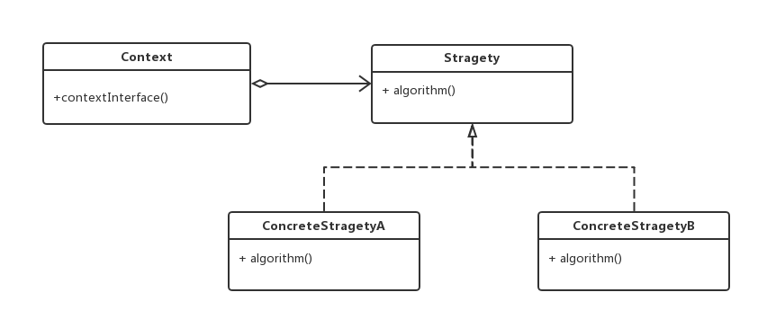

### **前言**

当我们写代码时总会遇到一种情况就是我们会有很多的选择，由此衍生出很多的if…else，或者case。如果每个条件语句中包含了一个简单的逻辑，那还比较容易处理，如果在一个条件语句中又包含了多个条件语句就会使得代码变得臃肿，维护的成本也会加大，这显然违背了开放封闭原则。这一讲我们就来讲策略模式，来看看它是怎么解决如上所说的问题的。  

<!--more-->

### 1.策略模式简介

#### 策略模式定义

定义一系列的算法，把每一个算法封装起来, 并且使它们可相互替换。策略模式模式使得算法可独立于使用它的客户而独立变化。

#### 策略模式UML图



- Context：用来操作策略的上下文环境。
- Stragety：策略的抽象。
- ConcreteStragetyA、ConcreteStragetyB：具体的策略实现。

### 2.策略模式简单实现

这回我们还举武侠的例子，张无忌作为一个大侠会遇到很多的对手，如果每遇到一个对手都用自己最厉害的武功去应战这显然是不明智的，于是张无忌想出了三种应战的策略分别对付三个实力层次的对手。

#### 定义策略接口

策略接口有一个fighting的方法用于战斗：  

```java
public interface FightingStrategy {
 public void fighting();
}
```

#### 具体策略实现

分别定义三个策略来实现策略接口，用来对付三个实力层次的对手：

```java
public class WeakRivalStrategy implements FightingStrategy {
 @Override
 public void fighting() {
 System.out.println("遇到了较弱的对手，张无忌使用太极剑");
 }
}


public class CommonRivalStrategy implements FightingStrategy {
 @Override
 public void fighting() {
 System.out.println("遇到了普通的对手，张无忌使用圣火令神功");
 }
}


public class StrongRivalStrategy implements FightingStrategy {
 @Override
 public void fighting() {
 System.out.println("遇到了强大的对手，张无忌使用乾坤大挪移");
 }
}
```

#### 实现环境类

环境类的构造函数包含了策略类，通过传进来不同的具体策略来调用不同策略的fighting方法：  

```java
public class Context {
 private FightingStrategy fightingStrategy;
 public Context(FightingStrategy fightingStrategy) {
 this.fightingStrategy = fightingStrategy;
 }
 public void fighting(){
 fightingStrategy.fighting();
 }
}
```

#### 客户端调用

张无忌会对不同实力层次的对手，采用了不同的策略来应战，为了举例，这里省略了对不同实力层次进行判断的条件语句，代码如下所示。  

```java
public class ZhangWuJi {
 public static void main(String[] args) {
 Context context;
 //如果遇到弱的对手
 context = new Context(new WeakRivalStrategy());
 context.fighting();
 //如果遇到普通的对手
 context = new Context(new CommonRivalStrategy());
 context.fighting();
 //如果遇到强劲的对手
 context = new Context(new StrongRivalStrategy());
 context.fighting();
 }
}
```

上面只是举了一个简单的例子，其实情况会很多，比如遇到普通的对手，也不能完全用圣火令神功，比如当遇到周芷若和赵敏时就需要手下留情，采用太极剑。又比如遇到强劲的对手张三丰，也不能用乾坤大挪移，类似这样的情况会很多，这样在每个策略类中可能会出现很多条件语句，但是试想一下如果我们不用策略模式来封装这些条件语句，那么可能会导致一个条件语句中又包含了多个条件语句，这样会使得代码变得臃肿，维护的成本也会加大。

### 3.策略模式优缺点和使用场景

#### 优点

- 策略模式提供了管理相关的算法族的办法。策略类的等级结构定义了一个算法或行为族。恰当使用继承可以把公共的代码转移到父类里面，从而避免重复的代码。
- 使用策略模式可以避免使用多重条件转移语句。多重转移语句不易维护，它把采取哪一种算法或采取哪一种行为的逻辑与算法或行为的逻辑混合在一起，统统列在一个多重转移语句里面，比使用继承的办法还要原始和落后。

#### 缺点

- 客户端必须知道所有的策略类，并自行决定使用哪一个策略类。这就意味着客户端必须理解这些算法的区别，以便适时选择恰当的算法类。换言之，策略模式只适用于客户端知道所有的算法或行为的情况。
- 策略模式造成很多的策略类，每个具体策略类都会产生一个新类。有时候可以通过把依赖于环境的状态保存到客户端里面，而将策略类设计成可共享的，这样策略类实例可以被不同客户端使用。换言之，可以使用享元模式来减少对象的数量。

#### 使用场景

- 对客户隐藏具体策略(算法)的实现细节，彼此完全独立。
- 针对同一类型问题的多种处理方式，仅仅是具体行为有差别时。
- 一个类定义了很多行为，而且这些行为在这个类里的操作以多个条件语句的形式出现。策略模式将相关的条件分支移入它们各自的 Strategy 类中以代替这些条件语句。
