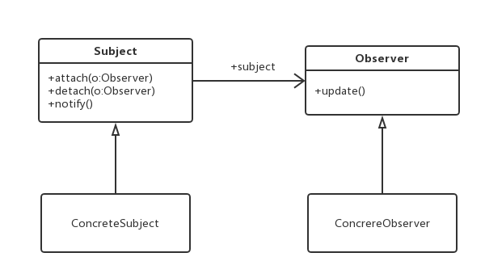

#### **定义**

观察者模式（又被称为发布-订阅（Publish/Subscribe）模式，属于行为型模式的一种，它定义了一种一对多的依赖关系，让多个观察者对象同时监听某一个主题对象。这个主题对象在状态变化时，会通知所有的观察者对象，使他们能够自动更新自己。

<!--more-->

#### 观察者模式结构图



- Subject：抽象主题（抽象被观察者），抽象主题角色把所有观察者对象保存在一个集合里，每个主题都可以有任意数量的观察者，抽象主题提供一个接口，可以增加和删除观察者对象。
- ConcreteSubject：具体主题（具体被观察者），该角色将有关状态存入具体观察者对象，在具体主题的内部状态发生改变时，给所有注册过的观察者发送通知。
- Observer：抽象观察者，是观察者者的抽象类，它定义了一个更新接口，使得在得到主题更改通知时更新自己。
- ConcrereObserver：具体观察者，是实现抽象观察者定义的更新接口，以便在得到主题更改通知时更新自身的状态。

#### 观察者模式简单实

观察者模式这种发布-订阅的形式我们可以拿微信公众号来举例，假设微信用户就是观察者，微信公众号是被观察者，有多个的微信用户关注了程序猿这个公众号，当这个公众号更新时就会通知这些订阅的微信用户。好了我们来看看用代码如何实现：

#### 抽象观察者（Observer）

里面定义了一个更新的方法：  

```java
public interface Observer {
 public void update(String message);
}
```

#### 具体观察者（ConcrereObserver）

微信用户是观察者，里面实现了更新的方法：  

```java
public class WeixinUser implements Observer {
 // 微信用户名
 private String name;
 public WeixinUser(String name) {
     this.name = name;
 }
 @Override
 public void update(String message) {
     System.out.println(name + "-" + message);
 }
}
```

#### 抽象被观察者（Subject）

抽象主题，提供了attach、detach、notify三个方法：  

```java
public interface Subject {
 /**

* 增加订阅者

* @param observer
  */
  public void attach(Observer observer);
  /**

* 删除订阅者

* @param observer
  */
  public void detach(Observer observer);
  /**

* 通知订阅者更新消息
  */
  public void notify(String message);
  }
```

#### 具体被观察者

微信公众号是具体主题（具体被观察者），里面存储了订阅该公众号的微信用户，并实现了抽象主题中的方法：  

```java
public class SubscriptionSubject implements Subject {
 //储存订阅公众号的微信用户
 private List<Observer> weixinUserlist = new ArrayList<Observer>();
 @Override
 public void attach(Observer observer) {
     weixinUserlist.add(observer);
 }
 @Override
 public void detach(Observer observer) {
     weixinUserlist.remove(observer);
 }
 @Override
 public void notify(String message) {
     for (Observer observer : weixinUserlist) {
     observer.update(message);
     }
 }
}
```

#### 客户端调用

```java
public class Client {
 public static void main(String[] args) {
 SubscriptionSubject mSubscriptionSubject=new SubscriptionSubject();
 //创建微信用户
 WeixinUser user1=new WeixinUser("A");
 WeixinUser user2=new WeixinUser("B");
 WeixinUser user3=new WeixinUser("C");
 //订阅公众号
 mSubscriptionSubject.attach(user1);
 mSubscriptionSubject.attach(user2);
 mSubscriptionSubject.attach(user3);
 //公众号更新发出消息给订阅的微信用户
 mSubscriptionSubject.notify("更新了");
 }
}
```

**结果**

> A-更新了
> B-更新了
> C-更新了

#### 使用观察者模式的场景和优缺点

**使用场景**

- 关联行为场景，需要注意的是，关联行为是可拆分的，而不是“组合”关系。
- 事件多级触发场景。
- 跨系统的消息交换场景，如消息队列、事件总线的处理机制。

**优点**

解除耦合，让耦合的双方都依赖于抽象，从而使得各自的变换都不会影响另一边的变换。

**缺点**

在应用观察者模式时需要考虑一下开发效率和运行效率的问题，程序中包括一个被观察者、多个观察者，开发、调试等内容会比较复杂，而且在Java中消息的通知一般是顺序执行，那么一个观察者卡顿，会影响整体的执行效率，在这种情况下，一般会采用异步实现。

#### Android中的观察者模式

android源码中也有很多使用了观察者模式，比如OnClickListener、ContentObserver、android.database.Observable等；还有组件通讯库RxJava、RxAndroid、EventBus；在这里将拿我们最常用的Adapter的notifyDataSetChanged()方法来举例： 
当我们用ListView的时候，数据发生变化的时候我们都会调用Adapter的notifyDataSetChanged()方法，这个方法定义在BaseAdaper中，我们来看看BaseAdaper的部分源码：

```java
public abstract class BaseAdapter implements ListAdapter, SpinnerAdapter {

    //数据集观察者
    private final DataSetObservable mDataSetObservable = new DataSetObservable();

    public boolean hasStableIds() {
        return false;
    }

    public void registerDataSetObserver(DataSetObserver observer) {
        mDataSetObservable.registerObserver(observer);
    }

    public void unregisterDataSetObserver(DataSetObserver observer) {
        mDataSetObservable.unregisterObserver(observer);
    }

    /**
     * 当数据集变化时，通知所有观察者
     */
    public void notifyDataSetChanged() {
        mDataSetObservable.notifyChanged();
    }
```

很明显BaseAdapter用的是观察者模式，BaseAdapter是具体被观察者，接下来看看mDataSetObservable.notifyChanged()：  

```java
public class DataSetObservable extends Observable<DataSetObserver> {
    public void notifyChanged() {
        synchronized(mObservers) {
            for (int i = mObservers.size() - 1; i >= 0; i--) {
                mObservers.get(i).onChanged();
            }
        }
    }
```

我们看到了mObservers，这就是观察者的集合，这些观察者是在ListView通过setAdaper()设置Adaper时产生的：

```java
@Override
    public void setAdapter(ListAdapter adapter) {
        if (mAdapter != null && mDataSetObserver != null) {
            mAdapter.unregisterDataSetObserver(mDataSetObserver);
        }
        ...
        super.setAdapter(adapter);

        if (mAdapter != null) {
            mAreAllItemsSelectable = mAdapter.areAllItemsEnabled();
            mOldItemCount = mItemCount;
            mItemCount = mAdapter.getCount();
            checkFocus();
            //创建数据观察者
            mDataSetObserver = new AdapterDataSetObserver();
            //注册观察者
            mAdapter.registerDataSetObserver(mDataSetObserver);

            ...
        }
```

接下来看看观察者AdapterDataSetObserver中处理了什么：

```java
class AdapterDataSetObserver extends AdapterView<ListAdapter>.AdapterDataSetObserver {
        @Override
        public void onChanged() {
            super.onChanged();
            if (mFastScroller != null) {
                mFastScroller.onSectionsChanged();
            }
        }

        @Override
        public void onInvalidated() {
            super.onInvalidated();
            if (mFastScroller != null) {
                mFastScroller.onSectionsChanged();
            }
        }
    }
```

从上面的代码看不出什么，再看看AdapterDataSetObserver的父类AdapterView的AdapterDataSetObserver：

```java
class AdapterDataSetObserver extends DataSetObserver {
  private Parcelable mInstanceState = null;
        @Override
        public void onChanged() {
            mDataChanged = true;
            mOldItemCount = mItemCount;
            mItemCount = getAdapter().getCount();
            if (AdapterView.this.getAdapter().hasStableIds() && mInstanceState != null
                    && mOldItemCount == 0 && mItemCount > 0) {
                AdapterView.this.onRestoreInstanceState(mInstanceState);
                mInstanceState = null;
            } else {
                rememberSyncState();
            }
            checkFocus();
            //重新布局
            requestLayout();
        }
        ...
        public void clearSavedState() {
            mInstanceState = null;
        }
 }
```

我们看到在onChanged()方法中调用了requestLayout()方法来重新进行布局。好了，看到这里我们都明白了，当ListView的数据发生变化时，我们调用Adapter的notifyDataSetChanged()方法，这个方法又会调用观察者们（AdapterDataSetObserver）的onChanged()方法，onChanged()方法又会调用requestLayout()方法来重新进行布局。
