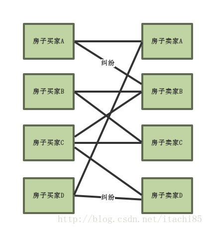
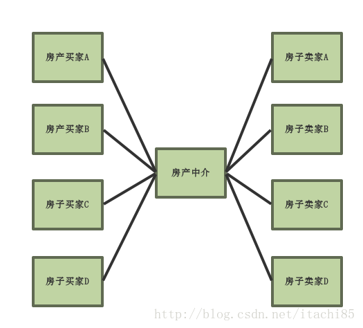
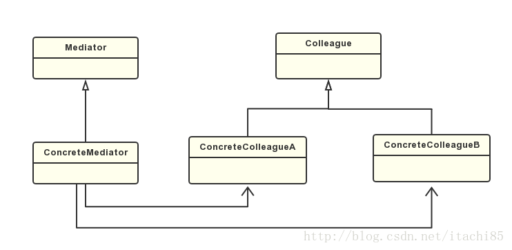
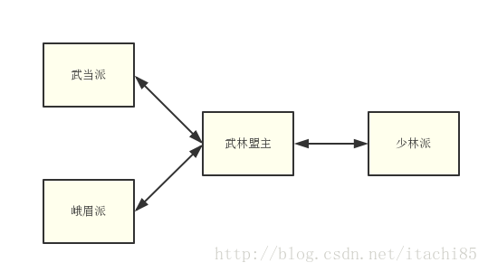
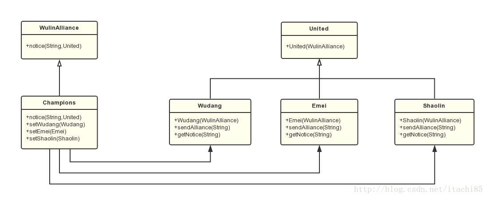

#### 中介者模式

中介者模式是行为型模式的一种，旨在处理类或对象如何交互及如何分配职责。 
中介者模式又叫做调停者模式，名字跟出国留学中介和房产中介是类似的。拿房产中介来说，现在房子买家和房子卖家非常多，如果任由房子买家和房子卖家自由交易，则会导致不同的买家和卖家之间有很多交互，一个买家会和多个卖家进行交涉，同样的一个卖家也会和多个买家进行交涉。如果在买房的过程中出现纠纷问题，则很难进行解决。就如下图所示一样。

<!--more-->



可以看出房子买家和卖家进行了很多错综复杂的交互，并且买家A和卖家B，买家D和卖家D还产生了纠纷，一看到这个图我们就觉得的晕，当然比我们晕的还有房子买家和卖家。我们在设计原则文章讲过迪米特原则，这个原则所说的就是要尽量减少对象之间的交互，如果两个对象之间不必彼此直接通信，那么这两个对象就不应当发生任何直接的相互作用，如果其中的一个对象需要调用另一个对象的某一个方法的话，可以通过第三者转发这个调用。迪米特原则同样适用于本场景，我们可以引入第三者也就是房产中介。它的出现不需要买家和卖家进行直接交涉，而是通过房产中介而进行交涉。并且也不容易出现买卖家之间纠纷，因为有中介者房产中介进行第三方监督。如下图所示。 


图中的关系清晰了很多。回到我们软件开发中，我们为了减少对象之间的交互和耦合，符合迪米特原则，那么就可以使用中介者模式，先来学习下中介者模式的定义。

#### 中介者模式定义

**定义：用一个中介者对象来封装一系列的对象交互。中介者使得各对象不需要显式地相互引用，从而使其松散耦合，而且可以独立地改变它们之间的交互。**

中介者模式结构图如下图所示。

 
在中介者模式中有如下角色：

- Mediator：抽象中介者角色，定义了同事对象到中介者对象的接口。
- ConcreteMediator：具体中介者角色，它从具体的同事对象接收消息，向具体同事发出命令。
- Colleague：抽象同事角色，定义了中介者对象接口，它只知道中介者而不知道其他同事对象。
- ConcreteColleague：具体同事角色，每个具体同事类都知道自己在小范围内的行为，而不知道它在大范围内的目的。

#### 中介者模式简单实现

中介者模式可以拿武侠来举例，江湖中门派众多，门派之前因为想法不同会有很多的利益冲突，这样就会带来无休止的纷争。为了江湖的安宁，大家推举出了一个大家都认可的武林盟主来对江湖纷争进行调停。 
前段时间武当派和峨眉派的的弟子被大力金刚指所杀，大力金刚指是少林派的绝学，因为事情重大，而且少林派实力强大，武当派和峨眉派不能够直接去少林派去问罪，只能上报武林盟主由武林盟主出面进行调停，如下图所示。



##### 抽象中介者角色

首先我们创建抽象中介者类，在这个例子中，它是一个武林联盟类，如下所示。

```java
public abstract class WulinAlliance {
    public abstract void notice(String message, United united);
}
```

notice方法用于向门派发送通知，其中United为抽象同事类也就是门派类，接下来我们来创建它。

##### 抽象同事角色

```java
public abstract class United {
  protected WulinAlliance wulinAlliance;
  public United(WulinAlliance wulinAlliance){
      this.wulinAlliance=wulinAlliance;
  }
}
```

门派类（抽象同事类）会在构造方法中得到武林联盟类（抽象中介者类）。

##### 具体同事角色

具体同事类包括武当派、峨眉派和少林派，如下所示。

```java
/**
 * 具体同事类（武当）
 */
public class Wudang extends United {
    public Wudang(WulinAlliance wulinAlliance) {
        super(wulinAlliance);
    }
    public void sendAlliance(String message) {
        wulinAlliance.notice(message, this);
    }
    public void getNotice(String message) {
        System.out.println("武当收到消息：" + message);
    }
}
/**
 * 具体同事类（峨眉派）
 */
public class Emei extends United {
    public Emei(WulinAlliance wulinAlliance) {
        super(wulinAlliance);
    }
    public void sendAlliance(String message) {
        wulinAlliance.notice(message, Emei.this);
    }
    public void getNotice(String message) {
        System.out.println("峨眉收到消息：" + message);
    }
}
/**
 * 具体同事类（少林派）
 */
public class Shaolin extends United {
    public Shaolin(WulinAlliance wulinAlliance) {
        super(wulinAlliance);
    }
    public void sendAlliance(String message){
        wulinAlliance.notice(message,Shaolin.this);
    }
    public void getNotice(String message){
        System.out.println("少林收到消息："+message);
    }
}
```

武当、峨眉和少林类都有两个方法，其中getNotice方法是自有方法，对于其他的门派（同事类）和武林联盟（中介者）没有依赖，只是用来接收武林盟主的通知。sendAlliance方法则是依赖方法，它必须通过武林盟主才能完成行为。

##### 具体中介者角色

具体中介者类则是武林盟主类，如下所示  

```java
public class Champions extends WulinAlliance {
 private Wudang wudang;
 private Shaolin shaolin;
 private Emei emei;
 public void setWudang(Wudang wudang) {
     this.wudang = wudang;
 }
 public void setEmei(Emei emei) {
     this.emei = emei;
 }
 public void setShaolin(Shaolin shaolin) {
     this.shaolin = shaolin;
 }
 @Override
 public void notice(String message, United united) {
   if (united == wudang) {
       shaolin.getNotice(message);
   } else if (united == emei) {
       shaolin.getNotice(message);
   } else if (united == shaolin) {
       wudang.getNotice(message);
       emei.getNotice(message);
   }
 }
}
```

武林盟主需要了解所有的门派，所以需要用setter来持有武当、峨眉和少林的引用。notice方法会根据不同门派发来的消息，转而通知给其他的门派。比如武当发来的消息，武林盟主就会将消息通知给少林。

##### 客户端调用

```java
public class Client {
 public static void main(String[]args) {
   Champions champions=new Champions();
   Wudang wudang=new Wudang(champions);
   Shaolin shaolin=new Shaolin(champions);
   Emei emei=new Emei(champions);
   champions.setWudang(wudang);
   champions.setShaolin(shaolin);
   champions.setEmei(emei);
   wudang.sendAlliance("武当弟子被少林大力金刚指所杀");
   emei.sendAlliance("峨眉弟子被少林大力金刚指所杀");
   shaolin.sendAlliance("少林弟子绝不会做出这种事情");
 }
}
```

首先创建武林盟主类Champions 并传入到各个门派类，接着调用武林盟主类的setter方法传入各个门派类，最后调用各个门派的sendAlliance方法通过武林盟主类向其他门派发送消息。

输出结果为： 
少林收到消息：武当弟子被少林大力金刚指所杀 
少林收到消息：峨眉弟子被少林大力金刚指所杀 
武当收到消息：少林弟子绝不会做出这种事情 
峨眉收到消息：少林弟子绝不会做出这种事情

接下来给出这个例子的UML图，如下所示。 


#### 中介者模式的优缺点和使用场景

**优点** 
符合迪米特原则，将原有的一对多的依赖变成了一对一的依赖，降低类间的耦合。

**缺点** 
中介者会变得庞大且复杂，原本多个对象直接的相互依赖变成了中介者和多个同事类的依赖关系，同事类越多，中介者的逻辑就越复杂。

**使用场景** 
中介者模式很容易实现呢，但是也容易误用，不要着急使用，先要思考你的设计是否合理。 
当对象之间的交互变多时，为了防止一个类会涉及修改其他类的行为，可以使用中介者模式，将系统从网状结构变为以中介者为中心的星型结构。

#### 代理模式、外观模式和中介者模式对比

当我们学完中介者模式是不是会觉得和此前讲过的代理模式和外观模式有些类似呢？现在我们一一来将它们进行对比。

#### 代理模式和中介者模式

代理模式是结构型设计模式，它有很多种类型，主要是在访问对象时引入一定程度的间接性，由于有间接性，就可以附加多种的用途，比如进行权限控制。中介者模式则是为了减少对象之间的相互耦合。虽然网上有很多代理模式和中介者模式的对比，但是在我看来这两者实际上并没有可比性，只是看起来有些类似罢了。

#### 外观模式和中介者模式

外观模式主要是以封装和隔离为主要任务，中介者则是调停同事类之间的关系，因此，中介者具有部分业务的逻辑控制。他们之间的主要区别为：

- 外观模式的子系统如果脱离外观模式还是可以运行的，而中介者模式增加了业务逻辑，同事类不能脱离中介者而独自存在。
- 外观模式中，子系统是不知道外观类的存在的，而中介者模式中，每个同事类都知道中介者。
- 外观模式将子系统的逻辑隐藏，用户不知道子系统的存在，而中介者模式中，用户知道同事类的存在。
