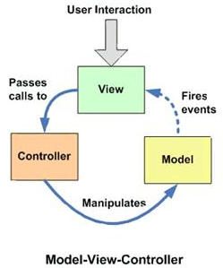
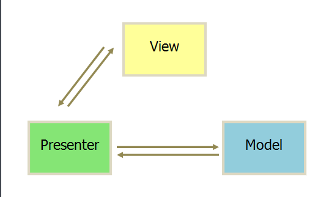
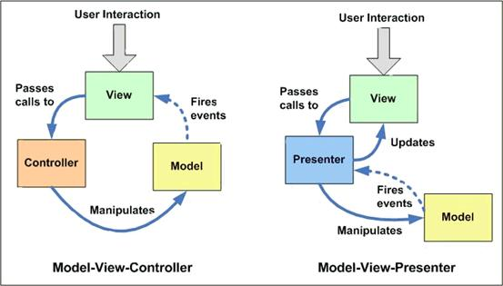
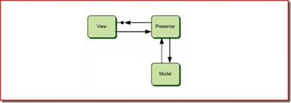
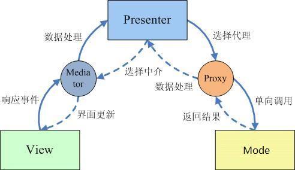
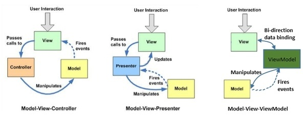

### 设计架构目的

通过设计使程序模块化，做到模块内部的高聚合和模块之间的低耦合。这样做的好处是使得程序在开发的过程中，开发人员只需要专注于一点，提高程序开发的效率，并且更容易进行后续的测试以及定位问题。但设计不能违背目的，对于不同量级的工程，具体架构的实现方式必然是不同的，切忌犯为了设计而设计，为了架构而架构的毛病。

<!--more-->

**例子：**

一个Android App如果只有3个Java文件，那只需要做点模块和层次的划分就可以，引入框架或者架构反而提高了工作量，降低了生产力；

但如果当前开发的App最终代码量在10W行以上，本地需要进行复杂操作，同时也需要考虑到与其余的Android开发者以及后台开发人员之间的同步配合，那就需要在架构上进行一些思考！

### MVC设计架构

#### MVC简介

MVC全名是Model View Controller，如图，是模型(model)－视图(view)－控制器(controller)的缩写，一种软件设计典范，用一种业务逻辑、数据、界面显示分离的方法组织代码，在改进和个性化定制界面及用户交互的同时，不需要重新编写业务逻辑。

其中M层处理数据，业务逻辑等；V层处理界面的显示结果；C层起到桥梁的作用，来控制V层和M层通信以此来达到分离视图显示和业务逻辑层。

#### Android中的MVC

Android中界面部分也采用了当前比较流行的MVC框架，在Android中：

- 视图层(View) 
  一般采用XML文件进行界面的描述，这些XML可以理解为AndroidApp的View。使用的时候可以非常方便的引入。同时便于后期界面的修改。逻辑中与界面对应的id不变化则代码不用修改，大大增强了代码的可维护性。

- 控制层(Controller) 
  Android的控制层的重任通常落在了众多的Activity的肩上。这句话也就暗含了不要在Activity中写代码，要通过Activity交割Model业务逻辑层处理，这样做的另外一个原因是Android中的Actiivity的响应时间是5s，如果耗时的操作放在这里，程序就很容易被回收掉。

- 模型层(Model) 
  我们针对业务模型，建立的数据结构和相关的类，就可以理解为AndroidApp的Model，Model是与View无关，而与业务相关的（感谢@Xander的讲解）。对数据库的操作、对网络等的操作都应该在Model里面处理，当然对业务计算等操作也是必须放在的该层的。就是应用程序中二进制的数据。

### MVP设计架构

在App开发过程中，经常出现的问题就是某一部分的代码量过大，虽然做了模块划分和接口隔离，但也很难完全避免。从实践中看到，这更多的出现在UI部分，也就是Activity里。想象一下，一个2000+行以上基本不带注释的Activity，我的第一反应就是想吐。Activity内容过多的原因其实很好解释，因为Activity本身需要担负与用户之间的操作交互，界面的展示，不是单纯的Controller或View。而且现在大部分的Activity还对整个App起到类似IOS中的【ViewController】的作用，这又带入了大量的逻辑代码，造成Activity的臃肿。为了解决这个问题，让我们引入MVP框架。

#### MVC的缺点

在Android开发中，Activity并不是一个标准的MVC模式中的Controller，它的首要职责是加载应用的布局和初始化用户 界面，并接受并处理来自用户的操作请求，进而作出响应。随着界面及其逻辑的复杂度不断提升，Activity类的职责不断增加，以致变得庞大臃肿。

#### 什么是MVP

MVP从更早的MVC框架演变过来，与MVC有一定的相似性：Controller/Presenter负责逻辑的处理，Model提供数据，View负责显示。

#### MVP框架由3部分组成：

View负责显示，Presenter负责逻辑处理，Model提供数据。在MVP模式里通常包含3个要素(加上View interface是4个):

* View:负责绘制UI元素、与用户进行交互(在Android中体现为Activity) 

* Model:负责存储、检索、操纵数据(有时也实现一个Model interface用来降低耦合) 

* Presenter:作为View与Model交互的中间纽带，处理与用户交互的负责逻辑

* View interface:需要View实现的接口，View通过View interface与Presenter进行交互，降低耦合，方便进行单元测试 
  Tips：*View interface的必要性

回想一下你在开发Android应用时是如何对代码逻辑进行单元测试的？是否每次都要将应用部署到Android模拟器或真机上，然后通过模拟用 户操作进行测试？然而由于Android平台的特性，每次部署都耗费了大量的时间，这直接导致开发效率的降低。而在MVP模式中，处理复杂逻辑的Presenter是通过interface与View(Activity)进行交互的，这说明我们可以通过自定义类实现这个interface来模拟Activity的行为对Presenter进行单元测试，省去了大量的部署及测试的时间。

### MVC → MVP

当我们将Activity复杂的逻辑处理移至另外的一个类（Presenter）中时，Activity其实就是MVP模式中的View，它负责UI元素的初始化，建立UI元素与Presenter的关联（Listener之类），同时自己也会处理一些简单的逻辑（复杂的逻辑交由 Presenter处理）。

MVP的Presenter是框架的控制者，承担了大量的逻辑操作，而MVC的Controller更多时候承担一种转发的作用。因此在App中引入MVP的原因，是为了将此前在Activty中包含的大量逻辑操作放到控制层中，避免Activity的臃肿。

#### 两种模式的主要区别：

（最主要区别）View与Model并不直接交互，而是通过与Presenter交互来与Model间接交互。而在MVC中View可以与Model直接交互 
通常View与Presenter是一对一的，但复杂的View可能绑定多个Presenter来处理逻辑。而Controller是基于行为的，并且可以被多个View共享，Controller可以负责决定显示哪个View 
Presenter与View的交互是通过接口来进行的，更有利于添加单元测试。

因此我们可以发现MVP的优点如下：

- 模型与视图完全分离，我们可以修改视图而不影响模型；

- 可以更高效地使用模型，因为所有的交互都发生在一个地方——Presenter内部；

- 我们可以将一个Presenter用于多个视图，而不需要改变Presenter的逻辑。这个特性非常的有用，因为视图的变化总是比模型的变化频繁；

- 如果我们把逻辑放在Presenter中，那么我们就可以脱离用户接口来测试这些逻辑（单元测试）。

具体到Android App中，一般可以将App根据程序的结构进行纵向划分，根据MVP可以将App分别为模型层(M)，UI层(V)和逻辑层(P)。

UI层一般包括Activity，Fragment，Adapter等直接和UI相关的类，UI层的Activity在启动之后实例化相应的Presenter，App的控制权后移，由UI转移到Presenter，两者之间的通信通过BroadCast、Handler或者接口完成，只传递事件和结果。

举个简单的例子，UI层通知逻辑层（Presenter）用户点击了一个Button，逻辑层（Presenter）自己决定应该用什么行为进行响应，该找哪个模型（Model）去做这件事，最后逻辑层（Presenter）将完成的结果更新到UI层。

### MVP的变种：Passive View

MVP的变种有很多，其中使用最广泛的是Passive View模式，即被动视图。在这种模式下，View和Model之间不能直接交互，View通过Presenter与Model打交道。Presenter接受View的UI请求，完成简单的UI处理逻辑，并调用Model进行业务处理，并调用View将相应的结果反映出来。View直接依赖Presenter，但是Presenter间接依赖View，它直接依赖的是View实现的接口。  

相对于View的被动，那Presenter就是主动的一方。对于Presenter的主动，有如下的理解：

- Presenter是整个MVP体系的控制中心，而不是单纯的处理View请求的人；
- View仅仅是用户交互请求的汇报者，对于响应用户交互相关的逻辑和流程，View不参与决策，真正的决策者是Presenter；
- View向Presenter发送用户交互请求应该采用这样的口吻：“我现在将用户交互请求发送给你，你看着办，需要我的时候我会协助你”，不应该是这样：“我现在处理用户交互请求了，我知道该怎么办，但是我需要你的支持，因为实现业务逻辑的Model只信任你”；
- 对于绑定到View上的数据，不应该是View从Presenter上“拉”回来的，应该是Presenter主动“推”给View的；
- View尽可能不维护数据状态，因为其本身仅仅实现单纯的、独立的UI操作；Presenter才是整个体系的协调者，它根据处理用于交互的逻辑给View和Model安排工作。

### MVP架构存在的问题与解决办法

- 加入模板方法（Template Method） 
  转移逻辑操作之后可能部分较为复杂的Activity内代码量还是不少，于是需要在分层的基础上再加入模板方法（Template Method）。

具体做法是在Activity内部分层。其中最顶层为BaseActivity，不做具体显示，而是提供一些基础样式，Dialog，ActionBar在内的内容，展现给用户的Activity继承BaseActivity，重写BaseActivity预留的方法。如有必要再进行二次继承，App中Activity之间的继承次数最多不超过3次。

- Model内部分层 
  模型层（Model）中的整体代码量是最大的，一般由大量的Package组成，针对这部分需要做的就是在程序设计的过程中，做好模块的划分，进行接口隔离，在内部进行分层。

- 强化Presenter 
  强化Presenter的作用，将所有逻辑操作都放在Presenter内也容易造成Presenter内的代码量过大，对于这点，有一个方法是在UI层和Presenter之间设置中介者Mediator，将例如数据校验、组装在内的轻量级逻辑操作放在Mediator中；在Presenter和Model之间使用代理Proxy；通过上述两者分担一部分Presenter的逻辑操作，但整体框架的控制权还是在Presenter手中。Mediator和Proxy不是必须的，只在Presenter负担过大时才建议使用。

最终的架构如下图所示：

### MVVM

MVVM可以算是MVP的升级版，其中的VM是ViewModel的缩写，ViewModel可以理解成是View的数据模型和Presenter的合体，ViewModel和View之间的交互通过Data Binding完成，而Data Binding可以实现双向的交互，这就使得视图和控制层之间的耦合程度进一步降低，关注点分离更为彻底，同时减轻了Activity的压力。

在比较之前，先从图上看看三者的异同。

刚开始理解这些概念的时候认为这几种模式虽然都是要将view和model解耦，但是非此即彼，没有关系，一个应用只会用一种模式。后来慢慢发现世界绝对不是只有黑白两面，中间最大的一块其实是灰色地带，同样，这几种模式的边界并非那么明显，可能你在自己的应用中都会用到。实际上也根本没必要去纠结自己到底用的是MVC、MVP还是MVVP，不管黑猫白猫，捉住老鼠就是好猫。

### MVC->MVP->MVVM演进过程

MVC -> MVP -> MVVM 这几个软件设计模式是一步步演化发展的，MVVM 是从 MVP 的进一步发展与规范，MVP 隔离了MVC中的 M 与 V 的直接联系后，靠 Presenter 来中转，所以使用 MVP 时 P 是直接调用 View 的接口来实现对视图的操作的，这个 View 接口的东西一般来说是 showData、showLoading等等。M 与 V已经隔离了，方便测试了，但代码还不够优雅简洁，所以 MVVM 就弥补了这些缺陷。在 MVVM 中就出现的 Data Binding 这个概念，意思就是 View 接口的 showData 这些实现方法可以不写了，通过 Binding 来实现。

#### 同

如果把这三者放在一起比较，先说一下三者的共同点，也就是Model和View：

Model：数据对象，同时，提供本应用外部对应用程序数据的操作的接口，也可能在数据变化时发出变更通知。Model不依赖于View的实现，只要外部程序调用Model的接口就能够实现对数据的增删改查。 
View：UI层，提供对最终用户的交互操作功能，包括UI展现代码及一些相关的界面逻辑代码。

#### 异

三者的差异在于如何粘合View和Model，实现用户的交互操作以及变更通知

#### Controller

Controller接收View的操作事件，根据事件不同，或者调用Model的接口进行数据操作，或者进行View的跳转，从而也意味着一个Controller可以对应多个View。Controller对View的实现不太关心，只会被动地接收，Model的数据变更不通过Controller直接通知View，通常View采用观察者模式监听Model的变化。

#### Presenter

Presenter与Controller一样，接收View的命令，对Model进行操作；与Controller不同的是Presenter会反作用于View，Model的变更通知首先被Presenter获得，然后Presenter再去更新View。一个Presenter只对应于一个View。根据Presenter和View对逻辑代码分担的程度不同，这种模式又有两种情况：Passive View和Supervisor Controller。

#### ViewModel

注意这里的“Model”指的是View的Model，跟MVVM中的一个Model不是一回事。所谓View的Model就是包含View的一些数据属性和操作的这么一个东东，这种模式的关键技术就是数据绑定（data binding），View的变化会直接影响ViewModel，ViewModel的变化或者内容也会直接体现在View上。这种模式实际上是框架替应用开发者做了一些工作，开发者只需要较少的代码就能实现比较复杂的交互。
