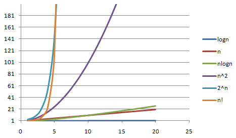

### 前言

算法很重要，但是一般情况下做移动开发并不经常用到，所以很多同学早就将算法打了个大礼包送还给了老师了，况且很多同学并没有学习过算法。这个系列就让对算法头疼的同学能快速的掌握基本的算法。过年放假阶段玩了会游戏NBA2K17的生涯模式，没有比赛的日子也都是训练，而且这些训练都是自发的，没有人逼你，从早上练到晚上，属性也不涨，但是如果日积月累，不训练和训练的人的属性值就会产生较大差距。这个突然让我意识到了现实世界，要想成为一个球星（技术大牛）那就需要日积月累的刻意训练，索性放下游戏，接着写文章吧。

<!--more-->

### 1.算法的效率

虽然计算机能快速的完成运算处理，但实际上，它也需要根据输入数据的大小和算法效率来消耗一定的处理器资源。要想编写出能高效运行的程序，我们就需要考虑到算法的效率。 
算法的效率主要由以下两个复杂度来评估：

**时间复杂度**：评估执行程序所需的时间。可以估算出程序对处理器的使用程度
**空间复杂度**：评估执行程序所需的存储空间。可以估算出程序对计算机内存的使用程度

设计算法时，一般是要先考虑系统环境，然后权衡时间复杂度和空间复杂度，选取一个平衡点。不过，时间复杂度要比空间复杂度更容易产生问题，因此算法研究的主要也是时间复杂度，不特别说明的情况下，复杂度就是指时间复杂度。

### 2.时间复杂度

#### 时间频度

一个算法执行所耗费的时间，从理论上是不能算出来的，必须上机运行测试才能知道。但我们不可能也没有必要对每个算法都上机测试，只需知道哪个算法花费的时间多，哪个算法花费的时间少就可以了。并且一个算法花费的时间与算法中语句的执行次数成正比例，哪个算法中语句执行次数多，它花费时间就多。一个算法中的语句执行次数称为语句频度或时间频度。记为T(n)。

#### 时间复杂度

前面提到的时间频度T(n)中，n称为问题的规模，当n不断变化时，时间频度T(n)也会不断变化。但有时我们想知道它变化时呈现什么规律，为此我们引入时间复杂度的概念。一般情况下，算法中基本操作重复执行的次数是问题规模n的某个函数，用T(n)表示，若有某个辅助函数f(n)，使得当n趋近于无穷大时，T（n)/f(n)的极限值为不等于零的常数，则称f(n)是T(n)的同数量级函数，记作T(n)=O(f(n))，它称为算法的渐进时间复杂度，简称时间复杂度。

### 3.大O表示法

像前面用O( )来体现算法时间复杂度的记法，我们称之为大O表示法。 
算法复杂度可以从最理想情况、平均情况和最坏情况三个角度来评估，由于平均情况大多和最坏情况持平，而且评估最坏情况也可以避免后顾之忧，因此一般情况下，我们设计算法时都要直接估算最坏情况的复杂度，而大O表示法O(f(n)就是指出了算法最坏情况下的运行时间。 
大O表示法O(f(n)中的f(n)的值可以为1、n、logn、n²等，因此我们可以将O(1)、O(n)、O(logn)、O(n²)分别可以称为常数阶、线性阶、对数阶和平方阶，那么如何推导出f(n)的值呢？我们接着来看推导大O阶的方法。

#### 推导大O阶

推导大O阶，我们可以按照如下的规则来进行推导，得到的结果就是大O表示法： 
1.用常数1来取代运行时间中所有加法常数。 
2.修改后的运行次数函数中，只保留最高阶项 
3.如果最高阶项存在且不是1，则去除与这个项相乘的常数。

在前面大O表示法的语言描述可能有些晦涩难懂，这里用通俗的语言来说，

#### 常数阶

先举了例子，如下所示。

```java
int sum = 0,n = 100; //执行一次
sum = (1+n)*n/2; //执行一次
System.out.println (sum); //执行一次
```

上面算法的运行的次数的函数为f(n)=3，根据推导大O阶的规则1，我们需要将常数3改为1，则这个算法的时间复杂度为O(1)。如果sum = （1+n）*n/2这条语句再执行10遍，因为这与问题大小n的值并没有关系，所以这个算法的时间复杂度仍旧是O(1)，我们可以称之为常数阶。

#### 线性阶

线性阶主要要分析循环结构的运行情况，如下所示。

```java
for(int i=0;i<n;i++){
//时间复杂度为O(1)的算法
...
}
```

上面算法循环体中的代码执行了n次，因此时间复杂度为O(n)。

#### 对数阶

接着看如下代码：

```java
int number=1;
while(number<n){
number=number*2;
//时间复杂度为O(1)的算法
...
}
```

可以看出上面的代码，随着number每次乘以2后，都会越来越接近n，当number不小于n时就会退出循环。假设循环的次数为X，则由2^x=n得出x=log₂n，因此得出这个算法的时间复杂度为O(logn)。

#### 平方阶

下面的代码是循环嵌套：

```java
for(int i=0;i<n;i++){
    for(int j=0;j<n;i++){
       //复杂度为O(1)的算法
       ...
    }
}
```

内层循环的时间复杂度在讲到线性阶时就已经得知是O(n)，现在经过外层循环n次，那么这段算法的时间复杂度则为O(n²)。 
接下来我们来算一下下面算法的时间复杂度：

```java
for(int i=0;i<n;i++){
    for(int j=i;j<n;i++){
       //复杂度为O(1)的算法
       ...
    }
}
```

需要注意的是内循环中int j=i，而不是int j=0。当i=0时，内循环执行了n次；i=1时内循环执行了n-1次，当i=n-1时执行了1次，我们可以推算出总的执行次数为：

```java
n+(n-1)+(n-2)+(n-3)+……+1
=(n+1)+[(n-1)+2]+[(n-2)+3]+[(n-3)+4]+……
=(n+1)+(n+1)+(n+1)+(n+1)+……
=(n+1)n/2
=n(n+1)/2
=n²/2+n/2
```

根据此前讲过的推导大O阶的规则的第二条：只保留最高阶，因此保留n²/2。根据第三条去掉和这个项的常数，则去掉1/2,最终这段代码的时间复杂度为O(n²)。

#### 其他常见复杂度

除了常数阶、线性阶、平方阶、对数阶，还有如下时间复杂度： 
f(n)=nlogn时，时间复杂度为O(nlogn)，可以称为nlogn阶。 
f(n)=n³时，时间复杂度为O(n³)，可以称为立方阶。 
f(n)=2ⁿ时，时间复杂度为O(2ⁿ)，可以称为指数阶。 
f(n)=n!时，时间复杂度为O(n!)，可以称为阶乘阶。 
f(n)=(√n时，时间复杂度为O(√n)，可以称为平方根阶。

### 4.复杂度的比较

下面将算法中常见的f(n)值根据几种典型的数量级来列成一张表，根据这种表，我们来看看各种算法复杂度的差异。

| n    | logn | √n  | nlogn | n²       | 2ⁿ      | n!           |
| ---- | ---- | --- | ----- | -------- | ------- | ------------ |
| 5    | 2    | 2   | 10    | 25       | 32      | 120          |
| 10   | 3    | 3   | 30    | 100      | 1024    | 3628800      |
| 50   | 5    | 7   | 250   | 2500     | 约10^15  | 约3.0*10^64   |
| 100  | 6    | 10  | 600   | 10000    | 约10^30  | 约9.3*10^157  |
| 1000 | 9    | 31  | 9000  | 1000 000 | 约10^300 | 约4.0*10^2567 |

从上表可以看出，O(n)、O(logn)、O(√n )、O(nlogn )随着n的增加，复杂度提升不大，因此这些复杂度属于效率高的算法，反观O(2ⁿ)和O(n!)当n增加到50时，复杂度就突破十位数了，这种效率极差的复杂度最好不要出现在程序中，因此在动手编程时要评估所写算法的最坏情况的复杂度。

#### 下面给出一个更加直观的图：



其中x轴代表n值，y轴代表T(n)值（时间复杂度）。T(n)值随着n的值的变化而变化，其中可以看出O(n!)和O(2ⁿ)随着n值的增大，它们的T(n)值上升幅度非常大，而O(logn)、O(n)、O(nlogn)随着n值的增大，T(n)值上升幅度则很小。

```java
O(1)<O(logn)<O(n)<O(nlogn)<O(n²)<O(n³)<O(2ⁿ)<O(n!)
```
