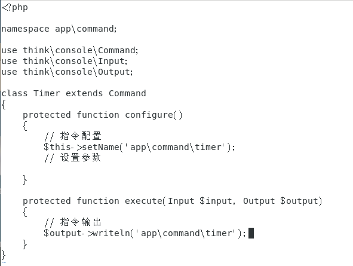
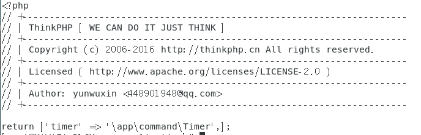
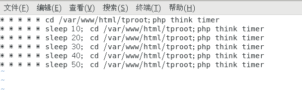
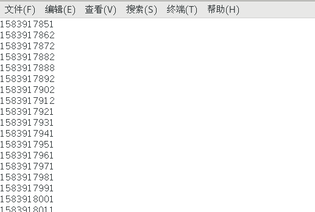

<!--more-->

### 前言：

尝试过thinkphp论坛里面workman扩展的方式，时间间隔不准确，并且有同一时间执行的情况，放弃.  最终还是觉着依托系统提供的crontab方式，虽然crontab自身不能支持秒级的定时，可以通过代码来弥补. 尝试成功，并且时间间隔很准确.

### 1.thinkphp5.1 创建command

thinkphp 根目录执行

```bash
php think make:command timer
```

application/command 会自动生成一个timer类



### 2.声明timer

编辑application下的command.php



### 3.测试command

thinkphp根目录执行

```bash
php think timer
```

看看是否会打印出 \app\commad\timer

### 4.指定crontab来执行thinkphp的command

命令：

```bash
crontab -e
```

编辑：

每10秒来执行一次



```bash
:wq
```

### 5.写文件测试

第一步中timer类的execute中加入 

```php
$holder = fopen('./timer.txt', 'a+');
fwrite($holder, time() . PHP_EOL);
fclose($holder);
```

查看文件



每10s执行一次，完成！
