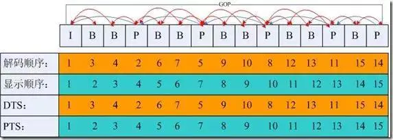

#### 一. 视频基础概念

##### 帧(Frame)

简单的理解帧就是为视频或者动画中的每一张画面，而视频和动画特效就是由无数张画面组合而成，每一张画面都是一帧。

<!--more-->

##### 帧数(Frames)

帧数其实就是为帧生成数量的简称，可以解释为静止画面的数量

##### 帧率(Frame Rate)

帧率(Frame rate) = 帧数(Frames)/时间(Time)，单位为帧每秒(f/s, frames per second, fps)。

##### 刷新率

屏幕每秒画面被刷新的次数，分为垂直刷新率和水平刷新率，一般我们提到的都是指垂直刷新率，以赫兹(Hz)为单位，刷新率越高，图像就越稳定，图像显示就越自然清晰。

目前， 大多数显示器根据其设定按 30Hz、 60Hz、 120Hz 或者 144Hz 的频率进行刷新。 而其中最常见的刷新频率是 60 Hz。 这样做是为了继承以前电视机刷新频率为 60Hz 的设定。

##### 帧率关键值

- 10~12 FPS：由于人类眼睛的特殊生理结构，如果所看画面之帧率高于每秒约10至12帧的时候，就会认为是连贯的，此现象称之为视觉暂留。
- 24 FPS：一般电影的拍摄及播放帧数是每秒24帧。
- 60 FPS：这个帧率对人眼识别来说已经具备较高的平滑度。
- 85 FPS：人类大脑处理视频的极限，人眼无法分辨更高频率的差异。

##### 60FPS

在做页面性能优化时，常用60FPS作为一个基准，所以需要尽量让每一帧的渲染控制在16ms内，这样才能达到一秒60帧的流畅度。

##### 分辨率

视频、图片的画面大小或尺寸。

##### 码率/比特率

单位时间播放连续的媒体如压缩后的音频或视频的比特数量。常用单位“比特每秒”，缩写是“bit/s”。比特率越高，带宽消耗得越多。

#### 二. CPU & GPU

**CPU**：中央处理器(英文全名：Central Processing Unit)，包括运算器（算术逻辑运算单元，ALU，Arithmetic Logic Unit）和高速缓冲存储器（Cache）及实现它们之间联系的数据（Data）、控制及状态的总线（Bus）。

**GPU**：图形处理器（英语全名：Graphics Processing Unit），专为执行复杂的数学和几何计算而设计的，拥有2D或3D图形加速功能。

GPU相比于CPU，更强大的2D、3D图形计算能力，可以让CPU从图形处理的任务中解放出来，执行其他更多的系统任务，这样可以大大提高计算机的整体性能。

##### 硬件加速

硬件加速（Hardware acceleration）就是利用硬件模块来替代软件算法以充分利用硬件所固有的快速特性。硬件加速通常比软件算法的效率要高。

将2D、3D图形计算相关工作交给GPU处理，从而释放CPU的压力，也是属于硬件加速的一种。

##### 硬解和软解

硬解和上面的硬件加速对应，即使用硬件模块来解析视频、音频文件等，而软解即是用CPU去计算解析。

#### 三. 视频封装格式(Container format)

| 格式   | 全名                                | 开发商                                          | 初版年限 | 特点                                                                   |
| ---- | --------------------------------- | -------------------------------------------- | ---- | -------------------------------------------------------------------- |
| MP4  | MP4                               | Moving Picture Experts Group，即 MPEG(动态图像专家组) | 1998 | 常用有损压缩格式，通用性强                                                        |
| AVI  | Audio Video Interleaved(音频视频交错格式) | 微软                                           | 1992 | 体积大算法简单                                                              |
| MOV  | QuickTime 影片格式                    | Apple                                        | 1991 | 苹果专属格式对很多其他的播放器支持不是很友好                                               |
| WMV  | Windows Media Video               | 微软                                           | 2003 | 微软的专业视频格式，兼容性并不是很好                                                   |
| FLV  | Adobe Flash 网络流媒体格式               | Adobe                                        | 2002 | 被淘汰的早期网络视频格式                                                         |
| MKV  | Matroska 多媒体容器                    | Matroska.org                                 | 2002 | 最有包容性的视频格式，能容纳无限量、多种不同类型编码的视频、音频及字幕流                                 |
| WebM | WebM                              | Google                                       | 2010 | 谷歌推出的 HTML5 标准的网络视频标准,以MKV容器格式为基础开发                                  |
| RMVB | RMVB                              | Real Networks                                | 1997 | 根据不同的网络传输速率，而制定出不同的压缩比率，从而实现在低速率的网络上进行影像数据实时传送和播放，具有体积小，画质不错的优点。已过时。 |

#### 四. 视频编码格式(Codec)

##### 1. MPEG：(Moving Picture Experts Group, ISO旗下的组织)

MPEG是Moving Picture Experts Group的简称。这个名字本来的含义是指一个研究视频和音频编码标准的“动态图像专家组”组织，成立于1988年，致力开发视频、音频的压缩编码技术。

| 版本             | 用途                |
| -------------- | ----------------- |
| MPEG - 1       | VCD               |
| MPEG - 2       | DVD、数字有线电视信号      |
| MPEG - 4(第二部分) | 视频电话、网络传输、广播和媒体存储 |

##### 2. H.26X : ITU-T VCEG(Visual Coding Experts Group，国际电联旗下的标准化组织)制定

| 版本    | 用于                                                      |
| ----- | ------------------------------------------------------- |
| H.261 | 老的视频会议和视频电话产品                                           |
| H.262 | DVD、数字有线电视信号(与MPEG共同制定，与MPEG-2完全一致)                     |
| H.263 | 视频会议、视频电话和网络视频                                          |
| H.264 | 高精度视频的录制、压缩和发布格式(与MPEG-4第十部分完全一致)，当前主流                  |
| H.265 | H.264的两倍之压缩率，可支持4K分辨率甚至到超高画质电视，最高分辨率可达到8192×4320（8K分辨率） |

##### 3. H.264

当前主流的编码格式是H.264，这是由ITU-T VCEG和MPEG共同制定的标准，MPEG - 4第十部分内容也是H.264。

##### 视频封装格式 & 视频编码格式

封装格式是提供了一个容器，用于存放视频、音频以及其他配置信息，而编码格式是指对视频画面内容进行压缩的一种标准。

#### 五. 音频格式

- **WAV**：因其文件扩展名为wav，微软和IBM联合开发的标准，数据本身的格式为PCM或压缩型，属于无损格式。
- **MP3** : MP3是一种音频压缩技术，其全称是动态影像专家压缩标准音频层面3（Moving Picture Experts Group Audio Layer III），简称为MP3。压缩比4:1~10:1之间。
- **AAC**：Advanced Audio Coding， 出现于1997年，由Fraunhofer IIS、杜比实验室、AT&T、Sony、Nokia等公司共同开发。AAC压缩比通常为18：1。相比MP3，采用更高效的编码算法，音质更佳，文件更小。
- **Opus**：Opus格式是一个开放格式，使用上没有任何专利或限制，比MP3、AAC、HE-AAC等常见格式，有更低的延迟和更好的声音压缩率。2012年7月2日，Opus被IETF批准用于标准化。

#### 六. H.264编码介绍

##### IPB帧

- I帧：帧内编码帧(intra picture)，采用帧内压缩去掉空间冗余信息。
- P帧：前向预测编码帧(predictive-frame)，通过将图像序列中前面已经编码帧的时间冗余信息来压缩传输数据量的编码图像。参考前面的I帧或者P帧。
- B帧：双向预测内插编码帧(bi-directional interpolated prediction frame)，既考虑源图像序列前面的已编码帧，又顾及源图像序列后面的已编码帧之间的冗余信息，来压缩传输数据量的编码图像，也称为双向编码帧。参考前面一个的I帧或者P帧及其后面的一个P帧。

##### PTS和DTS

- DTS(Decoding Time Stamp)是标识读入内存中bit流在什么时候开始送入解码器中进行解码。也就是解码顺序的时间戳。
- PTS(Presentation Time Stamp)用于度量解码后的视频帧什么时候被显示出来。在没有B帧的情况下，DTS和PTS的输出顺序是一样的，一旦存在B帧，PTS和DTS则会不同。也就是显示顺序的时间戳。

##### GOP

即Group of picture(图像组)，指两个I帧之间的距离，Reference(参考周期)指两个P帧之间的距离。

一个I帧所占用的字节数大于一个P帧，一个P帧所占用的字节数大于一个B帧。所以在码率不变的前提下，GOP值越大，P、B帧的数量会越多，平均每个I、P、B帧所占用的字节数就越多，也就更容易获取较好的图像质量；Reference越大，B帧的数量越多，同理也更容易获得较好的图像质量。

简而言之：

- 字节大小：I > P > B
- 解码顺序：I -> P -> B

