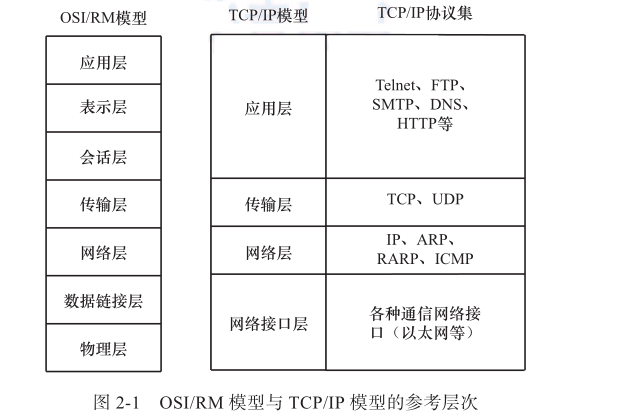

### 前言

大多数网络都采用分层的体系结构，每一层都建立在它的下层之上，同时向它的上一层提供一定的服务，而把如何实现这一服务的细节对上一层加以屏蔽。一台设备上的第 n层与另一台设备上的第 n 层进行通信的规则就是第 n 层协议。

<!--more-->

### OSI:

Open System Interconnection的缩写，意为开放式系统互联。国际标准化组织（ISO）制定了OSI模型，该模型定义了不同计算机互联的标准，是设计和描述计算机网络通信的基本框架。OSI模型把网络通信的工作分为7层，分别是物理层、数据链路层、网络层、传输层、会话层、表示层和应用层。

### 协议:

网络协议是网络上所有设备（网络服务器、计算机及交换机、路由器、防火墙等）之间通信规则的集合，它规定了通信时信息必须采用的格式和这些格式的意义。通过网络协议，网络上各种设备才能够相互交换信息。

### TCP :

传输控制协议（Transmission Control Protocol，TCP）是一种面向连接的、可靠的、基于字节流的传输层通信协议。

### UDP :

用户数据报协议（UDP）是 TCP/IP 模型中一种面向无连接的传输层协议，提供面向事务的简单不可靠信息传送服务。UDP 协议基本上是 IP 协议与上层协议的接口。UDP 协议适用于端口分别运行在同一台设备上的多个应用程序中。

### Socket:

TCP 和 UDP 的协议报文里面除了数据本身，还包含了包的目的地址和端口、包的源地址和端口以及其他各种附加的校验信息。这些包的长度是有限的，传输的时候需要将其分解为多个包，在到达传输的目的地址后再组合还原。如包有丢失或者破坏需要重传时，则乱序发送的包在达到时需要重新排序。处理这些过程是一项繁杂的工作，需要大量可靠的代码来完成。为了使程序员不必费心于上述这些底层具体细节，人们通过 Socket 对网络纠错、包大小、包重传等进行了封装。
