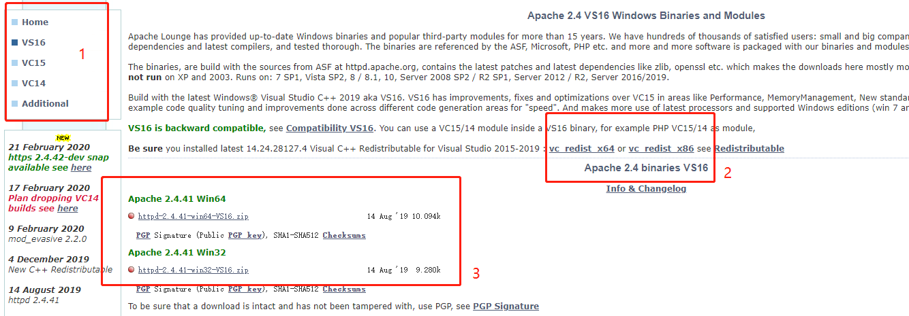
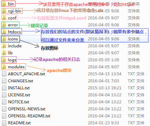

## 下载

官网下载地址:
[https://www.apachelounge.com/download/](https://www.apachelounge.com/download/)

<!--more-->



注意:

1. Apache 的版本以及支持多少位的系统  
2. 需要的vc依赖

## 安装

1.解压

2.配置 bin 目录到全局环境变量

3.Apache配置
配置conf/httpd.conf ${SRVROOT}

4.检测语法

```
httpd -t
```

5.安装服务
采用默认的服务名称 “Apache2.4”

```
httpd -k install
```

指定服务名称为apache

```
httpd -k install -n apache
```

6.启动/停止 服务

* 命令
  
  ```
  net start/ stop Apache2.4
  ```

* windows系统
  程序界面 右键Apache2.4 启动/停止/重新启动

* Apache监视器
  bin目录下的ApacheMonitor

7.卸载
一定要先卸载apache服务，然后删除安装文件

建议先停止 再卸载

```
httpd -k stop
httpd -k uninstall
```

目录简介


