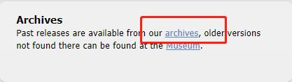
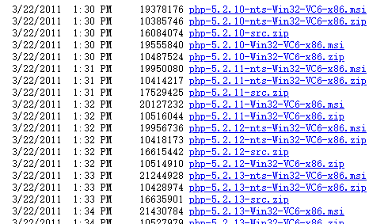

## 下载

### 下载地址:

[http://windows.php.net/](http://windows.php.net/ "http://windows.php.net/")

<!--more-->




**注意:**
系统位数以及vc版本

## 安装&配置

1.解压
2.配置php环境变量
3.配置Apache 支持PHP
编辑文件 /apache24/conf/httpd.conf 
修改：ServerRoot “C:/Software/apache24”
添加php7对apache的处理接口

```bash
PHPIniDir “D:/web/php-7.0.0-Win32-VC14-x86/”
LoadModule php7_module “C:/Software/apache24/php7apache2_4.dll”
```

添加 php的minetype，在 标签中添加

```bash
AddType application/x-httpd-php .php
```

添加DirectoryIndex 添加 php index (可选)

```bash
DirectoryIndex index.html index.php
```

4.配置 php.ini
打开php目录, 复制1个php.ini-development, 修改为php.ini.
编辑 php.ini, 找到 ;extension_dir = “ext” ,
把前面的分号去掉，修改为实际的ext文件路径:

```bash
extension_dir = “C:\Software\php7\ext”
```
